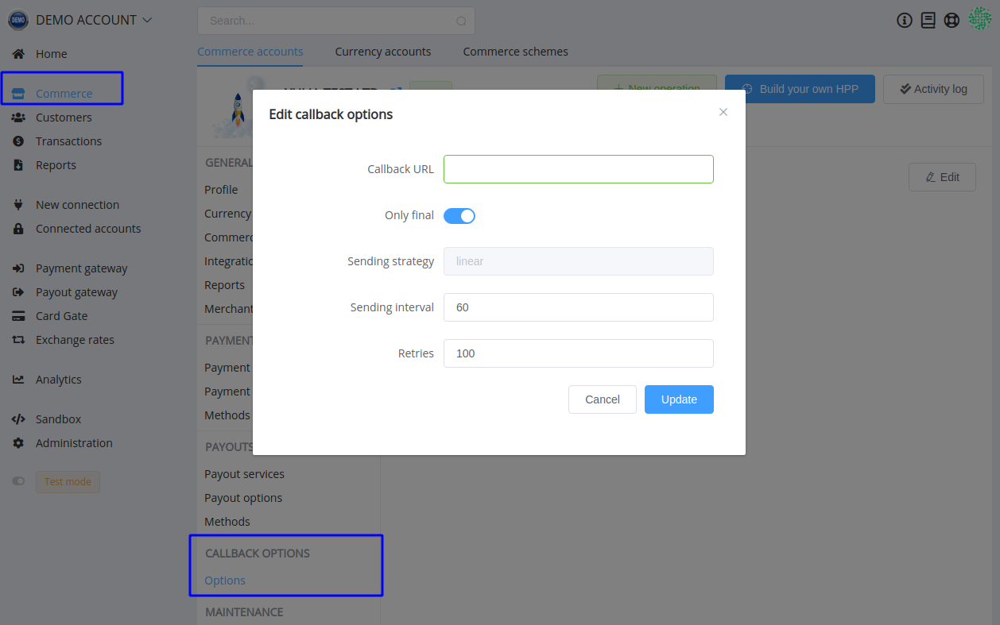

# Callbacks

Callbacks allow you to receive notifications whenever the state on an object changes (or something important happens to that object).

To set up Callbacks for an object, set a  `callback_url`  on that object. Whenever something important happens to the object that we think you should be notified of (typically a state change), we will make an HTTP POST request to your  `callback_url`  with the  `object_id`  in the body of the request.

!!! note
    Callbacks are asynchronous and are not recommended for time-critical applications. It is very much possible and even likely that callbacks reach your application out-of-order and that they get duplicated. For time-critical applications, we recommend using the  [API](/integration/) to poll our system for updates.

## Configure Callbacks

To configure your callbacks, go to  **Commerce Settings**  >  **Integration**  >  **Callbacks** and add a callback URL.

## Callback Requests

The HTTP request that we make to your `callback_url` will have the following characteristics:

- It will be a POST request.
- Request Body will be in  [JSON-API](https://jsonapi.org/)  format. It is the same as in public API.
- The  object `type` and `id` will be in the body of the request (and not added as a url-parameter).

This an example for Payout Invoice operation callback data:

```json
{
   "data":{
      "type":"payment-invoices",
      "id":"cpi_UoIW6RdSYyIRj8vR",
      "attributes":{
         "status":"process_pending",
         "resolution":"ok",
         "moderation_required":false,
         "amount":4,
         "payment_amount":4,
         "currency":"UAH",
         "service_currency":"UAH",
         "reference_id":"e2041fe2-44da-44da-0090-4ffe9d2f25d0",
         "test_mode":false,
         "fee":0,
         "deposit":4,
         "processed":null,
         "processed_amount":null,
         "processed_fee":null,
         "processed_deposit":null,
         "metadata":[

         ],
         "flow_data":{
            "action":"https://cardgate.example.io/hpp/2018e26d-8882-57f6-9a91-ac2acfeedbe3",
            "method":"GET",
            "params":[

            ]
         },
         "flow":"hpp",
         "created":1560889898,
         "updated":1560889898,
         "payload":[

         ]
      },
      "relationships":{
         "payment-service":{
            "data":{
               "type":"payment-services",
               "id":"payment_card_uah_hpp"
            }
         },
         "payment-method":{
            "data":{
               "type":"payment-methods",
               "id":"payment_card"
            }
         }
      },
      "links":{
         "self":"/api/payment-invoices/cpi_UoIW6RdSYyIRj8vR"
      }
   }
}
```

You also have the option to exclude card object from the callback. Enabling this will remove the masked card details object from the callback.

!!! note
    Although only masked card details are sent as part of the callback data, we recommend this option be enabled as the data could still be used for phishing attacks in case your site suffers a security breach.

## API Version

{{custom.company_name}} supports multiple API versions. The event content sent to the callback is structured based on the API version selected. Hence it is crucial that the API version of the callback matches the API version of the client library used by your application server. Learn more about API versioning  [here](/integration/).

## Signature

PayСore.io sign data using secret keys. They can be obtained in organization or Commerce Account settings. All callbacks are signed `live` or `test` secret key according to the mode in which operation has been created.

PayСore.io sends signature in `X-Signature` callback request header. The signature is created by next algorithm:

``` php
$signature = base64_encode(sha1($secret . $callbackData . $secret, true));
```

Where the `$secret` is one your secrets: `test` or `live`, `$callbackData` is raw json data.

!!! note
      To be sure you got data from PayСore, you should compute the signature using an appropriate secret key and compare with ones from PayСore.io callback data.

## Timeouts

There are 3 timeouts for Callbacks in {{custom.company_name}}:

1. **Connection Timeout:**  The connection timeout is the timeout for making the initial connection to the callback URL's HTTP server.
2. **Read Timeout:**  Once the initial connection has been made, at any time there is a possibility that there is an indefinite wait to read data from the HTTP server. The read timeout is the timeout for such a wait.
3. **Total Callback Timeout:**  In addition to the above timeouts, {{custom.company_name}} also checks the total execution of time of any callback via the callback execution timeout.

The values for each timeout are as follows:

|Timeout            |For Test site|For Live site|
|-------------------|-------------|-------------|
|Connection Timeout |10,000 ms    |20,000 ms    |
|Read Timeout       |10,000 ms    |20,000 ms    |
|Execution Timeout  |20,000 ms    |60,000 ms    |

## Automatic Retries

When you successfully process callback request, you must return 200 HTTP status code. Our application ignores any other data return by callback.

If the callback returns status code other then 200, it is assumed the delivery of request failed. The failed callback request is resent with an increasing delay between each attempt:

- the 1st retry 1 minute after the initial attempt,
- the 2nd retry 2 minutes after the 1st retry,
- the 3rd retry 3 minutes after the 2nd retry,
- the 4th retry 4 minutes after the 3rd retry,
- the 5th retry 5 minutes after the 4th retry,
- the 6th retry 6 minutes after the 5th retry,
- and so on, up to 100 attempts or up to receiving 200 HTTP status code.

You can set up delays between Callbacks' requests and the number of attempts in the *Commerce* settings.



Additionally, you can avoid receiving unnecessary messages in Callbacks by toggling the "Only final" statuses option.

!!! note
    You could resend a callback manually if you wish to sync your data immediately. Go to *Operation overview* > *Callbacks*, select the callback and use the button on the right side to resend it.

## Callback Handling

Because HTTPS/SSL verifies the identity of the server you are making API calls to, you will always know that the updated information you are receiving is correct.

If we sent object information in the Callback itself, you would have to verify the authenticity of the information via signed request, etc.

## Duplicate Handling

Due to callback retries, it's possible that your application receives the same callback more than once. Ensure idempotency of the callback by detecting such duplicates within your application.

To control processing idempotency use by examining the  `id`  parameter in callback request data since its value is unique to an operation and thus identifies it.

For some applications, this is not a serious issue. Work that can be repeated without changing the outcome is called idempotent. If your app's actions are always idempotent, you don't need to worry much about concurrency.

## Batching

We will batch Callbacks for the same object that are very close together. So if a payment goes from state `created` to `invoked` to `processed` immediately, you will only receive one Callback and when you look up the status of the payment it will be `processed`.

The advantage of doing this is that it prevents us from overwhelming your server(s) with HTTP requests and it prevents your app from having to build complicated logic around sequential state changes. Your app should only care about the latest state the object is in.

## Out-of-Order Delivery

Callbacks can also arrive at your application out-of-order. This can be due to issues such as network delays or callback failures. However, you can determine the order of the events by examining the  `updated`  attribute of the resource sent by the callback.  `updated`  is _timestamp_ value that updated for every change made to the resource.

## IPs whitelist

We use Amazon's EC2 for our infrastructure and currently we do not have a static IP address assigned. IP addresses for our instances are automatically allocated by Amazon, as we scale up or down. Hence, we are unable to provide any specific IP address for whitelisting.
