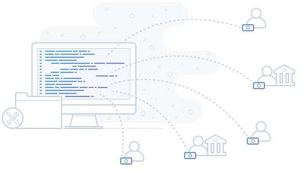

# Make Payouts

## Overview

Mass payouts or mass payments, refers to the concept of paying out to a large number of partners, publishers, suppliers, or sub-merchants – usually on a regular basis. In many cases, it can involve making a high volume of payments in multiple payment methods, multiple currencies, and to countries across the world.

Payouts allows marketplaces and financial institutions (banks and payment service providers) to use PayCore.io as a payout option for their customers.

All the above listed payouts and account automation benefits are also true for payouts service. You can build payment services to your customers on top of PayCore.io payment platform that enables your customers to send cross-border payouts to 40+ currencies in 70+ countries.

## Benefits

Mass payouts to bank cards and alternative payment methods:

-   Guaranteed payouts (cascading) under different conditions (by region, business types).
-   Payouts available to all business types and market segments.
-   Payouts to customers anywhere in the world.
-   Security and confidentiality guaranteed throughout the payout process.
-   Use webhooks – get updates sent to your application.

## Batch Payouts

If earlier you counted one-on-one with your remote employees, then you definitely liked our mass payouts. You can unite in one big operation. You send a button - and hundreds, or thousands of payouts simultaneously send to recipients.

You don’t necessarily need to integrate with the API to make a large number of payouts.

Create and send up to 1,000 transfers with just one payment using our Batch Payouts tool. All you need to do is fill a CSV file with all the transfer details, upload it to PayCore.io, and payout for the batch. No development effort needed.

[Learn more -->](/products/batch-payouts/)

## Payouts over API

PayCore.io’s Payout API is a mass payout solution that enables businesses to initiate hundreds of supplier payments or vendor payments through an easy to use, intuitive API.

Completely automate your payout process by sending payout orders via the [Commerce Private API](/integration/api-references/#commerce-private-api).

[Learn more -->](/integration/api-references/)