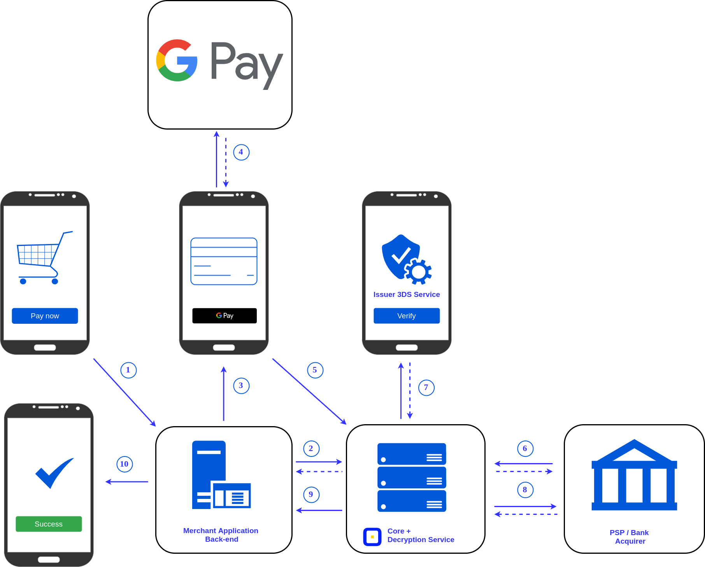
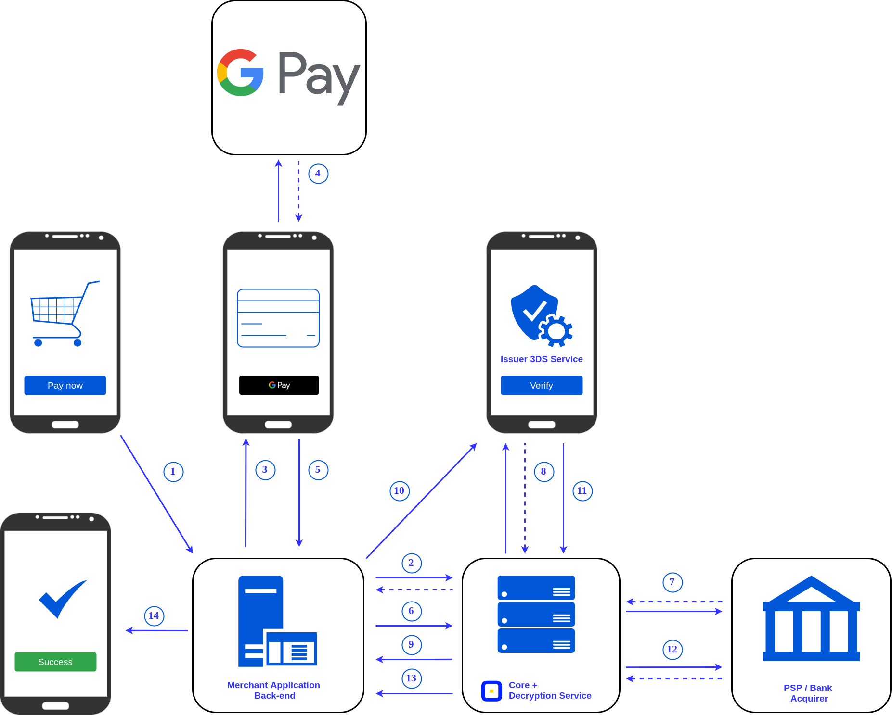

# Payment Method Google Pay

You can allow customers to pay quicker with cards stored on their Google Pay accounts. Combine our solutions and the Google suggestion to enable secure, one-touch payments in your stores for all devices (smartphones and PCs), irrespective of the operating systems and web browsers.

Google Pay™ is an instant payment that allows quick and easy card transaction without having to input your payment data each time. You reduce customers’ time to buy and make them far less likely to drop their carts. And you can be sure that their sensitive card data is securely stored by Google.

!!! quote ""
    Google Pay and Google Play are trademarks of Google LLC.

## Implementing Google Pay with the {{custom.company_name}} HPP

### How to set up

1. Sign a contract with {{custom.company_name}}.
2. Review and agree with [Google Pay Terms of Service](https://payments.developers.google.com/terms/sellertos) and [Acceptable Use Policy](https://payments.developers.google.com/terms/aup).
3. Inform your {{custom.company_name}} account manager about.

That's all! We integrate the Google Pay button to the Hosted Payment Page for you. Thus you can create a payment invoice from the *Dashboard* or via the API and start processing Google Pay transactions through {{custom.company_name}}.

### How it works



1. You request the customer payment data from your application/checkout page.
2. You send the invoice request to [{{custom.company_name}}](http://{{custom.company_name}}/), and we respond with the HPP redirect form.
3. The Hosted Payment Page displays available payment methods to the customer, including Google Pay option.
4. Google Pay authenticates the customer and returns their encrypted data.
5. We decrypt received payment data.
6. We create the purchase request and transfer the card data to the payment service provider (PSP) or bank acquirer service to complete the transaction and obtain a payment response.
7. The acquirer can request an additional user verification step by passing a 3DS or OTP test; in that case, the customer gets the verification page from the issuer.
8. We get the response value received from the issuer 3DS service and finalize the transaction.
9. We send a Callback message to the application back-end; if the Callback URL is not set, we expect a status request from your server.
10. You inform the customer about the result.

## Implementing Google Pay directly through the API

### Before you start

!!! attention "Be aware"
    Your site should run on the HTTPS scheme and support the TLS 1.2 protocol.

To integrate Google Pay into your Android application, check the links below:

- [Google Pay Android developer documentation](https://developers.google.com/pay/api/android/overview)
- [Google Pay Android integration checklist](https://developers.google.com/pay/api/android/guides/test-and-deploy/integration-checklist)
- [Google Pay Android brand guidelines](https://developers.google.com/pay/api/android/guides/brand-guidelines)

To integrate Google Pay into your website, review the following links:

- [Google Pay Web developer documentation](https://developers.google.com/pay/api/web/overview)
- [Google Pay Web integration checklist](https://developers.google.com/pay/api/web/guides/test-and-deploy/integration-checklist)
- [Google Pay Web brand guidelines](https://developers.google.com/pay/api/web/guides/brand-guidelines)

Get verified: send mobile app (.apk) or link to your site with the payment page.

### How the direct integration works



1. You request the customer payment data from your application/checkout page.
2. Your application displays available payment methods to the customer, including Google Pay option.
3. You request the encrypted payment data from your application, and Google Pay authenticates the customer.
4. You handle the received payment data and send to your server.
5. The application back-end transfers the encrypted data to card gateway [{{custom.company_name}}](http://{{custom.company_name}}/) with the invoice request to the Commerce API, and we respond with the invoice ID and the invoice status `created`.
6. We decrypt the payment data, create the purchase request, and transfer the card data to the payment service provider (PSP) or bank acquirer service to complete the transaction and obtain a payment response.
7. The acquirer can request an additional user verification step by passing a 3DS or OTP test.
8. We send to your application back-end the ACS redirect form.
9. You display the ACS or OTP to the customer.
10. We get the response value received from the issuer 3DS service.
11. We request the payment status from the acquirer and finalize the transaction.
12. We send a Callback message to the application back-end; if the Callback URL is not set, we expect a status request from your server.
13. You inform the customer about the result.

### How to integrate the Google Pay method

The overall transaction flow is similar to the standard Google Pay process. {{custom.company_name}} receives the encrypted Google Pay payload from your application and is responsible for decrypting the payment token and transferring the purchase data to a chosen gateway.

1. Make sure that you complete preparations from the previous section. Use [Google Pay API](https://developers.google.com/pay/api/android/guides/setup) to get a **paymentData**.

2. As script parameters specify:

    1. Available payment methods:
        `var allowedPaymentMethods = ['CARD']`
    2. Tokenization type:
        `"tokenizationType": "PAYMENT_GATEWAY"`
    3. Allowed card networks:
        `"allowedCardNetworks": ["MASTERCARD", "VISA"]`
    4. Allowed authorization methods:
        `"allowedAuthMethods": "["PAN_ONLY", "CRYPTOGRAM_3DS"]"`
    4. Gateway parameter: `paycoreio`
    4. Your Google merchant ID 
    5. And gateway merchant ID parameter --> your unique account ID

    The Customer's billing address is not required for the {{custom.company_name}} Google Pay API requests.

    If your integration works properly, you will receive a Google Pay button on the payment page.
    
    The pop-up window or the additional card selection form will appear after pressing the button on the device with the Google Pay connected. And after customer selecting the card, you will get the data set with PaymentData.

    !!! example "The PaymentData item (JSON)"

        ``` json
        {
            "apiVersionMinor":0,
            "apiVersion":2,
            "paymentMethodData":{
                "description":"Mastercard  •••• 1111",
                "tokenizationData":{
                    "type":"PAYMENT_GATEWAY",
                    "token":"{\"signature\":\"MEQCIBjQhjaZB76j...d}"
                        }
                    },
                "type":"CARD",
                "info":{
                    "cardNetwork":"MASTERCARD",
                    "cardDetails":"1111"
                    }
            }
        ```

3. To initiate a Google Pay transaction, send request with the Google Pay gateway parameters and a JSON-formatted [Payment Token](https://developers.google.com/pay/api/web/reference/object#PaymentMethodTokenizationData)  encoded using Base64 function.

    `token` allows you initiate verify or charge flow transferring it to the Google Pay.

    **Endpoint**: `https://cardgate.{{custom.company_name}}/payment/sale`

    **Method**: POST

    !!! example "JSON"

        === "Request Sample"
    
            ``` json
            {
            "data":{
                "type":"sale-operation",
                "attributes":{
                    "google_pay":{
                        "apiVersionMinor":0,
                        "apiVersion":2,
                        "paymentMethodData":{
                        "description":"Mastercard  •••• 1111",
                        "tokenizationData":{
                            "type":"PAYMENT_GATEWAY",
                            "token":"{\"signature\":\"MEQCIBjQhjaZB76j...d}"
                            }
                        },
                        "type":"CARD",
                        "info":{
                        "cardNetwork":"MASTERCARD",
                        "cardDetails":"1111"
                            }
                        }
                    }
                }
            }
            ```
    
        === "API Response sample"

            ``` json
            {
                "data":{
                    "id":"cgi_7U4hCiGtMAaGJnwN",
                    "attributes":{
                        "amount":10,
                        "currency":"USD",
                        "description": "Payment Example",
                        "service":"googlepay",
                        "options":{},
                        "customer":{
                            "reference_id": "customer1"
                        },
                        "repeatable":true,
                        "flow":"charge",
                        "status":"process_pending",
                        "resolution":"ok",
                        "active_request":{
                            "status":"process_pending",
                            "resolution":"ok"
                        },
                        "active_payment":{
                            "status":"authorize_required",
                            "resolution":"ok"
                        },
                        "auto_repay":false,
                        "metadata":{
                            "fee":"0.00",
                            "fee_strategy":"external"
                        },
                        "form_data":{
                            "gateway":"paycoreio",
                            "google_merchant_id":"014****68",
                            "gateway_merchant_id":"coma_3****51"
                        }
                    },
                    "payment":{
                        "fee":"0.00",
                        "feeStrategy":"external"
                    }
                }
            }
            ```


    <!--
    There we have a place for Request and Response parameters' tables
    -->

5. If payment status requires 3DS-verification, you should redirect the customer to the issuing bank ACS page (`action`). Send POST request including `PaReq`  (Payer Authentication Request), and `MD` (Merchant Data) parameters and Return URL to return the customer after 3D Secure (`TermUrl`) for 3ds 1.0 or `creq` (Challenge Request Message) for 3DS 2.0.

    !!! example "Responses"

        === "3DS 1.0"

            ```json
            {
            "auth_payload":{
                    "action":"https://acs.pay_domain/acspage/cap?RID=8\u0026VAA=A",
                    "method":"POST",
                    "params":{
                        "MD":"999999999",
                        "PaReq":"eJxVUlFvVA2jYv2jAQfuZfoD5v2E5KfQlLFJ2jAQfuZfoD5v2E5KQqurpe5os5wRBJU6dZCX79bszlDIrUe6+zWRkwjEe0qVHL3dmbqjeATGvs6XKz2Np1GBFSxq3r684PeiZvQbwnXOj9i951XdPeC4HWHT5bV1v+3z29+Vgs/OIi+9oe48acmxbs8VxVT7cFNkaX3+raapimUYqiZPbGz2CAOvRCP6gbytXany0njnTX07Y3Ii6VYY9u64EQNFz3J5OPlalzjc/4nyTv63+Lo+rfR6tFtlbfnofQDCDmaXpUEdS3SmcbXhU7MLJSwQ12gwovceazvouxlVLxmX8EgKkXeDuMSs7UoPPH47/yLbkeV+MU3SeTqst8PT5mfi9m5WZtmv+eMzCzuTzr0rcpzulYTmVbAfBLejA8KAsIlhlij6b8b+AbaDvJg=",
                        "TermUrl":"your.pay_domain/\/complete-auth?pid=pay_gcRU0PhWvBCz2dabWNpLu1Q3_qK_ly"
                    }
                }
            }
            ```

        === "3DS 2.0"

            ```json
            {
                "auth_payload": {
                "action": "https://acs.pay_domain/acspage/challenge?id=0c95e0873",
                "method": "POST",
                "params": {
                    "creq": "eyJ0aHJlZURTU2VydmVyVHJhbnNJRCI6IjBjOTNhNWFhLTUyNzAtMzhiNi04ZGQ4LWY5Mjc5MTVlMDg3MyIsImFjc1RyYW5zSUQiOiIyYjVkNzIyYi0yNjk2LTRhOTktYTcxZS1iZjYwYmI5MzlmNTgiLCJjaGFsbGVuZ2VXaW5kb3dTaXplIjoiMDUiLCJtZXNzYWdlVHlwZSI6IkNSZXEiLCJtZXNzYWdlVmVyc2lvbiI6IjIuMS4wIn0="
                    }
                }
            }
            ```

5. The response from {{custom.company_name}} will contain the transaction result.

!!! question "Looking for help connecting the Google Pay method via {{custom.company_name}}?"
    [Please contact our support team!](mailto:{{custom.support_email}})