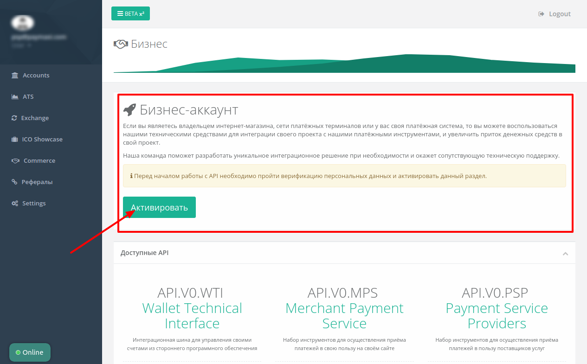
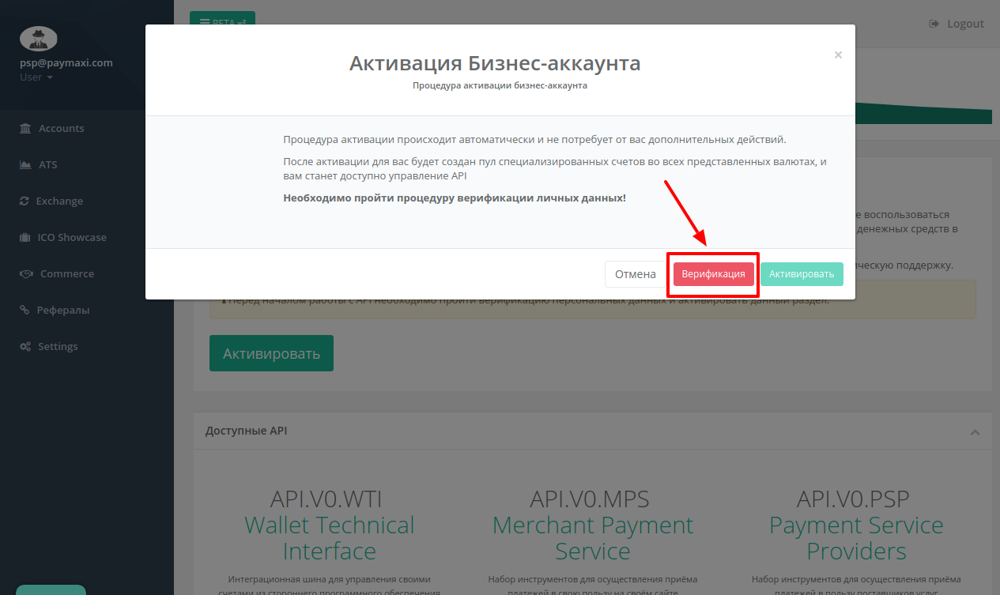
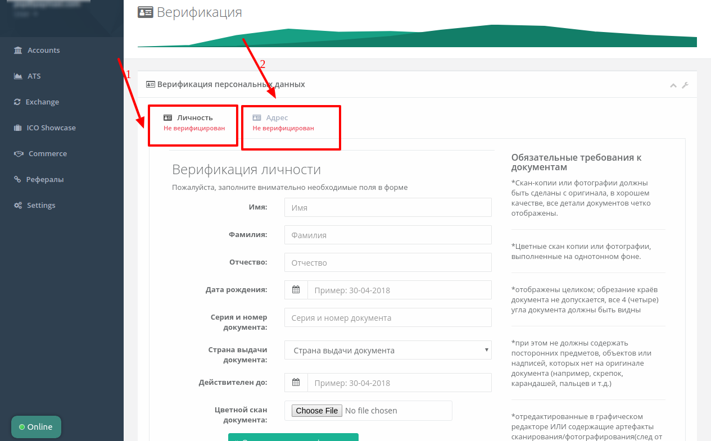
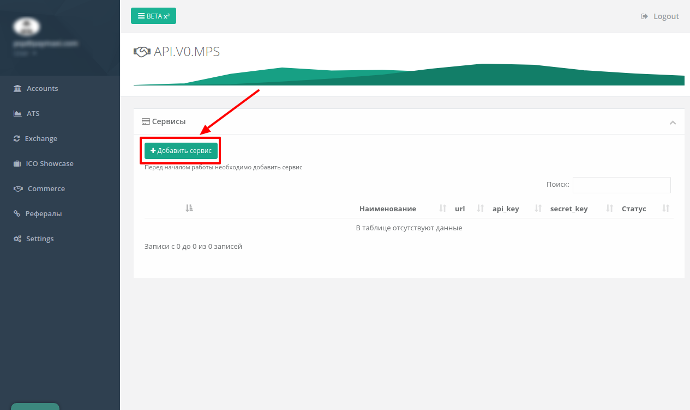
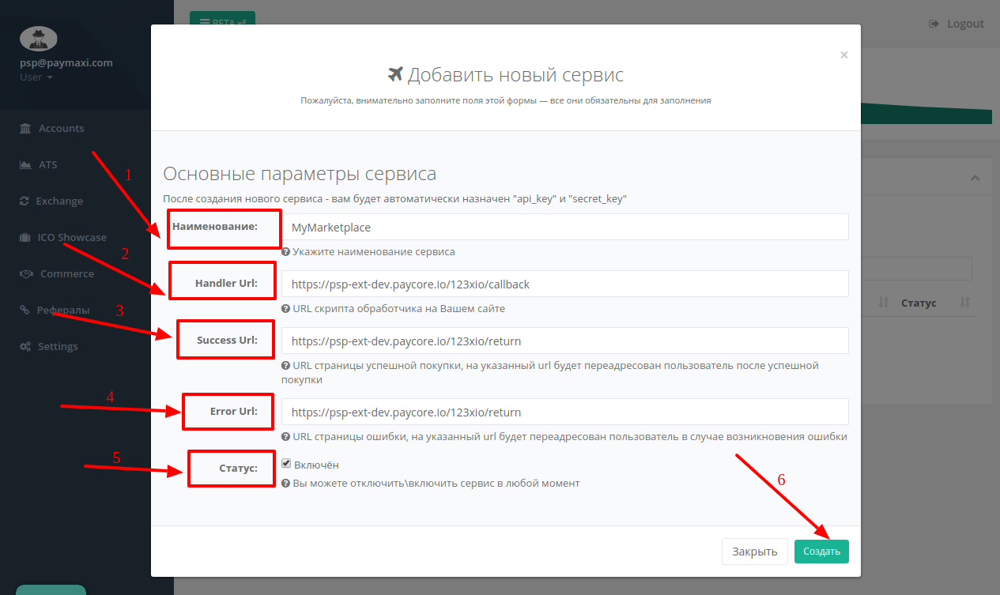

# 123x: Connecting account

## Introduction

Please setup 123x account in dashboard - 
[https://123x.io/site/index.html](https://123x.io/site/index.html)

## Setup account


#### Step 1: Open Commerce setting

??? info "Screenshot"
    [](images/123xio-step1.png)

#### Step 2: Verify your business account

??? info "Screenshots"
    [](images/123xio-step2_1.png)
    
    [](images/123xio-step2_2.png)

    [](images/123xio-step2_3.png)

#### Step 3: Back to Commerce and choose  "API.V0.MPS Merchant Payment Service"

??? info "Screenshots"
    [](images/123xio-step3.png)

#### Step 4: Add Service

??? info "Screenshots"
    [](images/123xio-step4.png)

#### Step 5: Set up parameters
- [x] Market name
- [x] Handler Url ```https://psp-ext.paycore.io/123xio/callback```
- [x] Success Url ```https://psp-ext.paycore.io/123xio/return```
- [x] Error Url ```https://psp-ext.paycore.io/123xio/return```
- [x] Status

??? info "Screenshots"
    [](images/123xio-step5.png)

- [x] Confirm creation

!!! success
    You have created Merchant Payment Service!

## Connect account

#### Step 1: Copy required credentials
- [x] API key
- [x] Secret key

??? info "Screenshots"
    [](images/123xio-step6.png)

#### Step 2: Enter credentials


??? info "Screenshot"
    [](images/123xio-step_connect.png)

!!! success
    You have connected **123x**!