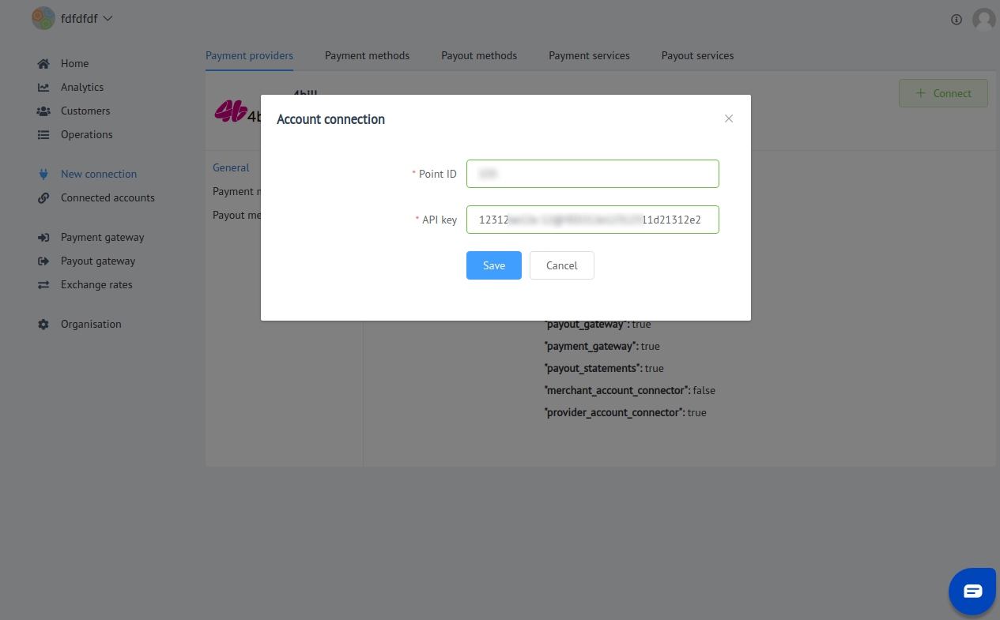

# 4bill: Connecting account

## Introduction

Here You can find  instructions for setting up <a href="https://4bill.io/" target="_blank" rel="noopener">**4bill** account</a>!

## Setup account

#### Step 1: Create merchant account

!!! note
    To create an account send connection request at <a href="https://4bill.io/" target="_blank" rel="noopener">**4bill Website**</a> or contact manager directly!

!!! info "Screenshot"
    [](images/4bill-step1.png)

#### Step 2: Get required credentials

- Ask your manager for required credentials
    - [x] Point ID
    - [x] API key

!!! note
    Another parameters You will be able to get within API key (token)! 

!!! success
    You are ready to connect!
    
## Connect account

#### Step 1: Copy credentials

- [x] Point ID
- [x] API key

#### Step 2: Enter credentials

!!! tip
    Press **```Connect```** at 4bill **```Provider Overview page```** in **```New connection```** section to open Connection form!

!!! tip
    **Don't forget to Save changes to confirm connection!**

!!! info "Screenshot"
    [](images/4bill-step_connect.png)
    

!!! success
    You have connected **4bill**!