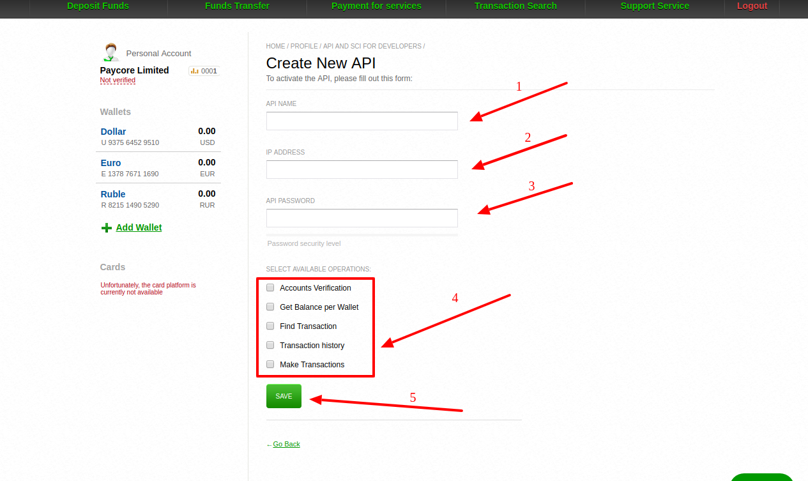
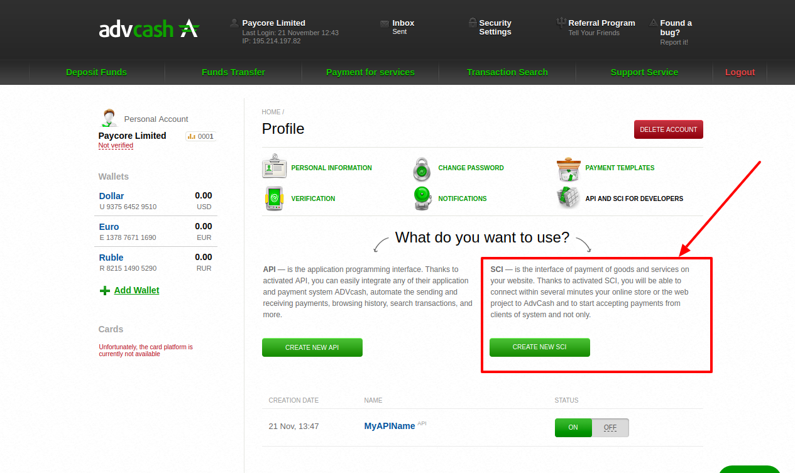
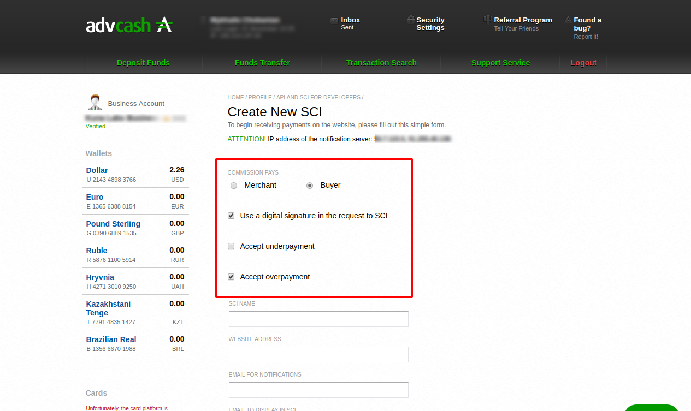

# Advcash: Connecting account

## Introduction

Please setup AdvCash account in dashboard - 
[https://wallet.advcash.com/](https://wallet.advcash.com/)

## Setup account


#### Step 1: Open profile setting

??? info "Screenshot"
    [](images/advcash-step1.png)

#### Step 2: Go to "API AND SCI FOR DEVELOPERS" section

??? info "Screenshot"
    [](images/advcash-step2.png)

### Setup API

#### Step 1: Create New API

??? info "Screenshot"
    [](images/advcash-step3.png)

#### Step 2: Set up the following parameters

- API Name
- IP adress list [PayCore white-list IP addresses](/ips)
- API Password
- Set all checkboxes
    - [x] Accounts Verification
    - [x] Get Balance per Wallet
    - [x] Find Transaction
    - [x] Transaction history
    - [x] Make Transactions

??? info "Screenshot"
    [](images/advcash-step4.png)
  
        
#### Step 3: Save changes

!!! warning
    To save changes You may be asked to Confirm this action though email!    
    
    ??? info "Screenshot"
        [](images/advcash-step4_2.png)

!!! success
    You have created an API


    
### Setup SCI

!!! info
    To create new SCI You need to have a varified account!

#### Step 1: Verify your account

??? info "Screenshot"
    [](images/advcash-step5_1.png)
        
        

#### Step 2: Create New SCI

??? info "Screenshot"
    [](images/advcash-step5.png)

#### Step 3: Set up basic parameters

- [x] Use a digital signature in the request to SCI
    
    !!! tip
        Parameters "**COMMISSION PAYS**", "**Accept underpayment**", "**Accept overpayment**"  are set at your discretion

??? info "Screenshot"
    [](images/advcash-step5_2.png)  
 

#### Step 4: Set up advanced parameters   

- [x] SCI NAME
- [x] WEBSITE ADDRESS : ```https://paycore.io/```
- [x] EMAIL FOR NOTIFICATIONS
- [x] EMAIL TO DISPLAY IN SCI
- [x] PASSWORD
- [x] SUCCESSFUL TRANSACTION PAGE : ```https://psp-ext.paycore.io/advcash/return```
- [x] FAILED TRANSACTION PAGE : ```https://psp-ext.paycore.io/advcash/return```
- [x] STATUS PAGE : ```https://psp-ext.paycore.io/advcash/callback```

??? info "Screenshot"
    [](images/advcash-step5_3.png)

#### Step 5: Save changes

!!! success
    You have created the SCI


## Connect account

#### Step 1: Copy required credentials

- [x] Account Email
    
    ??? tip
        Main email from your [Profile](https://wallet.advcash.com/pages/profile)

- [x] API Name
- [x] API Password
- [x] SCI Name
- [x] SCI Password


#### Step 2: Enter credentials

- [x] Account Email
- [x] API Name
- [x] API Password
- [x] SCI Name
- [x] SCI Password

??? info "Screenshot"
    [](images/advcash-step_connect.png)

!!! success
    You have connected **Advcash**!