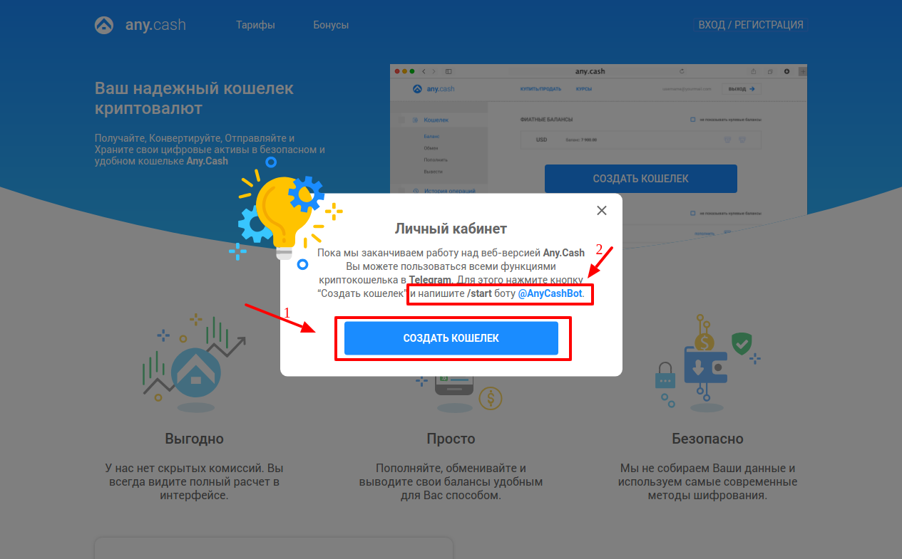

# AnyCash: Connecting account

## Introduction

Here You can find  instructions for setting up <a href="https://any.cash/" target="_blank" rel="noopener">**AnyCash** account</a>! 

## Setup account

#### Step 1: Create AnyCash wallet

!!! note
    Before creating You must have <a href="https://web.telegram.org" target="_blank" rel="noopener">**Telegram** account</a> with presetted ```@User name```

- [x] Press "Create Wallet" button
- [x] Run commant ```/start```

??? info "Screenshots"
    [](images/anycash-step1.png)
    
    [](images/anycash-step1_1.png)

#### Step 2: Contact with AnyCash Manager

!!! info
    This Payment Provoider gives acoount credentials personaly to their merchants!
    
#### Step 3: Get required credentials

!!! success
    You are ready to connect!
    
## Connect account

#### Step 1: Copy credentials

- [x] Merchant ID
- [x] Signature key

#### Step 2: Enter credentials

- [x] Merchant ID
- [x] Signature key


!!! tip
    Press **```Connect```** at AnyCash **```Provider Overview page```** in **```New connection```** section to open Connection form!

!!! tip
    **Don't forget to Save changes to confirm connection!**

??? info "Screenshot"
    [](images/anycash-step_connect.png)


!!! success
    You have connected **AnyCash**!