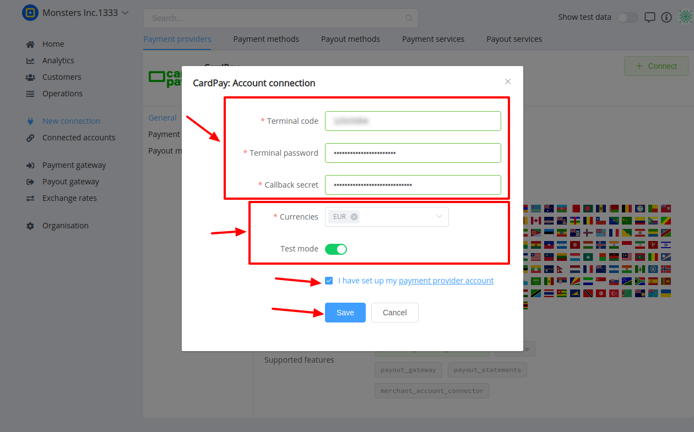

# CardPay: Connecting account

## Introduction

Here You can find  instructions for setting up <a href="https://cardpay.com/ma/" target="_blank" rel="noopener">**CardPay**  account</a>.

## Setup account

#### Step 1: Contact with CardPay Support Manager


#### Step 2: Get required credentials

- [x] Terminal code
- [x] Terminal password
- [x] Callback secret


#### Step 3: Send necessary paramenter yo CardPay

- [x] Callback URL : ```https://psp-ext.paycore.io/cardpay/callback```

!!! success
    You have configured account!


## Connect account

#### Step 1: Copy required credentials

- [x] Terminal code
- [x] Terminal password
- [x] Callback secret

#### Step 2: Enter credentials

!!! tip
    Press **```Connect```** at CardPay **```Provider Overview page```** in **```New connection```** section to open Connection form!

#### Step 3: Set up additional parameters 

- [x] Currencies
- [x] Test mode

!!! note
    These parameters are set according to your Merchant account type and it's available currencies!

!!! tip
    **Don't forget to Save changes to confirm connection!**

!!! info "Screenshot"
    [](images/cardpay-step_connect.png)


!!! success
    You have connected **CardPay**!