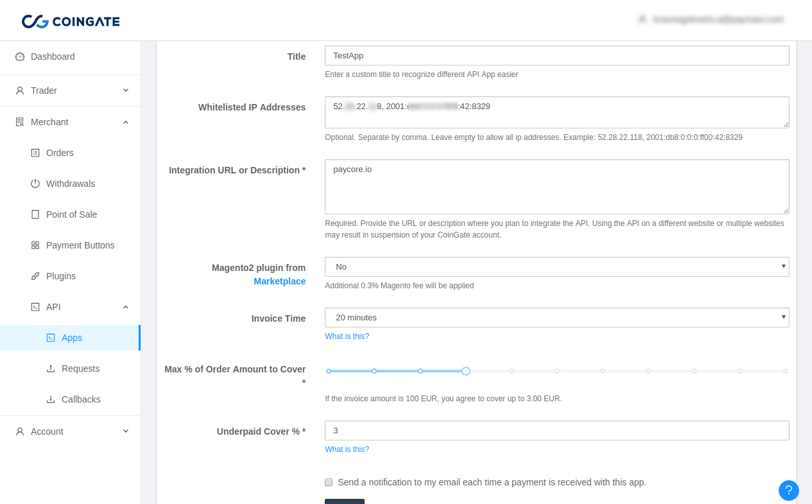
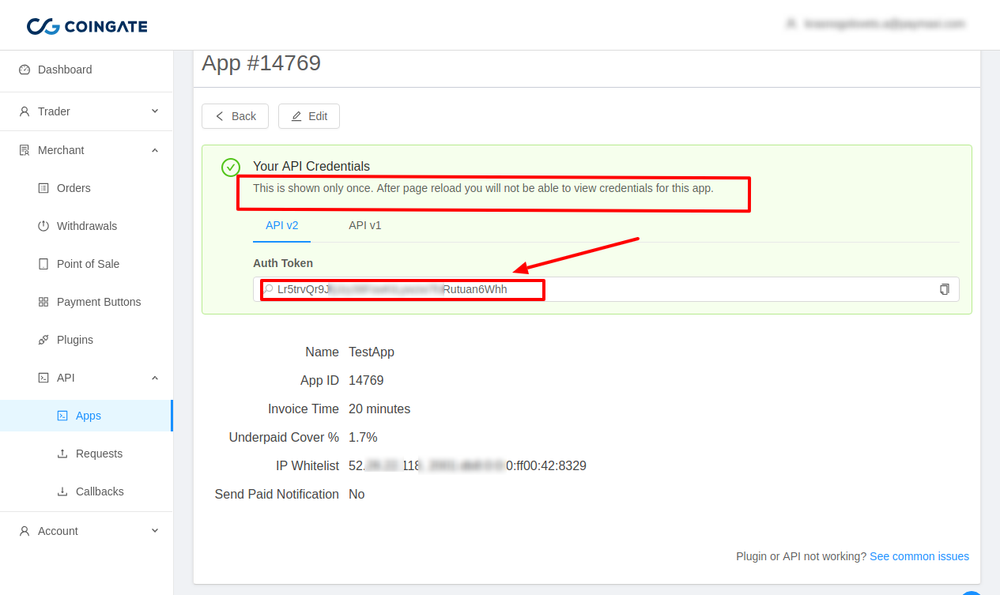
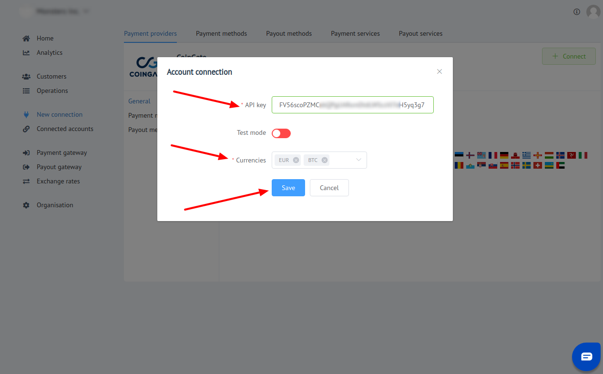

# CoinGate: Connecting account

## Introduction

Here You can find  instructions for setting up <a href="https://coingate.com/account/dashboard" target="_blank" rel="noopener">**CoingGate** account</a>!

## Setup account


#### Step 1: Open Merchant setting

!!! info "Screenshot"
    [](images/coingate-step1.png)

#### Step 2: Create new App
- [x] GO to the API App section
- [x] Press "New App" button

!!! info "Screenshot"
    [](images/coingate-step2_1.png)

#### Step 3: Set up parameters

- [x] Title
- [x] Add all necessary IP adressess to the White list, including  [PayСore.io white-list IP addresses](/ips/#white-list-ip-addresses)   
- [x] Integration URL or Description  as ```https://paycore.io/```

!!! info "Screenshot"
    [](images/coingate-step3.png)

!!! info
    **_Invoice Time_**, **_Max % of Order Amount to Cover_**, **_Underpaid Cover %_**, **_Notification_** parameters are set  at your choice!

 - [x] Confirm creation

!!! success
    You have created the API app!
    
## Connect account

#### Step 1: Copy required credentials

- [x] API key

!!! warning
    Copy the API key straight away after App creation!
    It will be unavailable later!

!!! info "Screenshot"
    [](images/coingate-step4.png)

#### Step 2: Enter credentials

- [x] API key
- [x] Currencies to use

!!! tip
    Press **```Connect```** at CoinGate **```Provider Overview page```** in **```New connection```** section to open Connection form!

!!! tip
    **Don't forget to Save changes to confirm connection!**

!!! info "Screenshot"
    [](images/coingate-step_connect.png)


!!! success
    You have connected **CoinGate**!