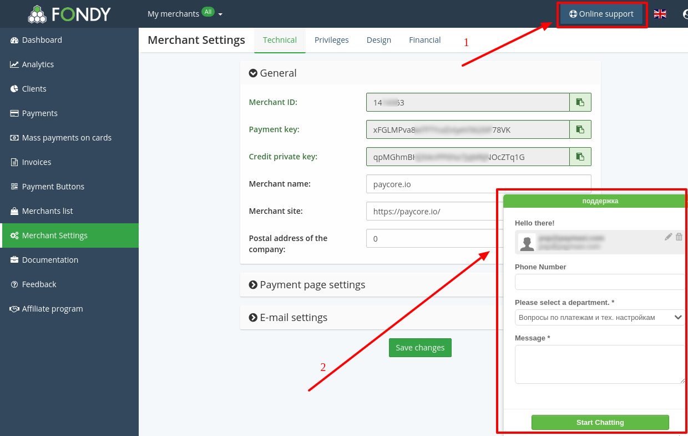
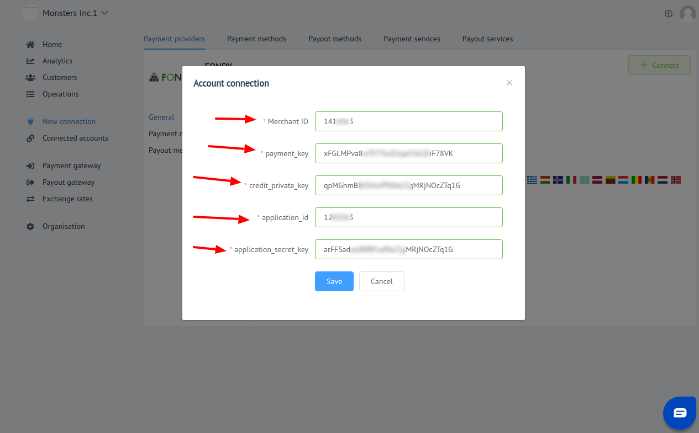

# Fondy: Connecting account

## Introduction

Here You can find  instructions for setting up <a href="https://portal.fondy.eu/" target="_blank" rel="noopener">**Fondy** account</a>!

## Setup account

#### Step 1: Create Merchant

- [x] Go to the Merchant list section
- [x] Press "Add Merchant"
- [x] Set up creation parameters

??? info "Screenshot"
    

#### Step 2: Setup Financial settings

- [x] Go to the Merchant Settings
- [x] Open Financial Settings
- [x] Fill the required data
- [x] Verify documents

??? info "Screenshot"
    

#### Step 3: Get Merchant and Aplication credentials

- **Merchant**: Go to the Technical Settings and find the following fields
    - [x] Merchant ID
    - [x] Payment Key
    - [x] Credit Private Key

??? info "Screenshot"
    

- **Application**
- [x] ID
- [x] Secret key

!!! info 
    Application credentials (**_ID_**, **_Secret key_**) You can get only from **Fondy Technical Support**

??? info "Screenshot"
    

!!! success
    You have configured Merchant!
    
## Connect account

#### Step 1: Copy required credentials
- Merchant data:

    - [x] Merchant ID
    - [x] Payment Key
    - [x] Credit Private Key

- Application data:
    
    - [x] ID
    - [x] Secret Key

#### Step 2: Enter credentials
   
- [x] Merchant ID
- [x] Payment Key
- [x] Credit Private Key
- [x] Application ID
- [x] Application Secret Key

!!! tip
    **Don't forget to Save changes to confirm action!**

??? info "Screenshot"
    

!!! success
    You have connected **Fondy**!