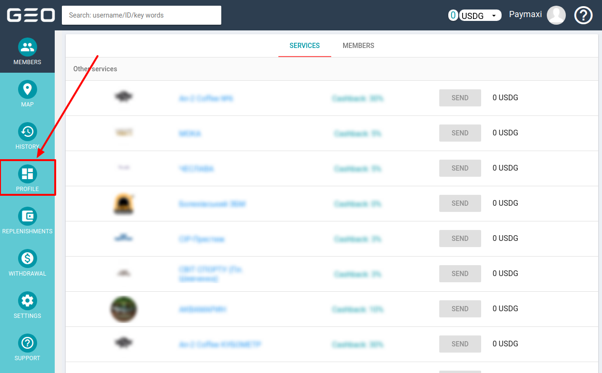
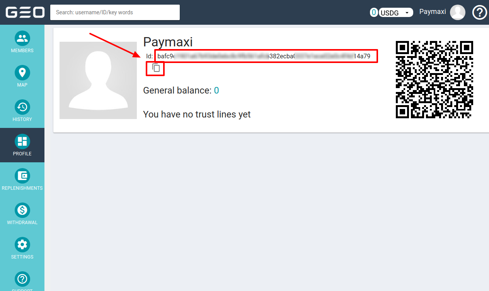

# GeoPay: Connecting account

## Introduction

Here You can find  instructions for setting up <a href="https://geo-pay.net/account/#!/" target="_blank" rel="noopener">**GeoPay**  account</a>!

## Setup account

#### Step 1: Create provider account

#### Step 2: Go to the **Profile** info

??? info "Screenshot"
    [](images/geopay-step1.png)

#### Step 3: Get User (Hash) ID

- [x] User ID (Hash)

??? info "Screenshot"
    [](images/geopay-step2.png)

#### Step 4: Contact with GeoPay manager

!!! info
    This Payment Provoider gives acoount credentials personaly to their merchants!

#### Step 5: Get API Key

- [x] API Key


!!! success
    You are ready to connect!
    
## Connect account

#### Step 1: Copy credentials

#### Step 2: Enter credentials

- [x] User ID (Hash)
- [x] API Key

!!! tip
    Press **```Connect```** at GeoPay **```Provider Overview page```** in **```New connection```** section to open Connection form!

!!! tip
    **Don't forget to Save changes to confirm connection!**

??? info "Screenshot"
    [](images/geopay-step_connect.png)

!!! success
    You have connected **GeoPay**!