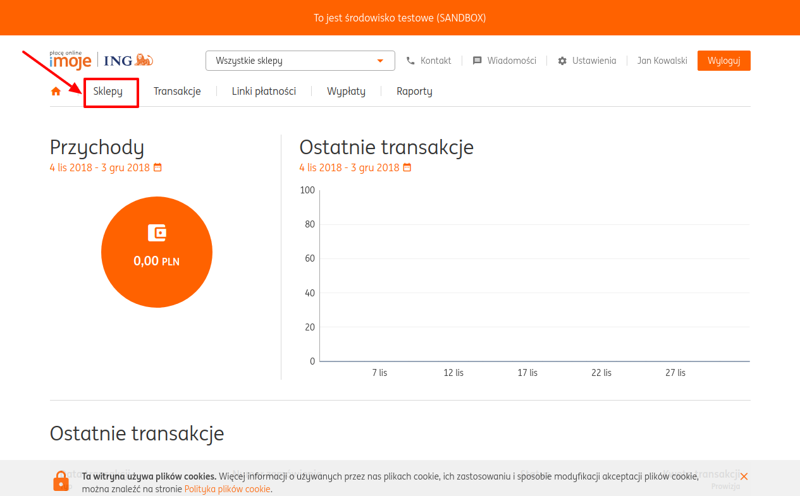
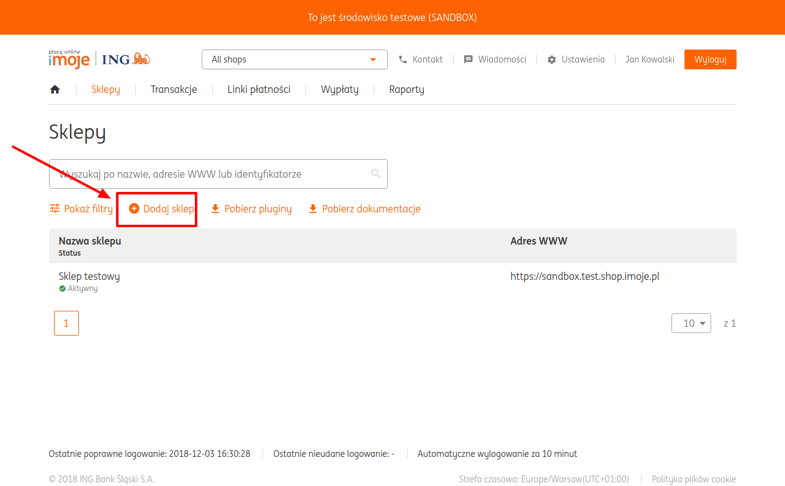
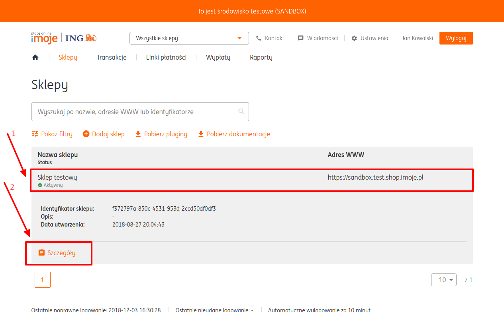

# ING Bank: Connecting account

## Introduction

Please setup **ING Bank** account!

## Setup account

#### Step 1: Create Shop
- [x] Go to the "Shops" (Sklepy) section
- [x] Add new shop (Sklep)

??? info "Screenshots"
    [](images/ingbank-step1_1.png)
    [](images/ingbank-step1_2.png)

#### Step 2: Congigure Your shop

- Return to the "Shops" (Sklepy) section
- Open Shop Details (Szczegóły)

??? info "Screenshot"
    [](images/ingbank-step2_1.png)

- Go to the Integration Data (Dane do integracji) Section
- Set "Notification address"(Adres notyfikacji)
    - [x] ```https://psp-ext.paycore.io/ingbank/callback```

??? info "Screenshots"
    [](images/ingbank-step2_2.png)
    [](images/ingbank-step2_3.png)

#### Step 3: Get required parameters:
- [x] Merchant ID (Identyfikator klienta)
- [x] Service ID (Identyfikator sklepu)
- [x] Store key (Klucz sklepu) 

??? info "Screenshots"
    [](images/ingbank-step3.png)

!!! success
    You are ready to connect!
    
## Connect account

#### Step 1: Copy credentials

- [x] Merchant ID (Identyfikator klienta)
- [x] Service ID (Identyfikator sklepu)
- [x] Store key (Klucz sklepu)

#### Step 2: Enter credentials

- [x] Merchant ID (Identyfikator klienta)
- [x] Service ID (Identyfikator sklepu)
- [x] Store key (Klucz sklepu)

??? info "Screenshot"
    [](images/4bill-step_connect.png)
    
- [x] Save changes

!!! success
    You have connected **ING Bank**!