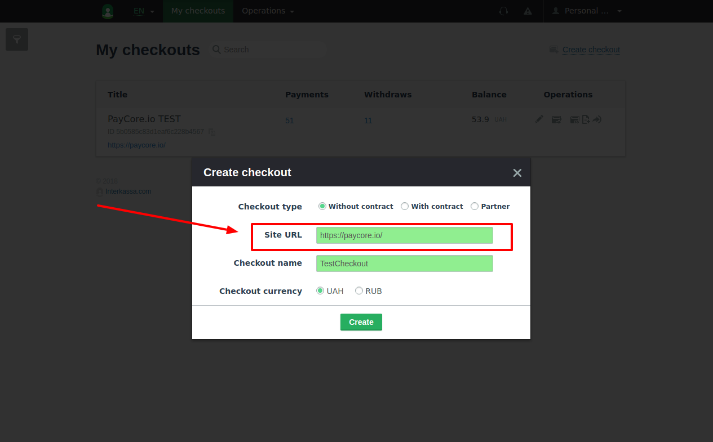
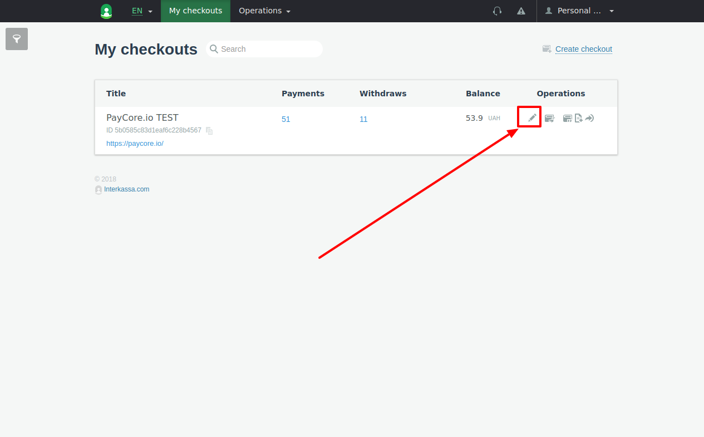
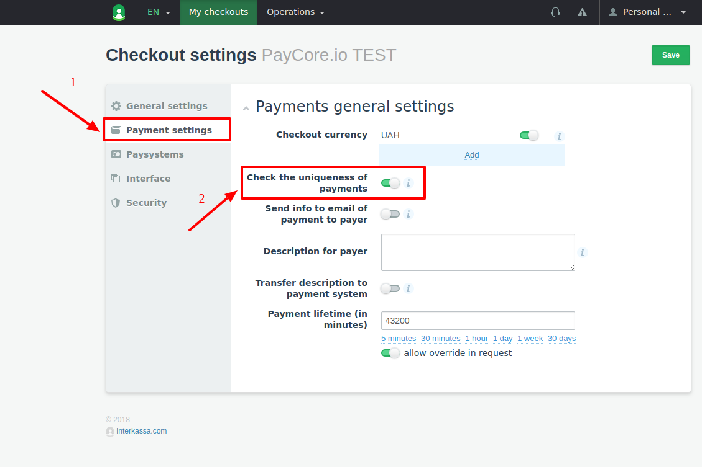
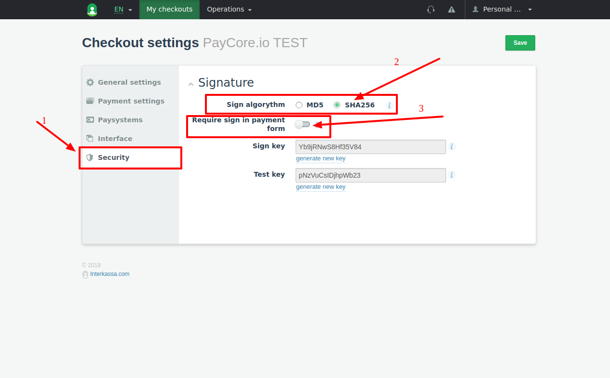
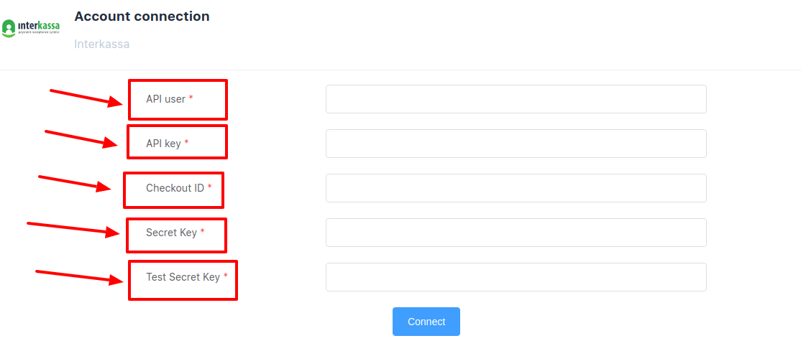

# Interkassa: Connecting account

## Introduction

Here You can find  instructions for setting up <a href="https://www.interkassa.com" target="_blank" rel="noopener">**Interkassa** account</a>!


## Setup account

#### Step 1: Configure API 
- Open "Personal Data Settings"

!!! info "Screenshot"
    [](images/interkassa-step1.png)

- Go to the API section
- Set up parameters:
    - [x] Add all necessary IP adressess to the White list, including  [PayСore.io white-list IP addresses](/ips/#white-list-ip-addresses)
    - [x] "Turn ON" API

!!! info "Screenshot"
    [](images/interkassa-step1_1.png)


 - Get required account parameters:   
   
    - [x] User ID
    - [x] API key 

    !!! note
        You may generate **```New API key```**!
    
    !!! warning
        **Be careful!** Before generating **```New API key```** ensure that **```Existing API key```** is **NOT** used somewhere else.

- Save changes
#### Step 2: Create Checkout

- [x] Ensure You are at **Checkout mode**
    
    !!! info "Screenshot"
        [](images/interkassa-step2.png)

- [x] Create new checkout
    
    !!! info "Screenshot"
        [](images/interkassa-step2_1.png)

- [x] Set up  Site URL as ```https://paycore.io```
      
    !!! info "Screenshot"
        [](images/interkassa-step2_2.png)

#### Step 3: Configure Checkout

- Open **_Checkout Settings_**

    !!! info "Screenshot"
        [](images/interkassa-step3_1.png)

- Go to **_Payment Settings_** and set **Check the uniqueness of payments** to **```Enabled```**
   
    !!! info "Screenshot"
        [](images/interkassa-step3_2_1.png)

- Go to **_Paysystems_** and activate **at least 1** paysystem

    !!! info "Screenshot"
        [](images/interkassa-step3_2.png)

- Go to  **_Interface_** and ensure that  **```allow override in request```** under **```Interaction URL```** option is **```ENABLED```**

- Go to **_Security_** and set up parameters:
    - [x] Sign algorithm only **```SHA256```**
    - [x] Require sign in payment form  **```Enabled```**

    !!! info "Screenshot"
        [](images/interkassa-step3_3.png)

- Get required checkout parameters
    
    - [x] Checkout ID
    - [x] Sign key
    - [x] Test key

    !!! info "Screenshots"
        [](images/interkassa-step3_4.png)
        
        [](images/interkassa-step3_5.png)

!!! success
    You have configured your account!
    
## Connect account

#### Step 1: Copy required credentials

- [x] User ID
- [x] API Key
- [x] Checkout ID
- [x] Sign key
- [x] Test key

#### Step 2: Enter credentials

- [x] User ID
- [x] API Key
- [x] Checkout ID
- [x] Sign key
- [x] Test key

!!! tip
    Press **```Connect```** at Interkassa **```Provider Overview page```** in **```New connection```** section to open Connection form!

!!! tip
    **Don't forget to Save changes to confirm connection!**

!!! info "Screenshot"
    [](images/interkassa-step_connect.png)


!!! success
    You have connected **Interkassa**!