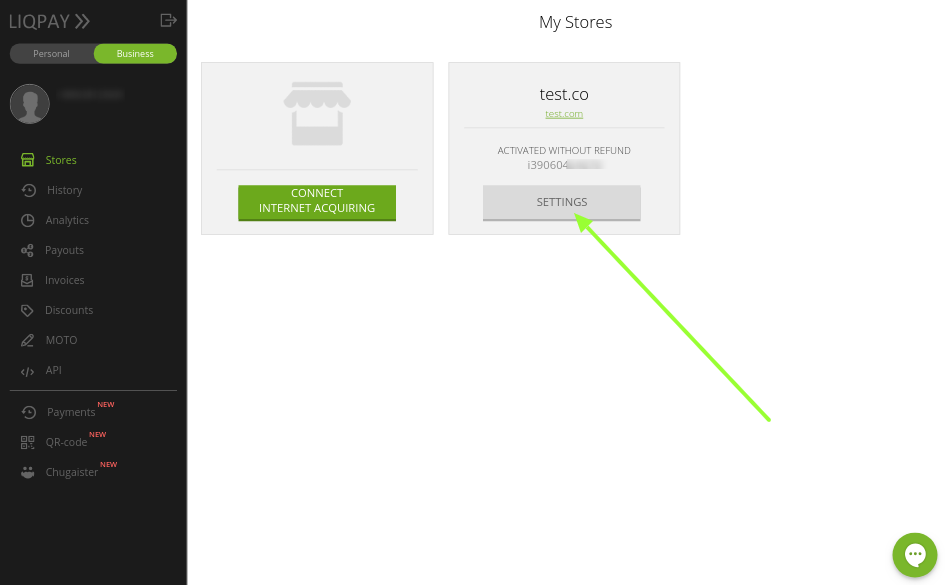
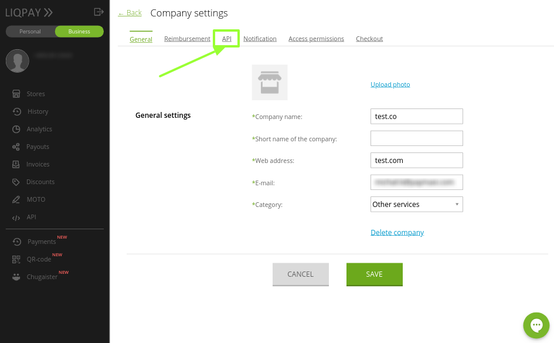
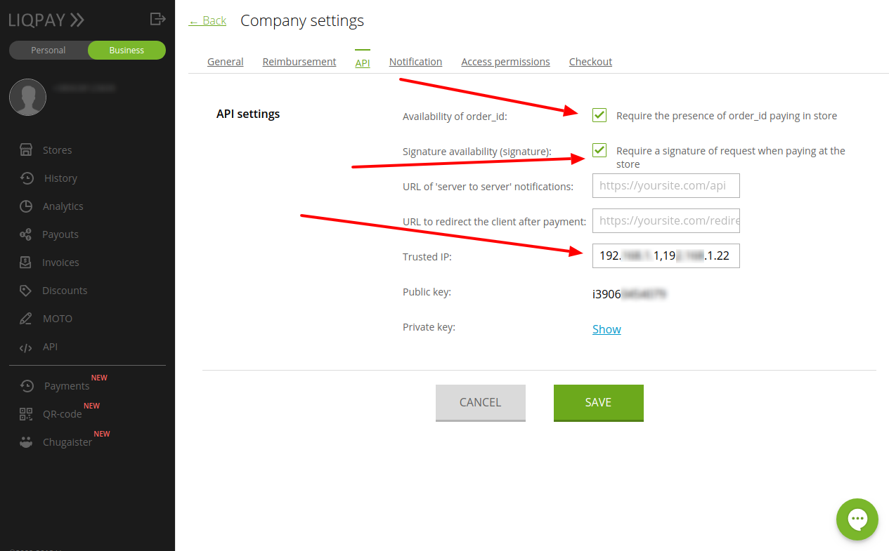
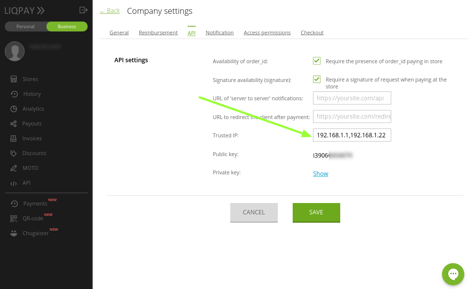
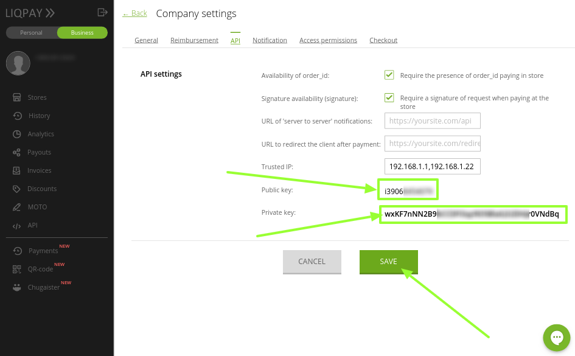
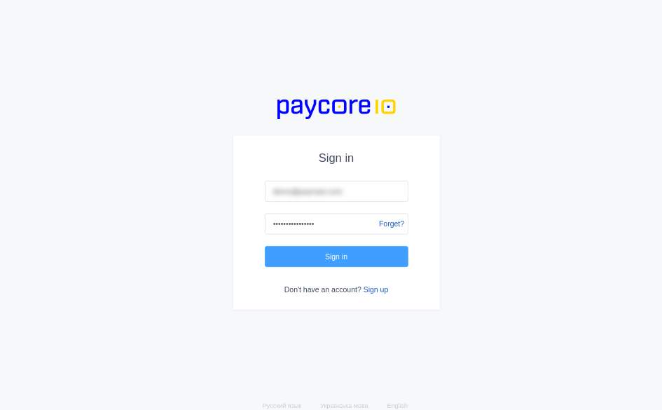
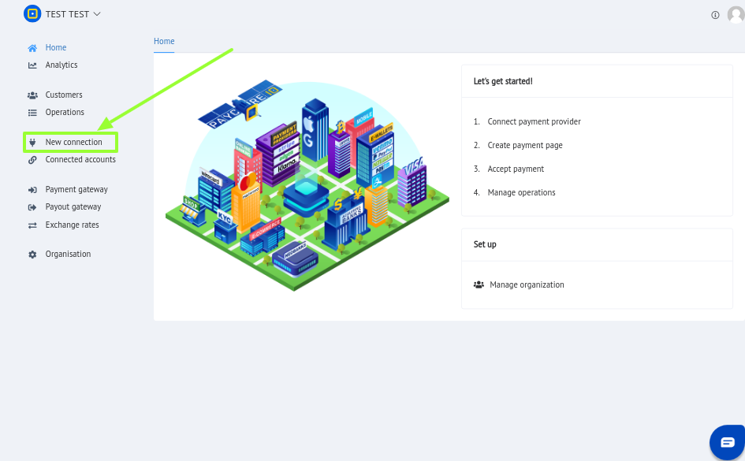
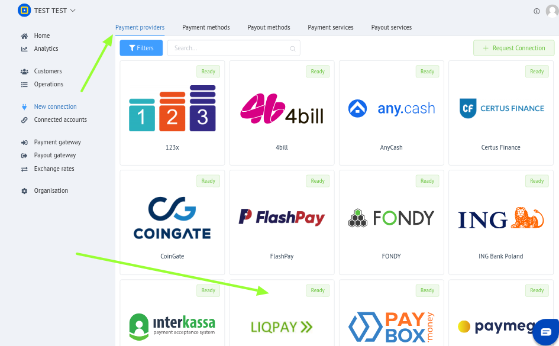
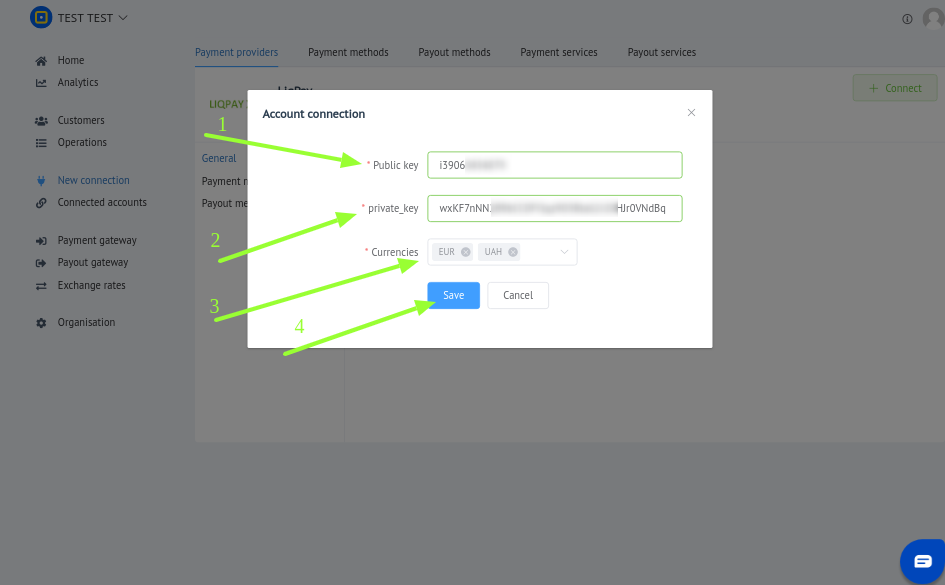

# Liqpay: Connecting merchant account

## Introdution

Please setup Liqpay account in dashboard - 
[https://www.liqpay.ua/](https://www.liqpay.ua/)

## Setup merchant account

### Step 1: Open merchant account settings
[https://www.liqpay.ua/en/admin/business](https://www.liqpay.ua/en/admin/business)

??? info "Screenshot"
    

### Step 2: Go to "API" section

??? info "Screenshot"
    

### Step 3: Set up parameters

- [x] Availability of `order_id`
- [x] Signature availability (signature)
- [x] Add trusted IP's from [PayCore white-list IP addresses](/ips).
- [x] Save settings

??? info "Screenshot"
    
    

### Step 4: Copy credentials

- [x] Copy Public key
- [x] Copy Private key

??? info "Screenshot"
    

## Connect merchant account

### Step 1: Open [PayCore Dashboard](https://dashboard.paycore.io/)

??? info "Screenshot"
    

### Step 2: Go to "New connection"

??? info "Screenshot"
    

### Step 3: Select "Liqpay"

Ensure that You are at "Payment Providers" tab and find LiqPay in the list.

??? info "Screenshot"
    

### Step 4: Open connection form

??? info "Screenshot"
    

### Step 5: Enter credentials

- [x] Choose provider's currencies.
- [x] Save connection changes.

??? info "Screenshot"
    

!!! success
    You have connected LiqPay merchant account!