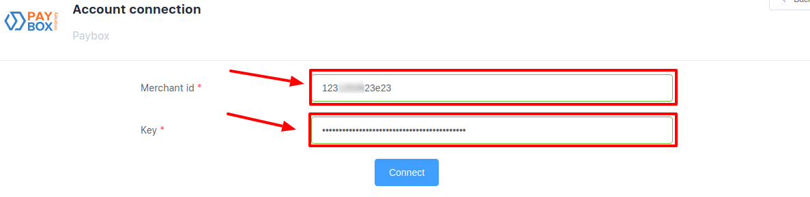

# Paybox: Connecting account

## Introduction

Please setup Paybox account in dashboard - 
[https://my.paybox.money/](https://my.paybox.money/)

## Setup account

#### Step 1: Connect to PayPox 

- [x] Submit a questionnaire
- [x] Verify your documents

#### Step 2: Open Settings

??? info "Screenshot"
    [](images/paybox-step1.png)

#### Step 3: Go to Merchant section (My markets)

??? info "Screenshot"
    [](images/paybox-step3.png)


#### Step 4: Configure your merchant

- Set up parameters:
    - [x] General merchant info
    - [x] Secret keys
        - For Payout

    ??? info "Screenshot"
        [](images/paybox-step4.png)

    - [x] URLs
        - RESULT URL    ```https://psp-ext.paycore.io/paybox/return```
        - SUCCESS ```https://psp-ext.paycore.io/paybox/callback```
        - FAILURE URL ```https://psp-ext.paycore.io/paybox/callback```
        
    - [x] REQUEST METHOD ```POST```
    
    ??? info "Screenshot"
        [](images/paybox-step5.png)

!!! success
    You have configured your account!
    
## Connect account

#### Step 1: Copy required credentials

- [x] Merchant ID
- [x] Secret key (_for payout_)

#### Step 2: Enter credentials

- [x] Merchant ID
- [x] Secret key (_for payout_)

!!! tip
    **Don't forget to Save changes to confirm action!**

??? info "Screenshot"
    [](images/paybox-step_connect.png)


!!! success
    You have connected **Paybox**!