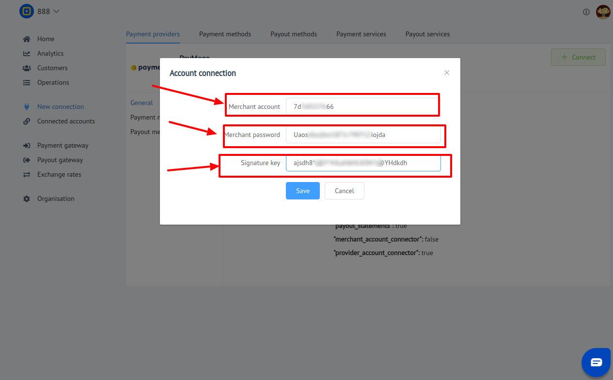

# PayMega: Connecting account

## Introduction

Here You can find  instructions for setting up **Paymega**  account!

## Setup account

#### Step 1: Contact with PayMega Support Manager

#### Step 2: Get required credentials

- [x]  Merchant account ID
- [x]  Merchant password
- [x]  Signature key

!!! success
    You have configured account!
    
## Connect account

#### Step 1: Copy required credentials

- [x]  Merchant account ID
- [x]  Merchant password
- [x]  Signature key

#### Step 2: Enter credentials

- [x]  Merchant account ID
- [x]  Merchant password
- [x]  Signature key

!!! tip
    Press **```Connect```** at PayMega **```Provider Overview page```** in **```New connection```** section to open Connection form!

!!! tip
    **Don't forget to Save changes to confirm connection!**

??? info "Screenshot"
    [](images/paymega-step_connect.png)


!!! success
    You have connected **PayMega**!