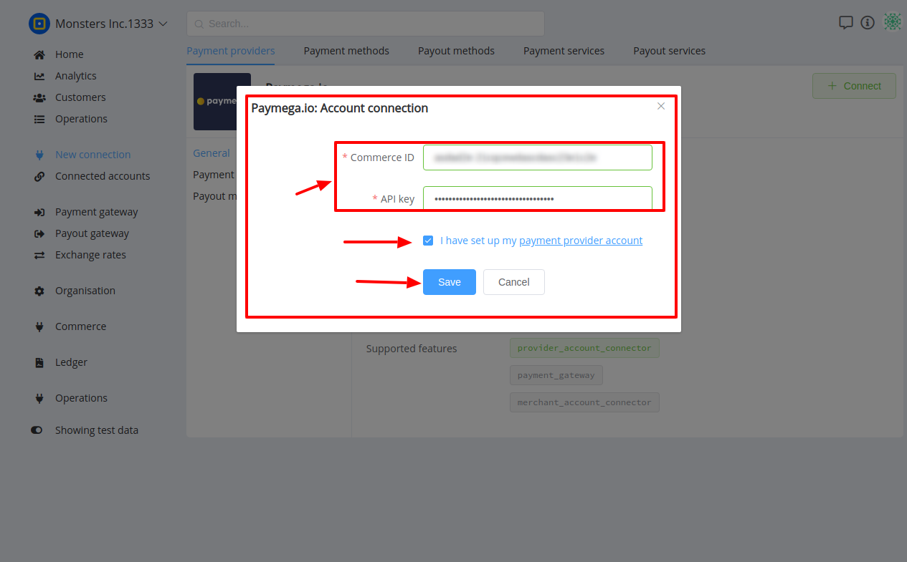

# PayMega.io: Connecting account

## Introduction

Here You can find  instructions for setting up **PayMega.io**  account.

## Setup account

#### Step 1  Contact with PayMega.io Support Manager


#### Step 2: Get required credentials

- [x] Commerce ID
- [x] API key
 

!!! success
    You have configured account!


## Connect account

#### Step 1: Copy required credentials

- [x] Commerce ID
- [x] API key

#### Step 2: Enter credentials


!!! tip
    Press **```Connect```** at PayMega.io **```Provider Overview page```** in **```New connection```** section to open Connection form!


!!! tip
    **Don't forget to Save changes to confirm connection!**

!!! info "Screenshot"
    [](images/paymegaio-step_connect.png)


!!! success
    You have connected **PayMega.io**!