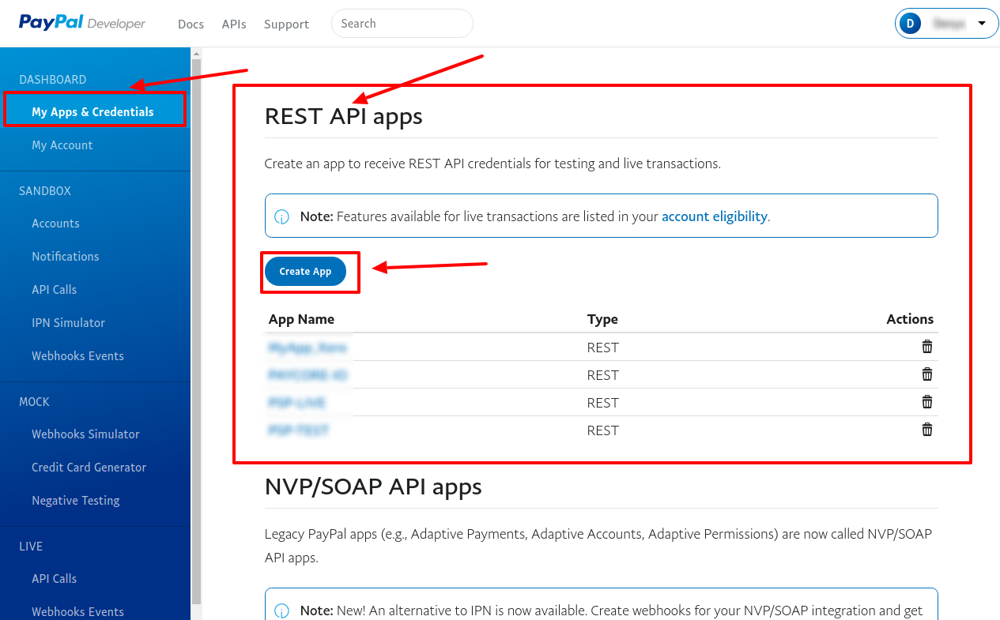
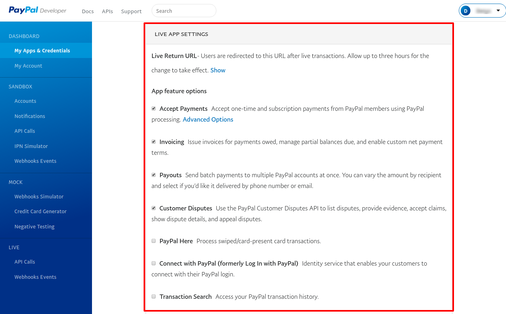
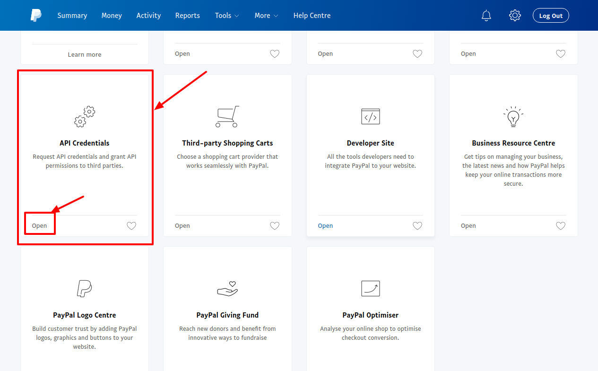
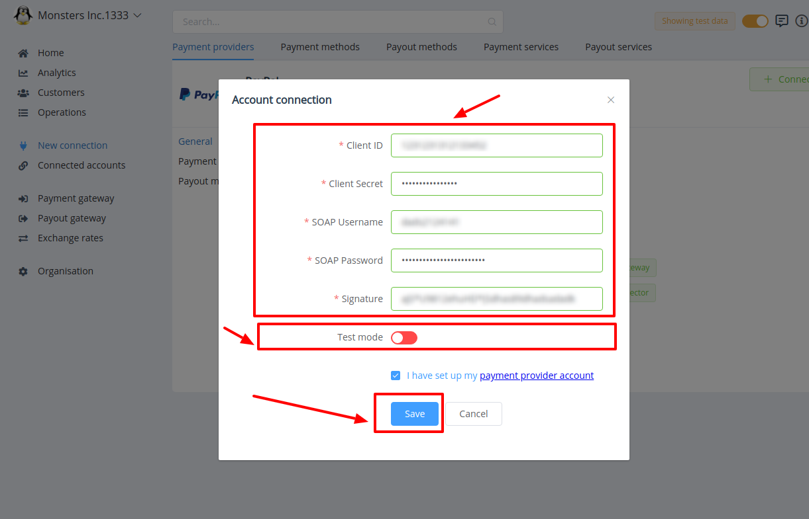

# PayPal: Connecting account

## Introduction

Here You can find  instructions for setting up <a href="https://developer.paypal.com/" target="_blank" rel="noopener"> **PayPal** account</a>.

## Setup account

#### Step 1: Create App

!!! info
     Skip this step if You have already configured it.

- Go to the **```REST API apps```** section
- Press **```Create App```**
- Set **```App Name```** 
- Choose **```Sandbox developer account```**

!!! tip
    Don't forget to confirm creation!


??? info "Screenshots"
    [](images/createapp1.png)

    [](images/createapp2.png)

!!! Note
    You will be automaticaly redirected to Created app!

#### Step 2: Get App credentials

- [x] Client ID
- [x] Client Secret

??? info "Screenshot"
    [](images/appcred1.png)

!!! warning
    Ensure that **```Mode Switcher```** has **```Live```** state, if you want to connect **```Live```** account!
    
!!! tip
    You can find **```Mode Switcher```** on the upper right.


#### Step 3: Set Up App settings
- Go to the  **```LIVE APP SETTINGS```**
- Set the necessary parameters

!!! note
    If **```Mode Switcher```** has **```Sanbox```** state - this section has **```SANDBOX APP SETTINGS```** title!

!!! tip
    Don't forget to confirm action!

??? info "Screenshots"
    [](images/setup1.png)


#### Step 4: Get Account credentials

Besides App credentials You also need:

- [x] SOAP Username
- [x] SOAP Password
- [x] Signature


To get them - folow this flow:

1. Log In at  <a href="https://paypal.com/" target="_blank" rel="noopener">  **PayPal.com**</a> 
2. Open **```Tools```** -> **```All Tools```** 
    
    !!! tip
        You can find this on the **```Navigation bar```**

3. Find  and Open **```API Credentials```**

5. Go to the **```NVP/SOAP API integration (classic)```** section
6. Press **```Manage API Credentials```**

- Find:
    - [x] SOAP Username
    - [x] SOAP Password
    - [x] Signature

??? info "Screenshots"
    [](images/acc-cred1.png)

    [](images/acc-cred2.png)

    [](images/acc-cred3.png)

    [](images/acc-cred4.png)

!!! success
    You have configured account!

## Connect account

#### Step 1: Copy required credentials

- [x] Client ID
- [x] Client Secret
- [x] SOAP Username
- [x] SOAP Password
- [x] Signature

#### Step 2: Enter credentials

!!! tip
    Press **```Connect```** at PayPal **```Provider Overview page```** in **```New connection```** section to open Connection form!

#### Step 3: Set additional parameters

- [x] Test mode

!!! info
    **```Test mode```** is set **_according to your PayPal account settings_**!

!!! tip
    **Don't forget to Save changes to confirm connection!**

??? info "Screenshot"
    [](images/paypal-step_connect.png)


!!! success
    You have connected **PayPal**!