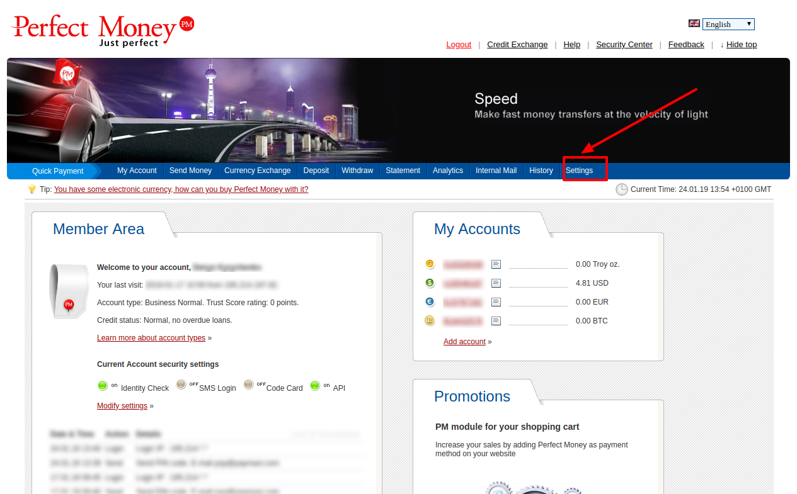
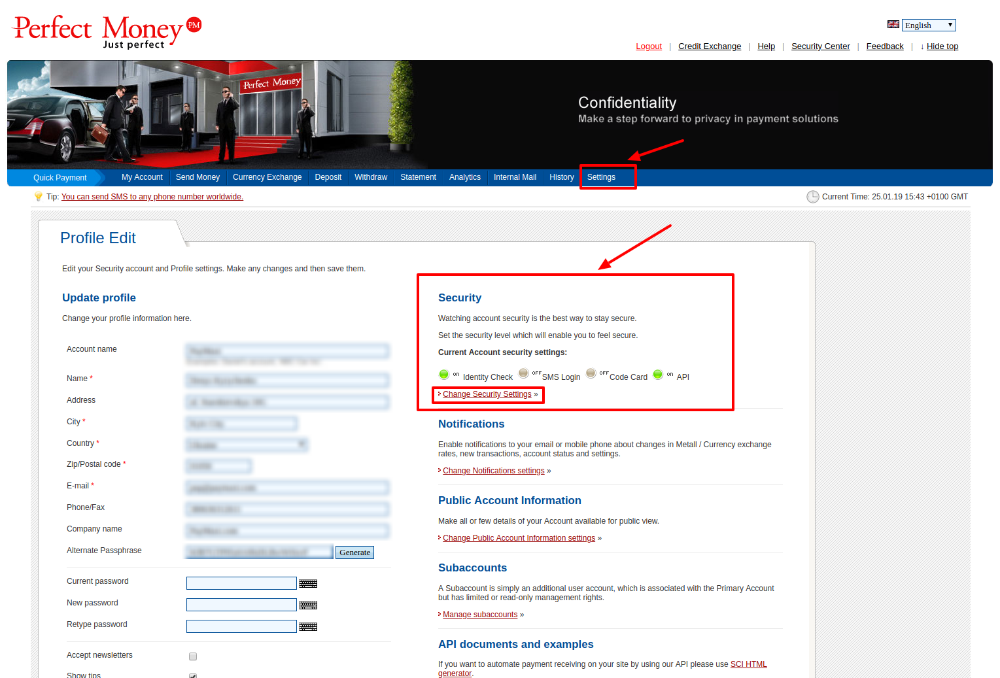
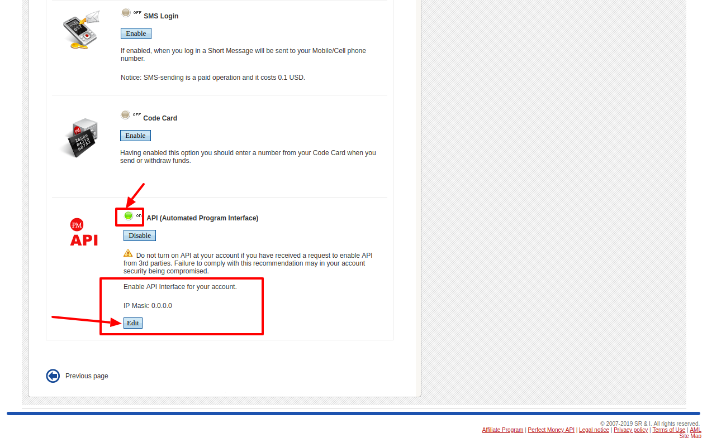
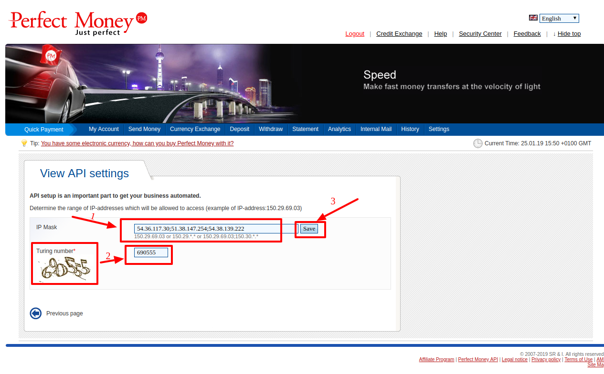
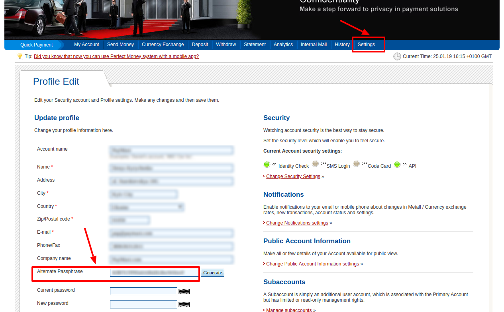
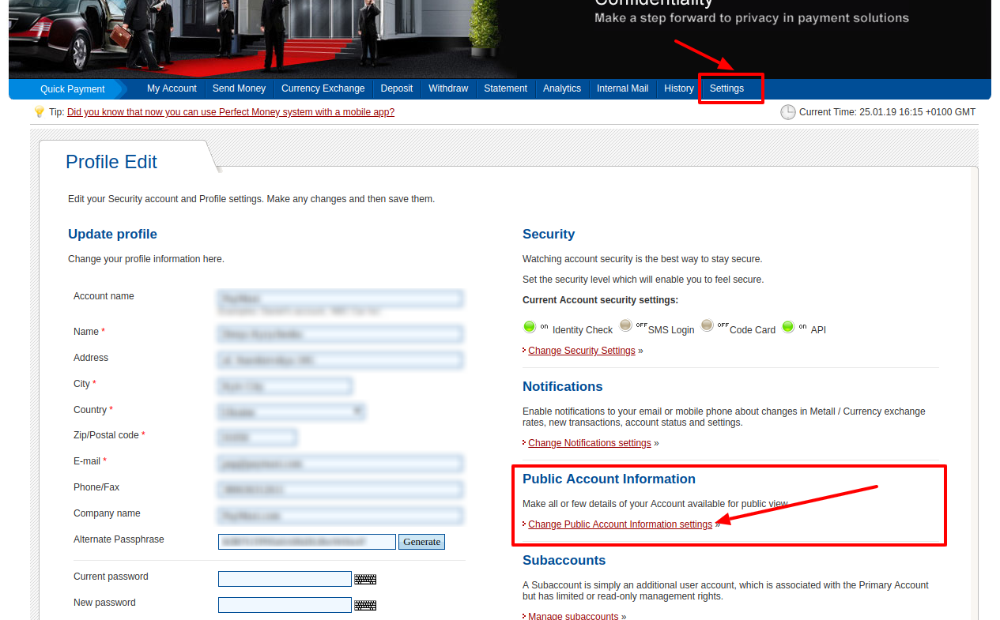
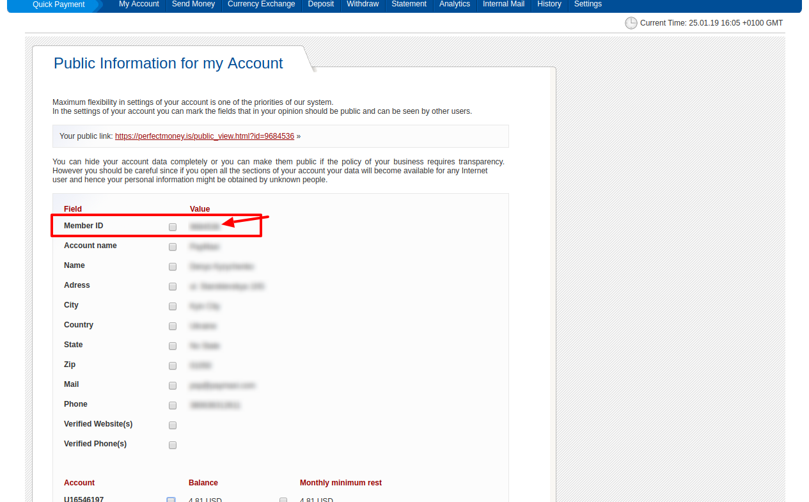

# PerfectMoney: Connecting account

## Introduction

Here You can find  instructions for setting up <a href="https://perfectmoney.is/login.html" target="_blank" rel="noopener"> **PerfectMoney** account</a>.

## Setup account


### Step 1: Open Commerce setting

??? info "Screenshot"
    [](images/perfmoney-verify1.png)

### Step 2: Verify your business account

??? info "Screenshots"
    [](images/perfmoney-verify2.png)

    [](images/perfmoney-verify3.png)

!!! tip
    You just need to verify **all documents** and **additional info**, which is necessary for successful setting up an account!

### Step 3: Set up API access

- Go to the **```Settings```**
- Find **```Security```**  section
- Enable **```API access```**
- Add all necessary IP adressess to the White list, including  [PayСore.io white-list IP addresses](/ips/#white-list-ip-addresses)
    
    !!! tip
        IP list should contains IP adresses separated with **```;```**.

        **_For example_**: _54.36.117.30; 51.38.147.254; 54.38.139.222_

??? info "Screenshots"
    [](images/api_security1.png)

    [](images/api_security2.png)

    [](images/api_security3.png)

    [](images/api_security4.png)

### Step 3: Get required credentials

- Return to the Settings

- Find and copy next credential:

    - [x] Alternate Passphrase

??? info "Screenshot"
    [](images/cred3.png)

- Go to the **```Public Account Information```**

- Press **```Change Public Account Information settings```**

- Find and copy next credential:

    - [x] Client ID

??? info "Screenshot"
    [](images/cred1.png)

    [](images/cred2.png)
 
## Connect account

### Step 1: Copy required credentials

- [x] Client ID

- [x] Alternate Passphrase

### Step 2: Enter credentials

!!! tip
    Press **```Connect```** at PerfectMoney **```Provider Overview page```** in **```New connection```** section to open Connection form!


!!! tip
    **Don't forget to Save changes to confirm connection!**

??? info "Screenshot"
    [](images/perfectmoney-step_connect.png)


!!! success
    You have connected **PerfectMoney**!