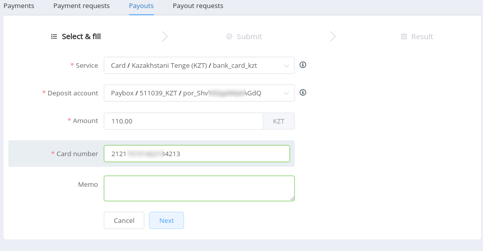
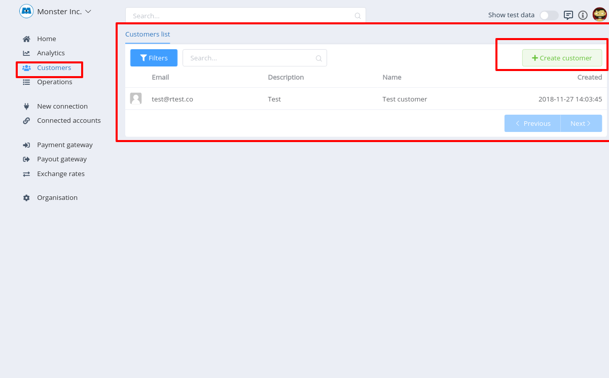

# Dashboard

## Overview

The [PayCore.io Dashboard](https://dashboard.paycore.io/) is a feature-rich user interface for you to operate and configure your PayCore.io account. You can use it to manage payments and payouts, respond to incidents, monitor your integration, and more.

The Dashboard home page provides useful at-a-glance information about the activity on your account. A wide range of analytics and real-time charts provide insight into the performance of your business. The Dashboard also shows recent activity that may require you to take action, such as unanswered disputes or identity verifications.

## Basic structure

Generally Dashboard consists of the next parts:

- Navigation menu
- Working space
- Header

!!! info "Basic structure"
    

!!! info "Navigation menu"
    

!!! info "Working space"
    

!!! info "Header"
    

## General facilities

Using **_PayCore.io Dashboard_**  you can:

- [x] Manage your organisations and it's preferences
    - invite and manage team members
    - control access rights
    - set security preferences
    

- [x] Connect [Payment Providers](/connectors) (Provider or Merchant accounts) 
   
    !!! note
        Before connecting an acoount - ensure it is **`implemented`** to PayСore.

- [x] Manage your [Connected Accounts](../../products/provider-hub/overview)

- [x] Create and manage Customers

- [x] Manage Operations
    - [Payments](../../products/payment-gateway/payments)
    - [Payment Requests](../../products/payment-gateway/payment-requests)
    - [Payouts](../../products/payout-gateway/payouts)
    - [Payout Requests](../../products/payout-gateway/payout-requests)

    
- [x] Create and  set up [Payment Pages](../../products/payment-gateway/payment-pages)  and [Payout points](../../products/payout-gateway/payout-points)
- [x] Create [Rate schemes](../../products/currency-rates/overview) for your operations
- [x] Generate and visualize [Analytics](../../products/analytics/overview) reports

!!! info "Note"
    If You have any questions, suggestions or comments, please, contat Us  through [**PayСore.io Service Desk**](https://support.paycore.io/)
    
    