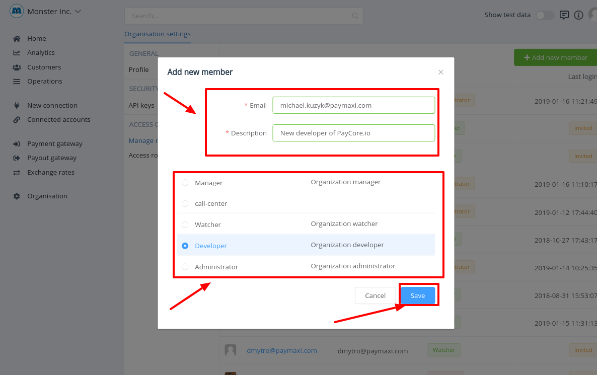
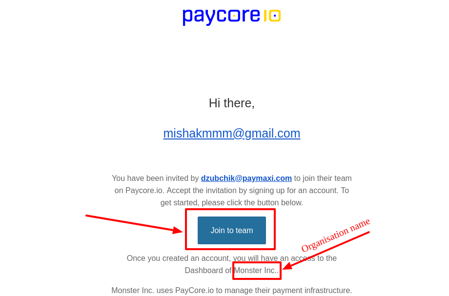
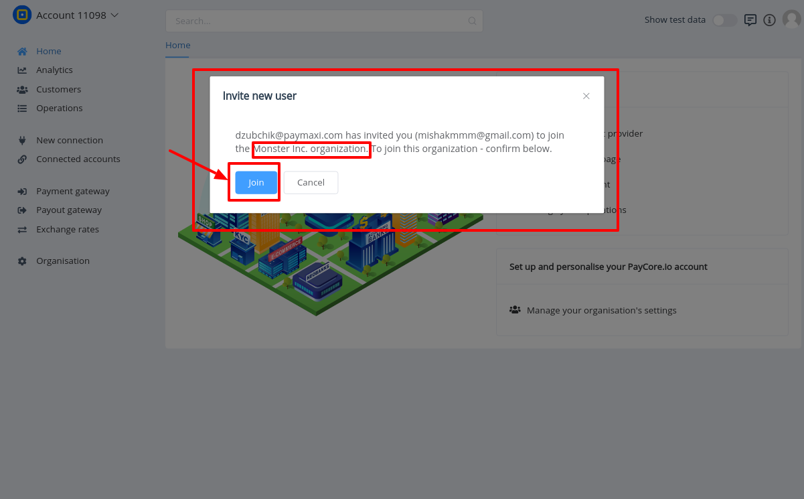
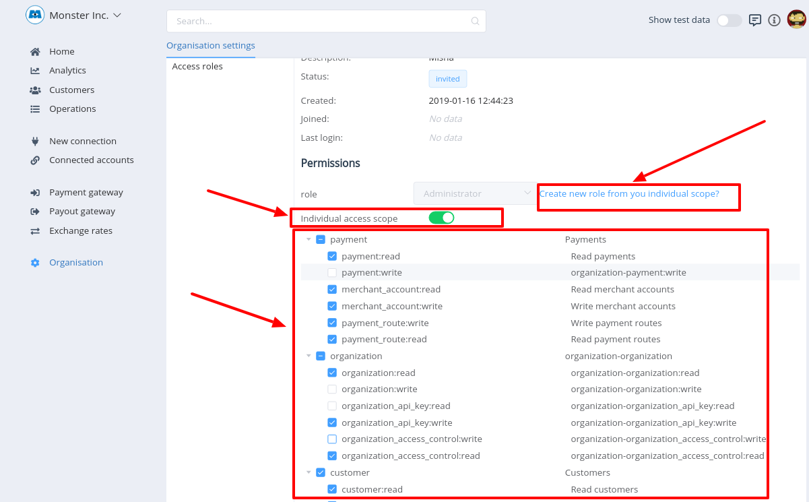
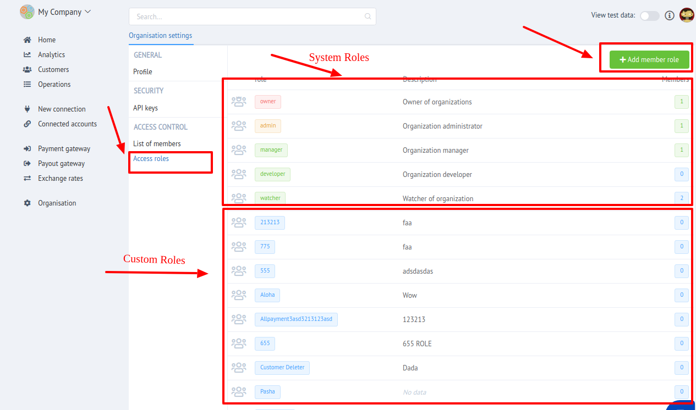

# Access Control

"Access control" is intended to delimit User access to different Dashboard sections  through User Roles assignment.

{{custom.company_name}} implements multi-user access, which allows one user to use several independent organization accounts and switch between them.

It is divided into **2 parts**:

- Members management
- Role Access management 

## Members management

Here you can manage your organisation team:

- [x] Invite new member

    !!! info
        You can invite both registered and unregistered users to become a new member of your organisation. 
        
        User will recieve an invitation to email with **`Join`** button. Join confirmation after sign in is required.
        After join accepting it will be automatically swiched to joined organisation!
   

- [x] Modify member

    - Assign Role to member

        !!! info
            Inviting of new member requires the role choosing. You can change invited member's role at the Member Overview page.

            It is **impossible** to set **`Owner`** role to members. Organisation's owner need to migrate it himself.

    - Set up and Change Individual access scope (Permission set) for each member

        !!! info
            If want to set different permissions for several members with the same role - You can set **`Individuall access scope`** for each of them.
    
            You can create **`New role`** based on individuial access scope!

    - Perform actions
    
        _For **`invited`** members_

        - Revoke invite
        - Resend invite

        _For **`active`** members_
    
        - Deactivate
        - Activate
        - Archive

User access to the organisation is primarily determined  by the status of a team member related to this user.

|    **ID**    | **Name** |
|:------------:|----------|
|  `invited` | The invited member  has no access to the organisation until he independently activates it through the mechanism of confirmation. When you try to enter the organisation, you will be redirected to the confirmation screen. A member can be deleted only in `invited` state using **_"Revoke invite"_** action. |
|  `active`  | Active user, team member |
| `inactive` | Inactive team member, does not have access to the organisation. When try to access,you will be shown an error screen with message - "No access rights. Contact your organisation administrator." |
| `archived` | Archived inactive team member. Not displayed in the management list of the team and its directory. |

!!! warning
    Inactive team member, does not have access to the organisation. 

    When try to access, you will be shown an error screen with message - _"No access rights. Contact your organisation administrator."_

## Role Access management 

In this section You can manage Access roles in current organisation!

!!! warning 
    Take stock, that You **can NOT** **`Modify`** or **`Delete`**  System Roles! 
    
### System roles

| **ID** | **Name** | **Description** |
|:------:|:--------:|-----------------|
| `owner` | Owner of organisation | **Only 1 member** of the team can have this role! The user with this role cannot be removed from the command. This role can be transferred to other team members by lowering the rights to the admin role. |
| `administrator` | Organisation administrator | Full access to the organisation, including the ability to manage access and team members (cannot delete a user with role **`owner`**). |
| `manager` | Organisation manager | Full read and write access, without the ability to manage **organisation** and **technical aspects**: _set up integrations, webhook, see keys, regenerate them, etc._ |
| `developer` | Organisation developer | Full read and write access, without the ability to manage **organisation** and **business aspects**: _re-wire payments, edit customers, organization data, etc._ |
| `viewer` | Watcher of  organisation | **Only read** access  of all data, except **"sensitive data"**, such as: _keys, webhook URL, integration, etc._ |

Here you can manage your organisation roles and their access scope:

- [x] Create New Role
- [x] Edit name and description of exsising roles
- [x] Set up permission set (access scope) _(Custom roles only)_
- [x] Delete out-of-use access roles _(Custom roles only)_
    
    !!! warning
        You can Delete **only if It has NO members assigned to**!

