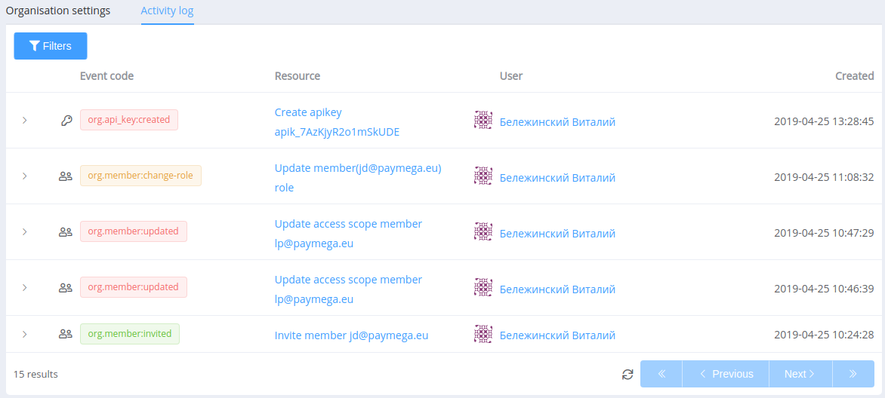

# Activity Log

## Overview

Protecting data, preserving privacy, and complying with regulations such as the  [General Data Protection Regulation](https://en.wikipedia.org/wiki/General_Data_Protection_Regulation)  are certainly some of the highest priorities for your business. It's critical that you audit the entirety of data processing actions taking place to be able to analyze for possible security breaches.

Also, this allows you to put a check and balance system in place so when things go out of control, you can figure out what went wrong, who did it, and how to fix it.

## Why Log User Activities?

Obviously you trust users that is why you have given them access to do certain things on your organization. However, people make mistakes all the time. If you knew who made a mistake and what they did wrong, then you can quickly correct it and also teach the user how to avoid this mistake in the future. For example, if a moderator approved a comment that doesn’t fit your comment guidelines, then you can quickly correct their mistake, notify them and it will save you time in the future.

It also allows you to get better editorial control of your organization. You can see which resources were modified and which payments/payouts were manually processed. Which users accessed the organization and the tasks they performed upon arrival.

## What's logged?

A list of what's logged with Activity Logging.

| Event code                           | Description                                     |
|--------------------------------------|-------------------------------------------------|
| org:created                          | New organisation created                        |
| org.profile:updated                  | Organisation profile updated                    |
| org.member:invited                   | Team member invited                             |
| org.member:joined                    | Team member joined                              |
| org.member:declined                  | Team member declined                            |
| org.member:updated                   | Team member updated                             |
| org.member:deactivated               | Team member deactivated                         |
| org.member:activated                 | Team member activated                           |
| org.api_key:created                  | API key created                                 |
| org.api_key:updated                  | API key updated                                 |
| deposit_account:created              | Deposit account created                         |
| deposit_account:updated              | Deposit account updated                         |
| provider_account:created             | Provider account created                        |
| provider_account:updated             | Provider account updated                        |
| merchant_account:created             | Merchant account created                        |
| merchant_account:updated             | Merchant account updated                        |
| payment_route:updated                | Payment route "{name}" updated                  |
| payment_routing_scheme:created       | Payment routing scheme created                  |
| payment_routing_scheme:updated       | Payment routing scheme updated                  |
| payout_route:updated                 | Payout route updated                            |
| payout_routing_scheme:created        | Payout routing scheme created                   |
| payout_routing_scheme:updated        | Payout routing scheme updated                   |
| fx_rate_scheme:created               | FX rate scheme created                          |
| fx_rate_scheme:updated               | FX rate scheme updated                          |
| com.scheme:created                   | Commerce scheme created                         |
| com.scheme:updated                   | Commerce scheme updated                         |
| com.scheme_payment_service:updated   | Commerce scheme payment service updated         |
| com.scheme_payout_service:updated    | Commerce scheme payout service updated          |
| com.account:created                  | Commerce account created                        |
| com.account:updated                  | Commerce account updated                        |