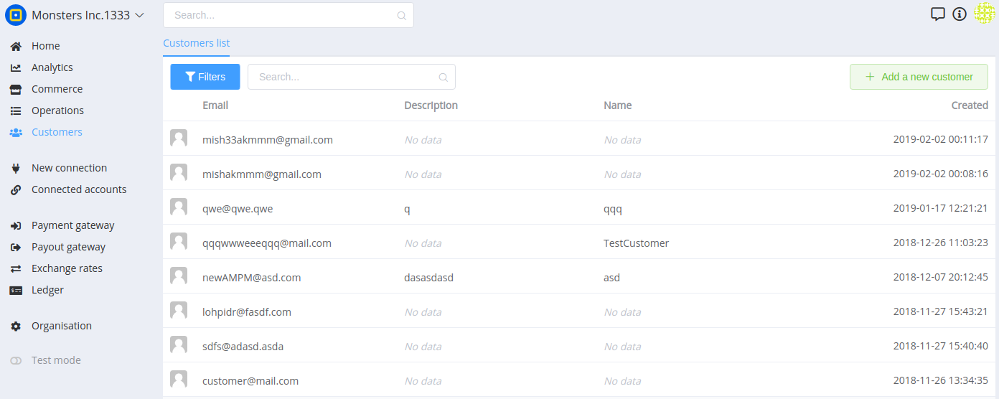

# Customers

## Introduction

Customers contain data related to your customers. You can store their name, email and address, but there’s also a metadata field that can be used to store additional data if needed.

## Customer Subscriptions

Customers are the basis for your subscriptions. They work seamlessly in conjunction with subscriptions. Under the hood, its the customer entry which contains vital information about a subscription, such as – credit card information and email address. PayCore.io uses the information stored in the customer record to create a subscription.

A customer may subscribe to several products. In this case, there will be one customer entry that will display multiple subscriptions, when the same exact customer entry is used across many subscriptions.

It’s important to note that under normal circumstances you won’t need to add a customer directly to this area. Additionally, you can search through your customers via email, organization and reference.

Other attributes such as  tax exempt status  and VAT numbers are included in the customer entry in PayCore.io, as well.

Please continue on to the next section to learn more about working with customer entries and how to edit them correctly.

## Managing Customers

The  **Customers** page contains the Customer Grid which provides you details about all your customers including: ID, Reference ID, Company, Name, Status.

There is a Search and Advanced Search option to help locate specific customers.

You can click on the ID, to drill down into a specific customer.

You can export your Customer list by using the **PayCore.io Analytics**.