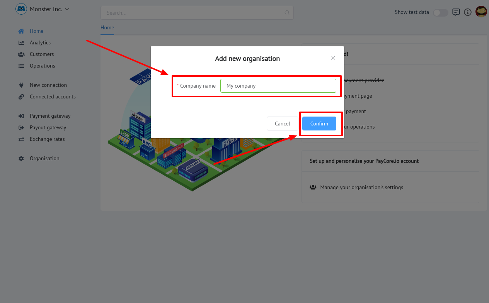
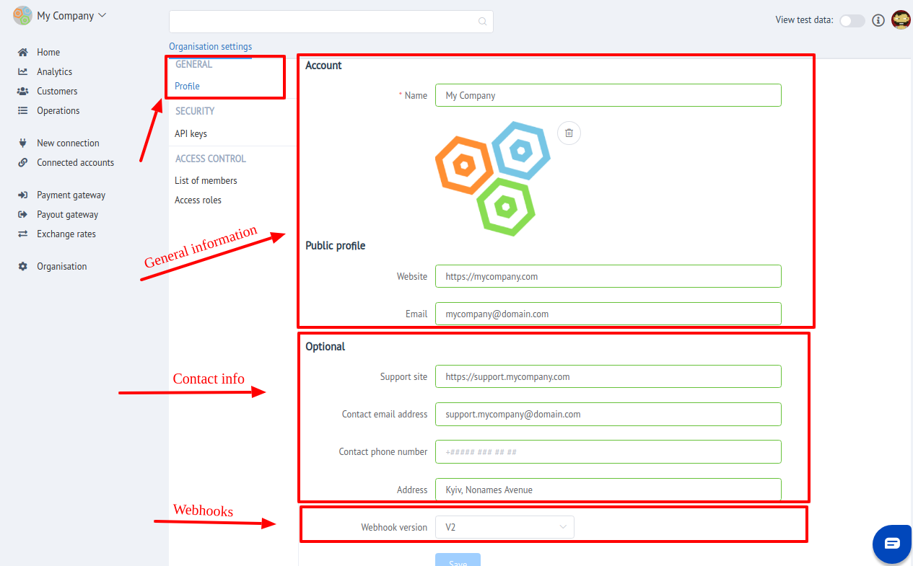

# Organization Account

## Introduction

A  **organization**  in PayCore.io can be visualized as a container that holds all the customer information, payment provider accounts, payment & payout data, reports and associated configurations. It's the heart of a PayCore.io account and the way it is built and configured determines how your customers are paid, charged and communicated with. The kind of access privileges you have on a organization depend on the kind of  **role**  you have as a organization  **member**. You can learn more about organization member roles  [here](/account/assess-control/). The top-left corner in PayCore.io shows the organization you are working in and allows you to switch to any other one you may have access to.

## Organisation settings

In these cases "Organisation settings" is structurally divided into 3 sections:

1. [General](general)

2. [Security](security)

3. [Access control](access)

You can **`Create`** your own organisation or become a member of **`Existing`** one.

## Join
To become a member of existing organisation - you need to be invited  by organisations's admininistrator, owner or another member with such permissions.

After invitaion you will recieve an email with link and invite token. 

Go to this link. You will be redirected to the confirmation page and asked to create password for your user account.

!!! info 
    If you are an active member in another organisation  - just **`Sign in `**  and an confirmation modal window will appear with **`TWO`** actions:
    
    - Confirm (Join)
    - Reject (Cancel)

## Create

You can create your own organisation in  **`TWO`** ways.

**`First way`**: you need to **`Sign up`** in [PayCore.io](https://dashboard.paycore.io/register).

After Signing up new organisation will be created automticaly.

**`Second way`**: If you have an existing account - **`Sign in `** and use Organisation adding mechanism.

- Open Organisation list
- Press **`Add new organisation`**
- Set organisation name
- Confirm creation

!!! tip    
    To switch current organisation manualy - just choose it in organisation list!

## General settings
In "General" section You can:

- [x] Change Organisation Name
- [x] Upload Organisation Logo image
- [x] Set up it's Public profile and Contact info
- [x] Set Webhook version  
    
    !!! info
       Read more about [**Webhooks**](../../webhooks/)

!!! tip
    **Don't forget to Save changes to confirm your choice!**

    