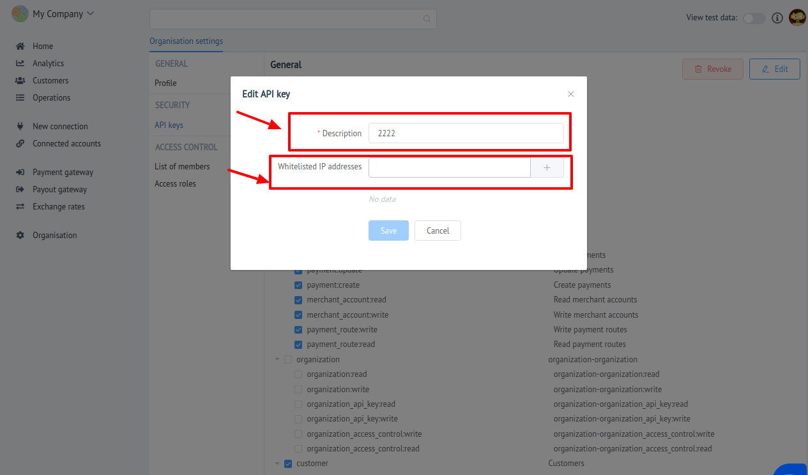
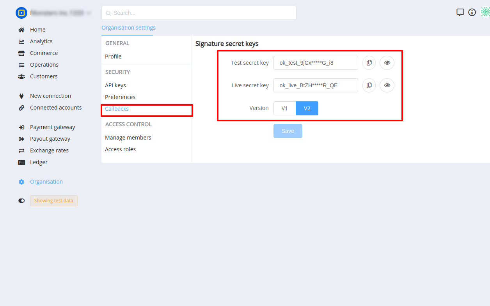

# Security

Security section is intended for:

- manage organisation API keys
- control organisation access keys
- setting up preferences
- callbacks configuration

## API Keys

Here You can:

- [x] Create new API keys 
- [x] Configure IP Whitelist
- [x] Change permission set of existing keys
- [x] Revoke deprecated keys

!!! tip
    **Don't forget to Save changes to confirm your choice!**

As a result, You will be able to give API key to External system or user for functional accessing through API connection.

## Preferences

This section includes organisation-wide properties.

- Currencies: Owner and Administrators have the possibility to determine available currencies.

## Callbacks

This section contains:

-  Signature secret keys

    !!! note
        These keys are **`READ ONLY`**!

- Webhooks version
    
    > This property determines the Callbacks structure and the way how data is signed

    !!! info
        Read more about [**Webhooks**](../../webhooks/)

