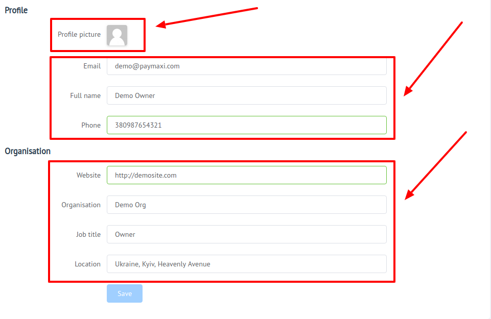
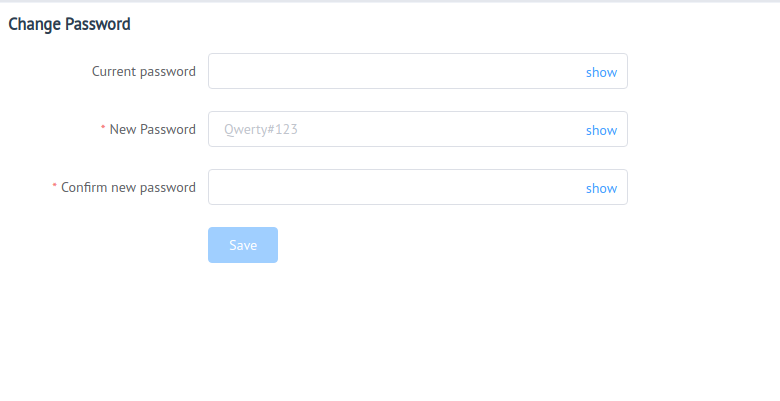

# User account

## Overview

[User profile]({{custom.dashboard_base_url}}user/settings/) is the part of[>PayСore.io Dashboard]({{custom.dashboard_base_url}}), where You can:

- [x] Configure your personal info
- [x] Set general preferences
- [x] Set up your contact data (*such as website, email, phone number, etc.*)
- [x] Manage your application access

Structurally User profile consists of:

-  [General settings](general)
    - Profile
    - Preferences
-  [Security settings](security)
    - Password management
    - Two-Factors Authentication
    - Sessions
    - Auditlog

## General 

This subsection intended  for setting up your General info and basic preferences of location and data layout.
It is divided into ** the next parts**:

1. Profile
2. Preferences

## Profile

It includes info about You and Organisation, in which You work! 

Here You can add a Profile picture from a file, set  your contact information and other.

## Preferences

Here You can configure:
- [x] Localisation
    - Set Interface language for Dashboard 
    - Set your time zone
- [x] Numbers formatting
    - Precision
    - Decimal separator
-  [x] Date & Time formatting
    - Date format type
    - Use relative time (*eg. 44 minutes ago*)
- [x] Data layout
    - Choose data layout preference (*Item per page*)
- [x] Show/Hide **`Test Mode`** toggle

## Security

This subsection intended for setting up your Security preferences and access management.
It is divided into several parts:

1. Passwords management
2. Two-Factor authentication
3. Sessions
4. Auditlog

### Passwords management

Here You can change your password!

!!! tip
    **Don't forget to Save changes to confirm entered data!**

### Two-Factor authentication

**`Two-factor authentication`** enables You to add an extra layer of protection from getting your account compromised.

 You can set up two-factor authentication using any device capable of generating Time-based One-Time Password (TOTP) authentication codes to log in to your {{custom.company_name}} account. 

!!! tip
    You can use **`Google Authenticator`** or **`Authy-2FA App`** or any other compatible application to generate the codes.

To set up two-factor authentication for your account:

Go your profile’s **`Profile Settings`** > **`Security`** > **`Two-Factor authentication`**.

To acivate this function You should do the follow:

**Step 1**: Download and install an authentication app at your choice

**Step 2**: Add {{custom.company_name}} account to the app
    
!!! note
    You can do this through **`scanning the QR-code`**, or **`set up`** required parameters **`manualy`**!

**Step 3**: Enter the verification code from the app

!!! info "Security: Two-Factor authentication"
    

!!! tip
    **Don't forget** to store your **`backup codes`**, to be able to get access to your account, if You have no access to your 2FA-device.
    
    !!! note
        Backup codes are One-Time! If You have already used all codes (10), You can Generate new code-list.

After all this you will be asked  to enter **`verification code`** **every time** you are **`Login in`** to the {{custom.company_name}} Dashboard!

To **`Disable`** 2FA authentication press **`Disable`** button!
!!! info "Security: Two-Factor authentication Disabling"
    

    

### Sessions

This section provides  an ability to control **`active `** sessions.

Session list contains the next information:
- Device type
- IP address
- Location (Based on IP)
- Last time accessed

You can revoke any unrecognized session using **`"Revoke"`** or **`"Revoke all"`**  button.

!!! note
    **`"Revoke"`** - this button revoke only 1 session

    **`"Revoke all"`** - this button provides bulk-revoke for **`all`** sessions  except the **`current`** one!

!!! tip
    To get more info about certain session - expand session row!

### Auditlog

This section is intended to inform user about the actions in context of user profile.

It register the next type of events:

- **`user:logged_in`** (*Logged in*)
- **`user:logged_out`** (*Logged out*)
- **`user:login_failed`** (*Login failed*)
- **`user.password:reset_requested`** (*Requested a password reset*)
- **`user.profile:updated`** (*Profile updated*)
- **`user.preferences:updated`** (*Preferences updated*)
- **``user.password:changed``** (*Password changed*)
- **``user.2fa:enabled``** (*2FA enabled*)
- **`user.2fa:disabled`** (*2FA disabled*)

To get more info about certain event - expand it's row!

Events list contains the next information:

- Event code
- Event message
- IP address
- Last time accessed
- Session hash
- Location (*Based on IP*)
- Device type
- Browser
- OS name
- ...other