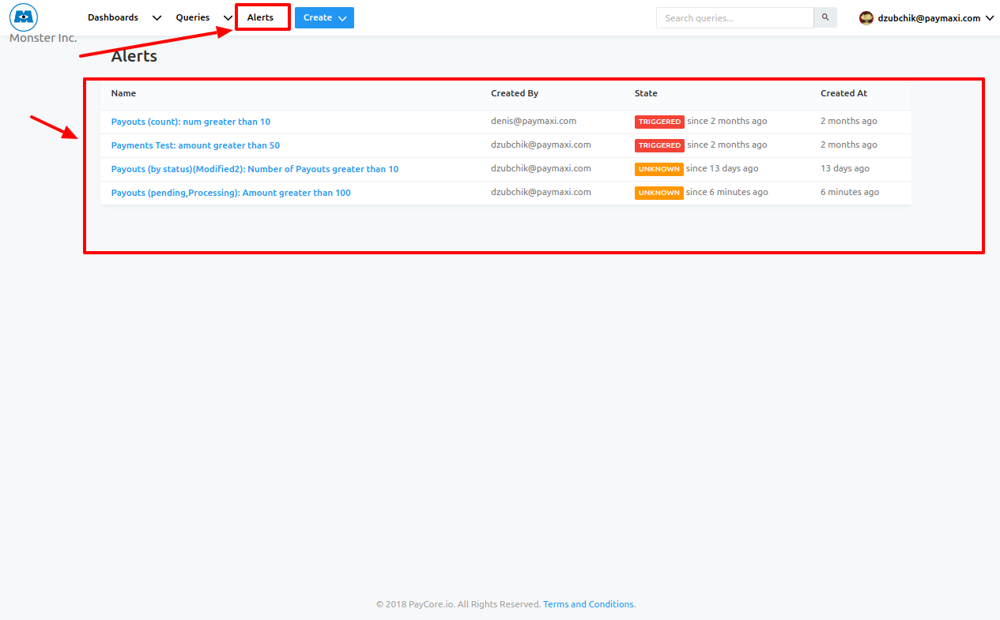
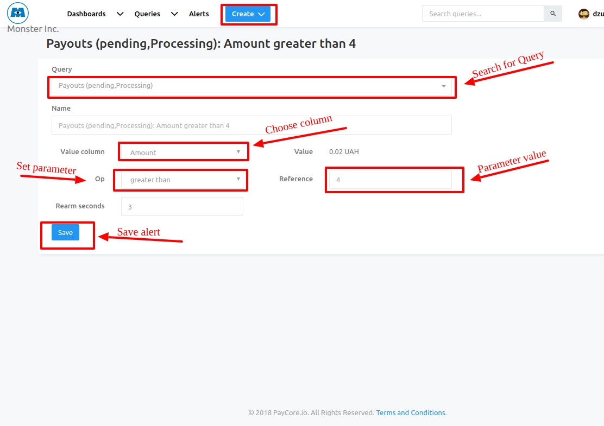

# Analytics: Alerts

## General

In the Alerts view, you’ll see all existing alerts.

!!! info "Screenshot"
    [](images/alerts3.png)

To set up a new alert you’ll need to follow next steps:

1. First, go to **```Create```** > **```Alert```**
2. Select the query you want to trigger an alert for 

!!! tip
    Just start typing a query name and select one from dropdown list! 

!!! warning
    Note that queries **_```with parameters```_** won’t work.

3. Select the column you want to watch.
4. Select the trigger type 
    
    - **```greater than```**
    - **```less than```** 
    - **```equals to```**


5. Leave **```Rearm Seconds```** empty to get 1 alert when the status changes from **```Triggered```** to **```OK```**, enter a number to get an alert every time the query runs (by schedule) + the Rearm seconds value.
6. Save, to confirm actions
7. Define alert destinations - choose alert destination point from dropdown list (_```email```_ or another if it is supported)

!!! info "Screenshots"
    [](images/alerts1.png)
    [](images/alerts2.png)


## Alert Status & Frequency
The Alert Status is checked every time the query is executed.

!!! warning
    Alerts only work with scheduled queries.

Alerts have **_3 Status Types_**:

- **```TRIGGERED```** - the value you set the alert for is triggered 
   
    !!! info "Example"
        If you set your alert to trigger when the value of “Account balance” **is less** than 100 000 as long as it’s above 100 000 your alert is triggered!

- **```OK```** - the value you have set to trigger the alert is not reached for now 
   
    !!! info "Example"
        Might happen after the alert was triggered or before it was ever triggered, if your “Account balance” value is now 100 500 your alert will show as OK!

- **```UNKNOWN```** - you should see this status once you have set your alert and it wasn’t yet checked. To make your alert in the know, run the query it is linked to after setting the alert.

## Get an Alert Upon Status Change

If you leave the **```REARM```** value empty alerts will only be sent when the status changes.

## Get an Alert Everytime the Query Runs

To get an alert every time the query runs, set the **```REARM```** value - the value is for seconds that pass since the system detects a change until it sends the alert, a 1-minute “delay” would require entering ‘60’ in the **```REARM```** field.

