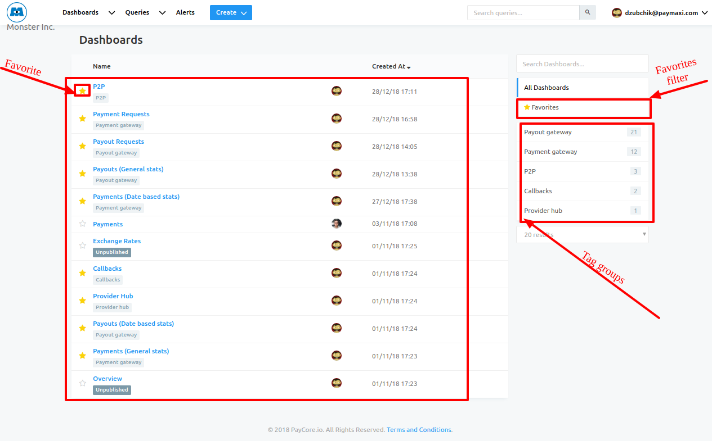
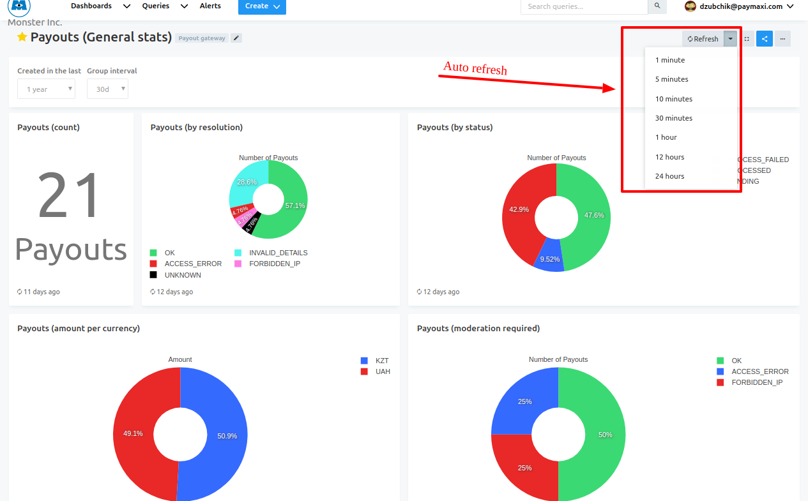
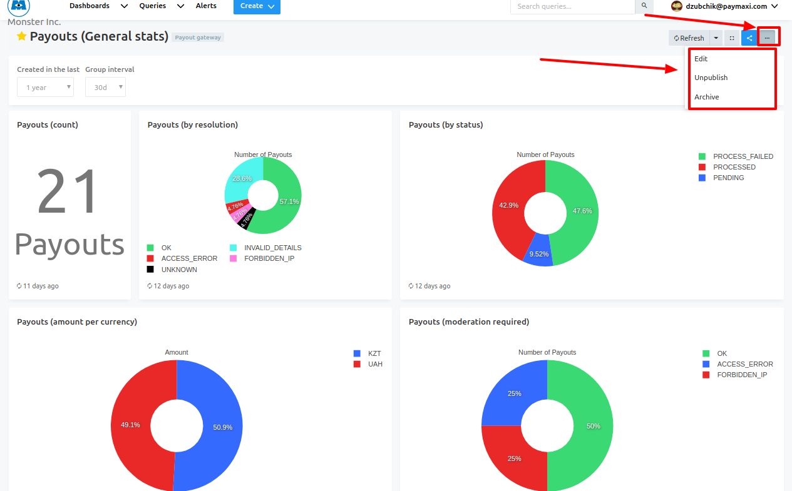

# Dashboards

The Second important entity of Paycore Analytics is Dashboard. 

!!! info "Definition"
    **Dashboard** is an information management tool that visually tracks, analyzes and displays key performance indicators (KPI), metrics and key data points to monitor the health of a business, department or specific process.

Analytics dashboards intended to collect your query visualizations for convenient display of query results.
A dashboard lets you combine visualizations and text boxes that provide context with your data

!!! info "Screenshots"
    [](images/dashboards1.png)

**_To  use this feature you need:_**

1. Have at least 1 query
2. Have at least 1 query visualization

!!! note
     You will have a **```table```** visualisation as default!

3. Create  dashboard
4. Add widget
5. Publish dashboard

## Dashboard Filters

When queries have filters you need to apply filters at the dashboard level as well. Setting your dashboard filters flag will cause the filter to be applied to all Queries.

1. Open dashboard settings

2. Check the “Use Dashboard Level Filters” checkbox


## Grouping Dashboards Using Tags

Dashboards can be grouped with **```#hashtags```**. You simply add the **```#hashtags```** to the dashboard name. All currently used **```#hashtags```** will appear on the dashboards page left pane.
You can click on any of the tags to show all dashboards with this tag or Shift+Click on multiple tags to show dashboards that use all selected tags together.

!!! info "Screenshots"
    [](images/dashboards2.png)
   

## Actions

### Embedding Dashboards

To embed a dashboard, you can use the full screen URL of a dashboard (click on the full screen button). 

!!! info "Screenshots"
    [](images/dashboards6.png)

### Sharing Dashboards
You can share any existing dashboard with external users (they’ll only see the widgets, so no navigation and other buttons you see in the Redash app).

!!! tip
    To share a dashboard, toggle the share URL and send the secret link that gets generated

!!! info "Screenshot"
     [](images/dashboards4.png)

### Auto refresh

!!! info "Screenshots"
    [](images/dashboards3.png)

### Other

- Edit
- Publish/Unpublish
- Archive (Delete)

!!! info "Screenshots"
    [](images/dashboards5.png)