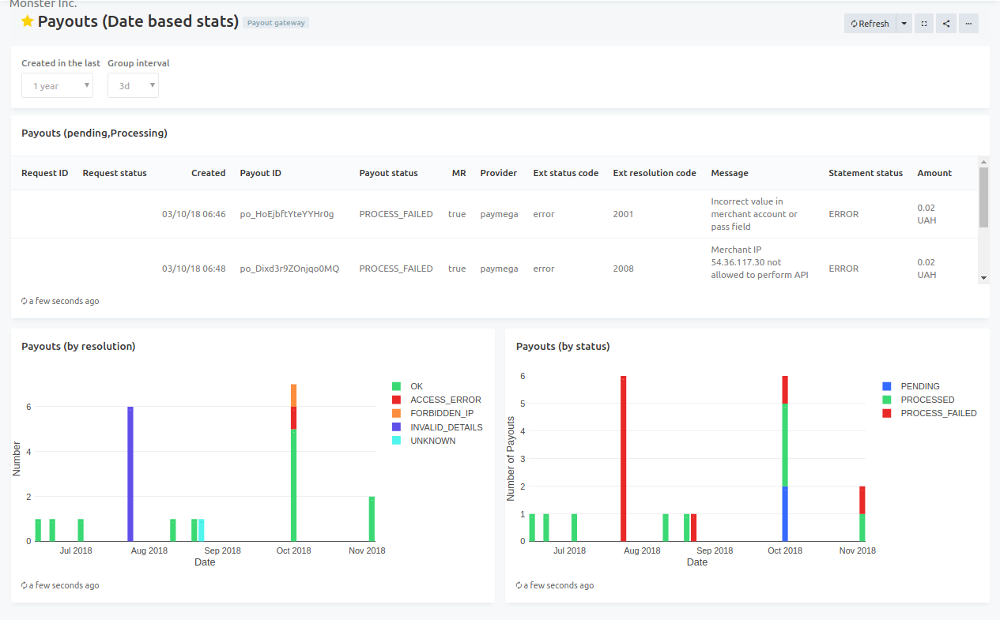

# Analytics

<a href="https://analytics.paycore.io" target="_blank" rel="noopener"> **Paycore Analytics**</a> - is a partly separated plugin, which is intended to generate, aggregate and create accessible and understandable visualization of your bussiness data.

!!! info "Screenshots"
    

The proccesses of data generating, aggregating and visualizing are provided by entities:

- Query (with Visualization)
- Dashboard
- Alert

!!! info "Screenshots"
    

## General workflow

Basic Analytics workflow includes next steps:

1. Create Query
2. Create Query Visualization 
3. Publish Query
4. Create Dashboard
5. Publish Dashboard
3. Add Query Visualization to Dashboard
4. Create Alert for Query. (**_optional_**) 

!!! info "Screenshots"
    

