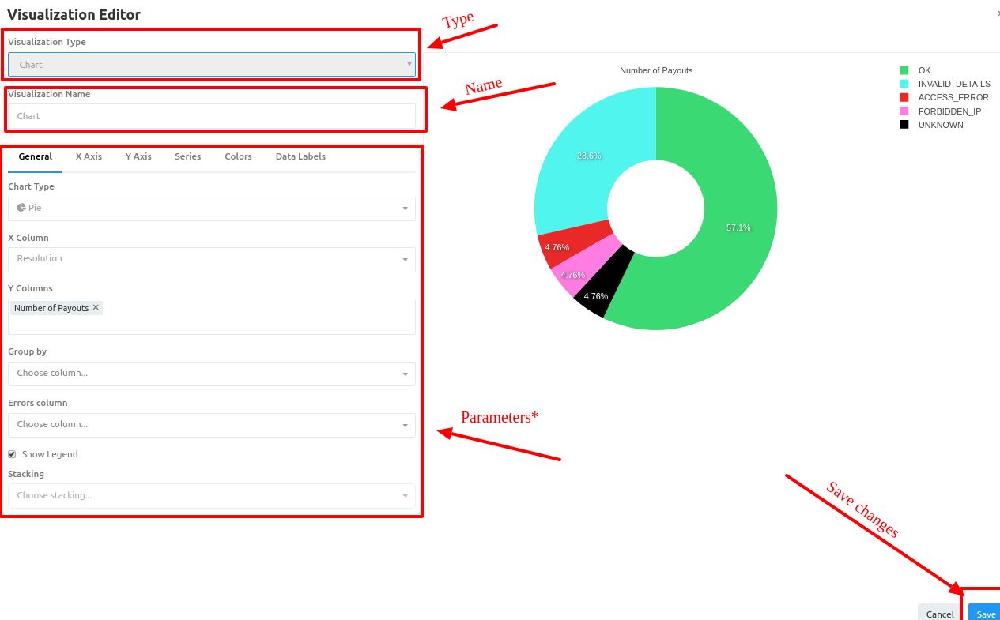

# Analytics: Queries

## General
The basic concept in analytics is the **query**. 

!!! info "Definition"
    **A query** is a means of selecting the necessary information from a database using a special language.


 PayСore.io Analytics uses <a href="https://en.wikipedia.org/wiki/SQL" target="_blank" rel="noopener"> **SQL (Structured Query Language)**</a>  for creating queries.


## Creating

To create query you need:

1. Basic SQL knowledges
2. General understanding of database structure
3. Folowing the [**Query creating workflow**](#query-creating-workflow)

### Query creating workflow

1. Press Create button on toolbar
2. Choose "Query"
3. Select Datasource
4. Write query text
5. Save to confirm creation

!!! tip "Tip #1"
    To facilitate writing a query, use the list of tables and their fields in the left menu.

    You can add field to the query by clicking on the **```">>"```** button.

!!! tip "Tip #2"
    Execute query after creation to make sure that it works correctly!
    

!!! info "Screenshot"
    [](images/queries1.png)
  


## Visualization

By default, your query results (data) will appear in a simple table. Visualizations are much better to help you digest complex information, so let’s visualize your data.

After you make sure that the query is working properly, returning the result you want,  you may **Add new** visualization or **Edit Existing** one.

!!! note 
    After first executing system will automaticaly create Table visualization.

### Visualization creating workflow

1. To crate another visualization press **```"+New visualization"```**
2. Choose Type
    
    ??? tip 
        Suitable select of visualization type depends on the business needs and analysis purpose.
        
        **_For example:_** To compare several indicators of the similar types, the most appropriate are **```Bar```** and **```Pie```** Charts

3. Set up visualization parameters
    
    !!! info
        There are a lot of different parameters for  different types of visualization. 

4. Save changes.

!!! note
    After saving - tab with name of your visualization  will appear next to the "Table" tab.
    
    And you will be able to add it to the [**Dashboard**](../dashboards)
    
!!! info "Screenshot"
    [](images/queries2.png)
