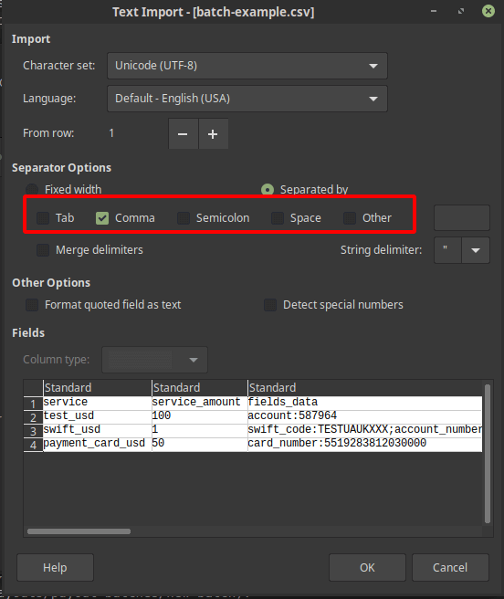
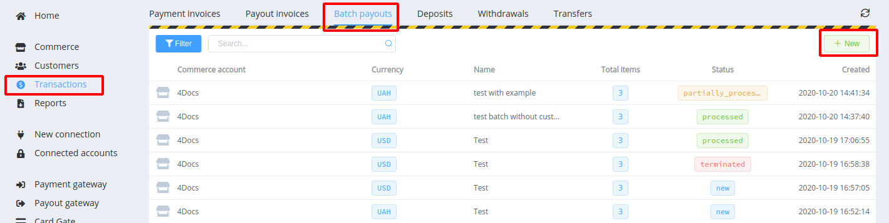
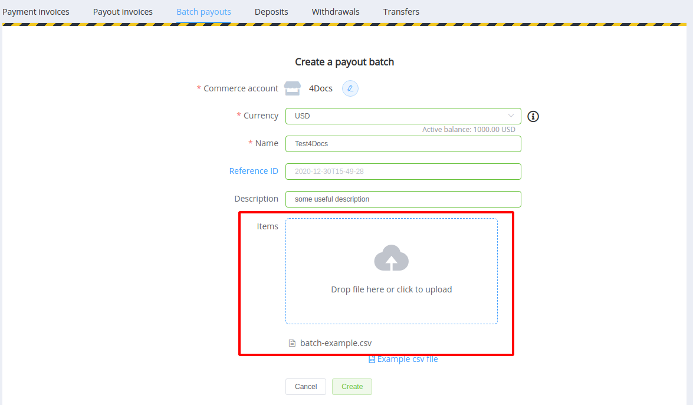
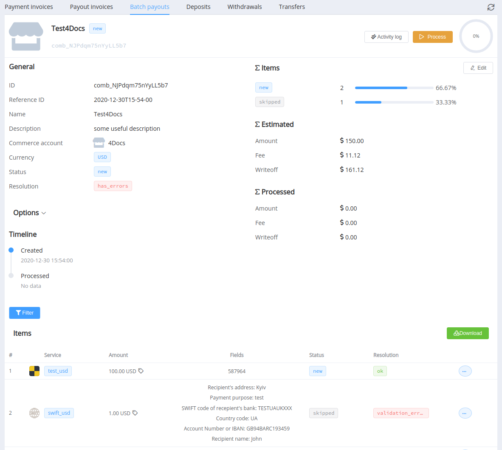
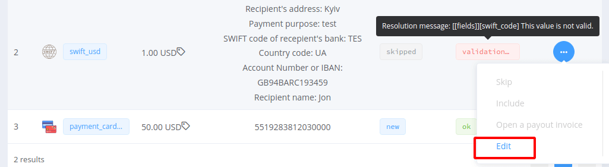
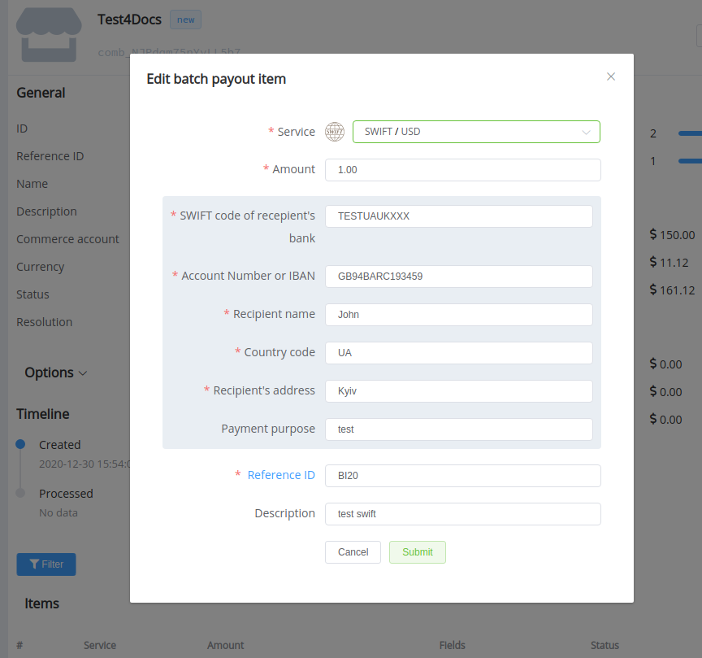
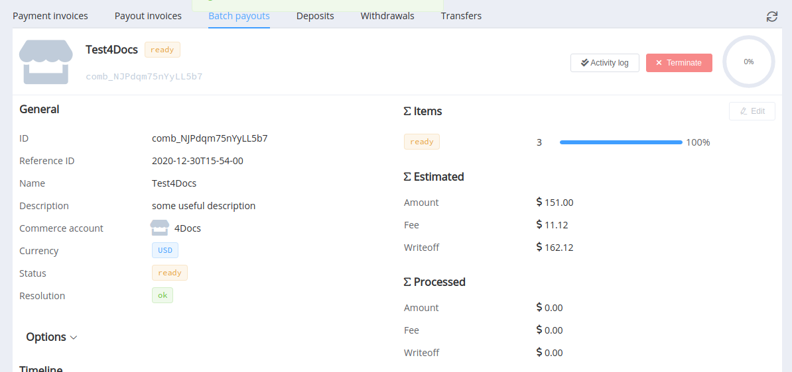
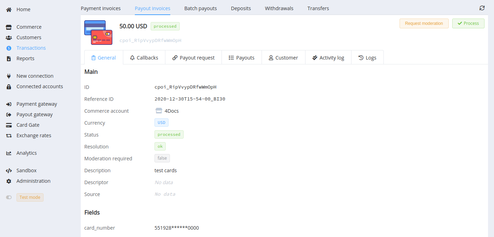
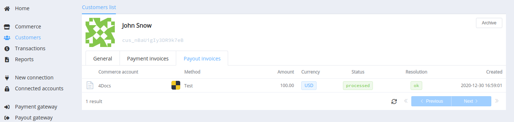

# Batch payouts


If you have already configured payment methods for separate payouts and successfully handled your first transactions, you can optimise the time spent using batch payouts.

Package payments allow to send up to 1000 payments from one currency account to different cards and accounts using any of the connected methods, if necessary - with conversion to other currencies. All you need to do is prepare the file in .csv format and load it into the Dashboard.

## Use Cases

| Business | Use Case |
|--|--|
| Advertising and affiliates | Pay global affiliates without manually verifying their identities |
| Digital gaming | Pay in-game winnings |
| Insurance | Process and send payouts for claims |
| Loyalty programs | Send earnings to customers through their preferred digital wallet |
| Online travel | Pay event organisers, ticketing platforms, and create  travel marketplaces |
| Retail and marketplaces | Manage payments from shoppers and pay sellers on their platform |
| Staff management | Pay salaries, bonuses and other staff entitlements |

## How to Handle Batch Payouts

### Prepare a File

??? info "Definition"
    A **comma-separated values (CSV)** file is a delimited text file that uses a comma to separate values. Each line of the file is a data record. Each record consists of one or more fields, separated by commas. The comma as a field separator is the source of the name for this file format. A CSV file typically stores tabular data (numbers and text) in plain text, in which case each line has the same number of fields.
    
    The CSV file format is supported by almost all spreadsheets and database management systems, including LibreOffice Calc, Microsoft Excel, Numbers, KCells, Google Spreadsheets. Separator selection is defined when creating or importing a file.

    

{{custom.company_name}} uses a comma `,` in batch payouts as the column separator and a semicolon `;` as the separator for properties in objects.

The top row of the table should contain the column headings:

* `service` as a payout service (payout method + currency code)
* `service_amount` as a payout amount in the chosen currency
* `fields_data` is an object with payment details (for example, an account or a credit card number)
* `reference_id` is a unique payout item ID

All the following rows are the values of the associating fields.

You can also add columns for objects with client data: `customer` and `customer_metadata`. If either one or both these objects are present in the row, you must specify the `reference_id` in the `customer` object field. Thus, the customer's updated data and the corresponding payout record will be added to the customer section database.

??? example "Example of a batch payout table"

    ```csv
    service,service_amount,fields_data,reference_id,description,customer,customer_metadata
    test_usd,100,account:587964,BI10,test,reference_id:example_ref1;email:test@example.com;phone:+12345678945;name:John S,
    swift_usd,1,swift_code:TESTUAUKXXX;account_number:GB94BARC193459;recipient_name:John;country_code:UA;address:Kyiv;purpose:test,BI20,test swift,reference_id:example_ref1,key:value;know:nothing
    payment_card_usd,50,card_number:5519283812030000,BI30,test cards,,
    ```

[The same example as a CSV file -->](batch-example.csv)

### Create the Batch in the Dashboard

[Click the *+New* button :material-launch:]({{custom.dashboard_base_url}}transactions/payout-batches/new-batch) in the Dashboard (*Transactions* --> *Batch Payouts*), and upload your prepared CSV file.





Required fields:

* the commerce account
* the related currency account for the write-offs: if the currency of the selected payment service differs, we convert the funds on the [current exchange rate](/products/fx-rates/)
* the batch name

The single item reference ID is created by connecting two elements: the batch ID and the payout `reference_id` specified in the table's corresponding CSV cell.

This final reference ID must be unique. If you use the same batch file several times without changing the `reference_id` values in the rows, you should specify the different batch IDs. Or leave the ID field blank: if the batch ID is not defined, it will be set automatically by the date and time of creation (as `yyyyy-mm-ddThh-mm-ss`).

### Check Items and Process

We validate the resulting payout batch at the initial stage. The platform verifies that the specified services are available for payouts and that all the parameters are rightly set. Rows with errors will be skipped at the processing stage.



Before processing, you can edit items in the batch overview line by line. To do so, choose *Edit* in the drop-down menu:




When all checks are completed, you can click the *Process* button and start processing the batch payouts.

And if a part of transactions is still in `ready` status (prepared but not sent), you can stop processing with the *Terminate* button.



## Check the Result

Processed transaction data are displayed in the *Batch Payouts* section with the batch and in the *Payout invoices* section as single payouts:



If you added a `customer` object with a `reference_id` property, you could also see the related payout in the customer data record.


