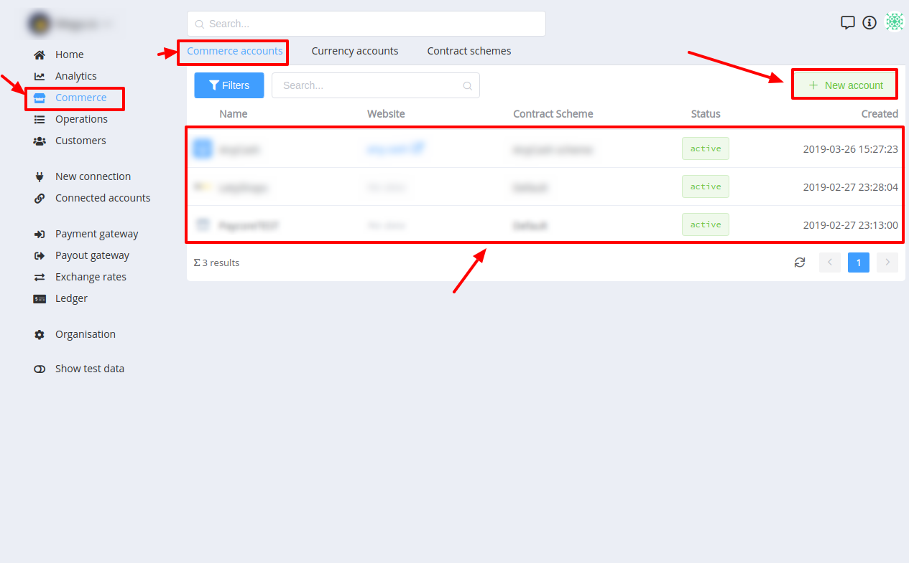
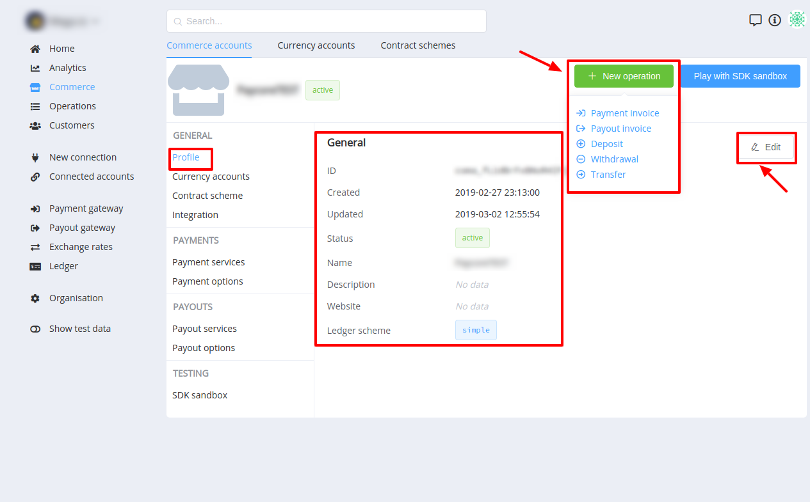
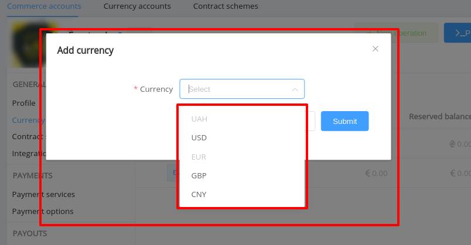
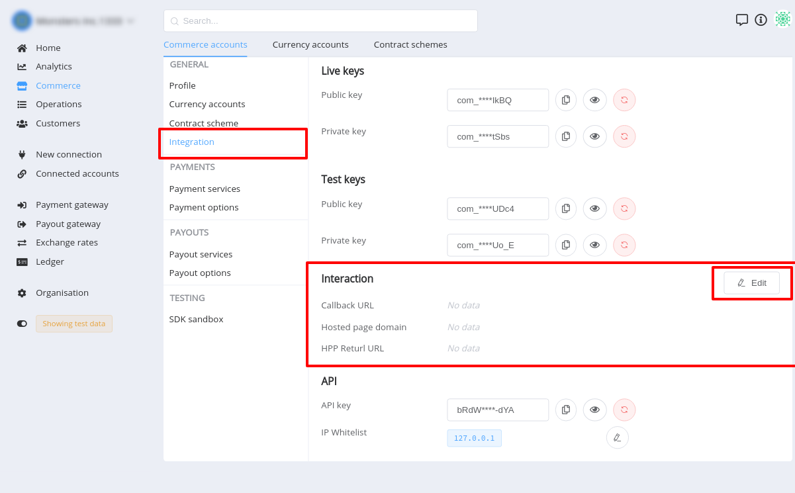
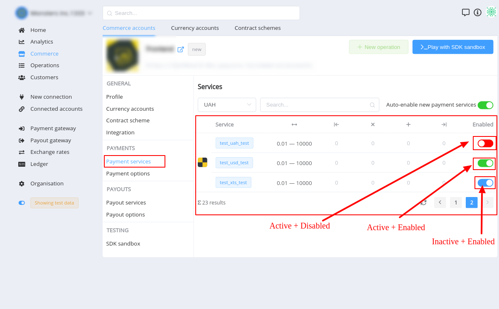
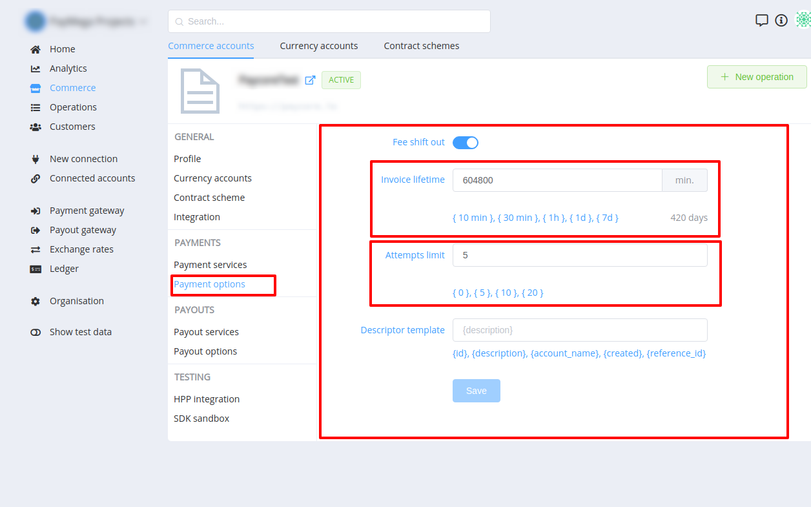
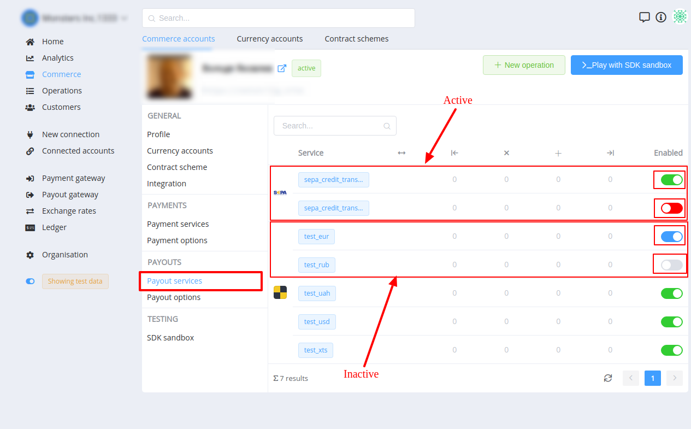
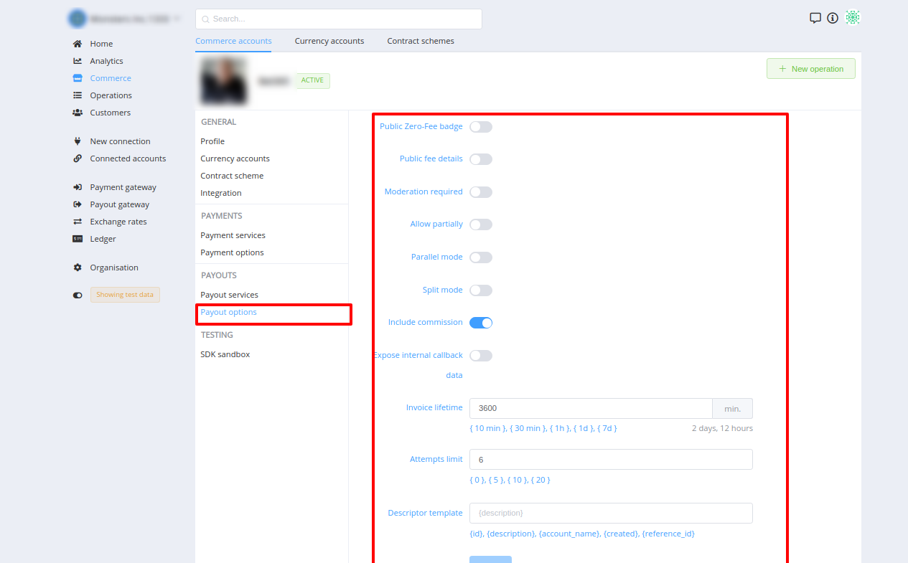

# Commerce Accounts

## A List of Accounts

Commerce accounts list includes information on merchant  name and logo, contract scheme, creation date and time etc.

There is the functionality to filter list and [create a new](#creating) account.

## Creating a new account

## Account settings

Commerce account settings is intended to configure payment and payout gateways for Organisation's  merchants.

All settings are devided into few groups:

- General
    - Profile
    - Currency accounts
    - Contract scheme
    - Integration
- Payments
    - Options
    - Services
- Payouts
    - Options
    - Services

### General

This section is intended for setting (changing) account name, description, logo, status, website etc.

### Account Status

Commerce account status determines its current state. Accordingly, a set of available actions is determined!

Below is a list of statuses and it's descriptions:

| Code                   | Description                                                                                                                        |
|------------------------|------------------------------------------------------------------------------------------------------------------------------------|
| `new`                  | Account was recently created. Business functionality (operations creating) is unavailable                                          |
| `active`               | All functionality is available. No additional moderation is required                                                               |
| `inactive`             | Account was deactivated by administrator. All functionality (including the access to the merchant dashboard) is unavailable        |
| `moderation_requested` | Merchant requested moderation of account. Business functionality (operations creating) is unavailable                              |
| `moderation_pending`   | Account moderation is in progress. Business functionality (operations creating) is unavailable                                     |
| `archived`             | Account was deleted (archived) by administrator. All functionality (including the access to the merchant dashboard) is unavailable |

### Currency accounts

This page includes the list [currency accounts](/products/commerce/currency-account/overview/) related to certain Commerce Account.
There is an ability to add new or remove unnecessary currencies.

A set of available currencies is limited by a [contract scheme](/products/commerce/contract-scheme/overview/) properties

- If certain currency was added previously ­— it would be disabled in **`Add currency`** selector list.
- If **All** currencies within assigned contract scheme are added, **`Add currency`** button is **`DISABLED`**!

### Commerce scheme

This page displays the contract scheme assigned to certain account. 

It also includes links on the related  Payment and Payout Rate and Routing schemes

There is an ability to **`change`** current contract scheme.

!!! danger
    Changing of the contract scheme is dangerous.
    
    This will affect the further functionality of the account!

    
### Integration

This section contains settings, which determine the external interaction with commerce account.

#### Keys

Keys subsection relates to [Commerce Public API](https://swagger-dev.{{custom.company_name}}/commerce-public/#/). 

 
**`Public`** Keys are used to: 

- initiate pre-requests,

    !!! info
        Pre-request is intended for getting a set of available services (both Payment and Payout) for Invoice initiating 

- to initiate Payment invoice,

    !!! note
        Payout Invoice can be initiated only via **`API key`**

- **`get`** Payment Invoices and Payout Invoice by ID

**`Private`** Keys are used to check the callback's signature.

#### Interaction

This subsection contains:

- Callback URL: this property is used as default for Payment and Payout invoices. 

    !!! note
        Although, it is possible to resend callback of certain operation to another URL.

        This is available only via Dashboard (not available via API) in **`Callbacks`** section of Operation Overview page

- Hosted page domain: this property determines at what domain certain commerce account keys can be used.
- HPP Return URL

#### API Keys

API key relates to [Commerce Private API](https://swagger-dev.{{custom.company_name}}/commerce/#/).

!!! info
    To authorize the connection **`basic auth`** is used.
    It is generated in the next way: `basic_auth = id + key`

This key is used to authorize:

- access to the Commerce Private API endpoints
- initiating of Payout Invoice 

### Payment Services

This page contains a list of available Payment services (within assigned contract scheme) with information on amount limits, set fee (min-max, rate, fix)

### Payment Options

To configure the payment invoice **`lifetime`** or **`attempts limit`**:

1. Navigate to the [Commerce accounts]({{custom.dashboard_base_url}}commerce/accounts/)
2. Go to the Setting of neccessary one
3. Find **Payment Options** section
4. Set property value

Available options:

| Option                        | Description                                                                                |
|-------------------------------|--------------------------------------------------------------------------------------------|
| Allow public creation         | Allow payment creation through the Public API. Used to create payments through HPP.        |
| Public Zero-Fee badge         | Wheather to give a sign "without commission" for each service through the Public API.      |
| Public fee details            | Wheather to give detailed commission values for each service through the Public API.       |
| Include commission            | Put the commission in the payment amount and calculate it from the amount of the write-off |
| Expose internal callback data | Expose internal callback data                                                              |
| Invoice lifetime              | Set operation expiration time based on creation. Expires = created + lifetime              |
| Attempts limit                | How many times processor will try to create new operation based on failed status           |
| Descriptor template           | Operation descriptor generation template for processing provider                           |

### Payout Services

This page contains a list of available Payout services (within assigned contract scheme) with information on amount limits, set fee (min-max, rate, fix)

### Payout Options

To configure the payout invoice set necessary properties at Commerce Account **`Payout options`** page:

1. Navigate to the [Commerce accounts]({{custom.dashboard_base_url}}commerce/accounts/)
2. Go to the Setting of neccessary one
3. Find **Payout Options** section
4. Set property value

Available options:

| Option                        | Description                                                                               |
|-------------------------------|-------------------------------------------------------------------------------------------|
| Public Zero-Fee badge         | Wheather to give a sign "without commission" for each service through the Public API.     |
| Public fee details            | Wheather to give detailed commission values for each service through the Public API.      |
| Moderation required           | Do not perform an operation without manual moderation                                     |
| Allow partially               | Partial processing allowed                                                                |
| Parallel mode                 | Parallel or sequential processing strategy                                                |
| Split mode                    | Allow the splitting of operation when exceeding the amount limit                          |
| Include commission            | Put the commission in the payout amount and calculate it from the amount of the write-off |
| Expose internal callback data | Expose internal callback data                                                             |
| Invoice lifetime              | Set operation expiration time based on creation. Expires = created + lifetime             |
| Attempts limit                | How many times processor will try to create new operation based on failed status          |
| Descriptor template           | Operation descriptor generation template for processing provider                          |
