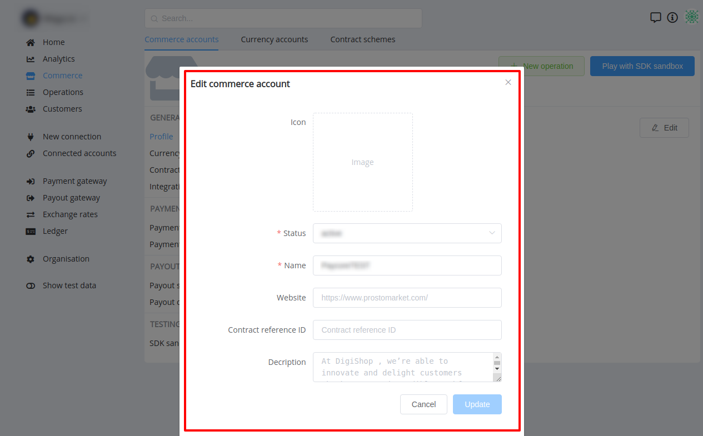
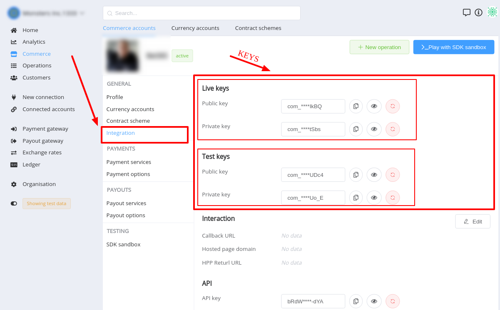
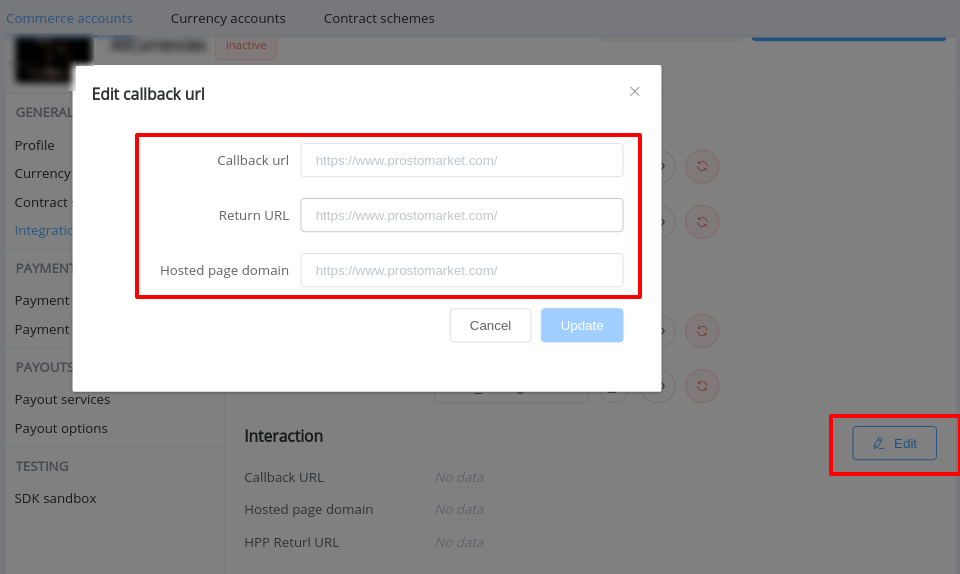

# Commerce account: Guide

## General

This entity includes the next sections:

- Accounts list
- Account settings
- Account creating 

(**—>>> UPGRADE**)

## List

Commerce accounts list includes information on merchant  name and logo, contract scheme, creation date and time etc.

There is the functionality to filter list and [create a new](#creating) account.

!!! info "Screenshot"
    

## Settings

Commerce account settings is intended to configure payment and payout gateways for Organisation's  merchants.

All settings are devided into few groups:

- General: 
    - Profile:
    - Currency accounts
    - Contract scheme
    - Integration
- Payments
    - Options
    - Services
- Payouts
    - Options
    - Services
- Testing

### General:

#### Profile

This section is intended for setting (changing) account name, description, logo, status, website etc.

!!! info "Screenshots"
    

    

#### Currency accounts
    

This page includes the list [currency accounts](/products/commerce/currency-account/overview/) related to certain Commerce Account.
There is an ability to add new or remove unnecessary currencies.

!!! note
    A set of available currencies is limited by a [contract scheme](/products/commerce/contract-scheme/overview/) properties

!!! info "Screenshots"
    

    

!!! info
    - If certain currency was added previously ­— it would be disabled in **`Add currency`** selector list.
    - If **All** currencies within assigned contract scheme are added, **`Add currency`** button is **`DISABLED`**!

#### Contract scheme

This page displays the contract scheme assigned to certain account. 

It also includes links on the related  Payment and Payout Rate and Routing schemes

There is an ability to **`change`** current contract scheme.

!!! danger
    Changing of the contract scheme is dangerous.
    
    This will affect the further functionality of the account!

!!! info "Screenshot"
    

    
#### Integration (DRAFT)

This section contains settings, which determine the external interaction with commerce account.

**KEYS:**

Keys subsection relates to <a href="https://swagger-dev.paycore.io/commerce-public/#/" target="_blank" rel="noopener">Commerce Public API</a>. 

 
**`Public`** Keys are used to: 

- initiate pre-requests,

    !!! info
        Pre-request is intended for getting a set of available services (both Payment and Payout) for Invoice initiating 

- to initiate Payment invoice,

    !!! note
        Payout Invoice can be initiated only via **`API key`**

- **`get`** Payment Invoices and Payout Invoice by ID

**`Private`** Keys are used to check the callback's signature.

!!! info "Screenshot"
    

**INTERACTION:**

This subsection contains:

- Callback URL: this property is used as default for Payment and Payout invoices. 

    !!! note
        Although, it is possible to resend callback of certain operation to another URL.

        This is available only via Dashboard (not available via API) in **`Callbacks`** section of Operation Overview page

- Hosted page domain: this property determines at what domain certain commerce account keys can be used.
- HPP Return URL

!!! info "Screenshots"
    

    

**API:**

API key relates to <a href="https://swagger-dev.paycore.io/commerce/#/" target="_blank" rel="noopener">Commerce Private API</a>.

!!! info
    To authorize the connection **`basic auth`** is used.
    It is generated in the next way: `basic_auth = id + key`

This key is used to authorize:

- access to the Commerce Private API endpoints
- initiating of Payout Invoice 

!!! info "Screenshots"
    

### Payments

#### Services

This page contains a list of available Payment services (within assigned contract scheme) with information on amount limits, set fee (min-max, rate, fix)

!!! info "Screenshot"
    

#### Options

##### Public Access

- Allow public creation (Public Creation)
- Public Zero-Fee badge
- Public fee details

##### Fee

- Fee strategy
- Include fee

##### Interaction

- Expose internal callback data
- Descriptor

##### Time

- Lifetime
- Attempts

### Payouts

#### Services

This page contains a list of available Payout services (within assigned contract scheme) with information on amount limits, set fee (min-max, rate, fix)

!!! info "Screenshot"
    

#### Options

##### Public Access

- Public Zero-Fee badge
- Public fee details

##### Fee

- Fee strategy
- Include fee

##### Interaction

- Moderation required
- Allow partially
- Parallel mode
- Split mode
- Expose internal callback data
- Descriptor

##### Time

- Lifetime
- Attempts

### Testing

## Creating