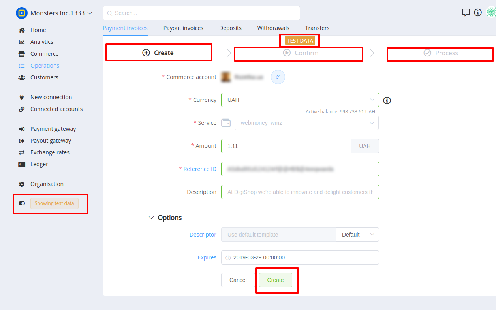

# Managing Payment Invoices

Payment Invoice is located in Operations section. This entity includes **List**, **Overview** and **Creating** screens.

## A list of payment invoices

This screen contains an enumeration of transactions with main properties, such as Commerce account, Payment Method, Amount, Currency, Current status, Resolution, Created time.

It also contains filters and search features to facilitate use.

## Overview of a payment invoice

Overview page is intended to display detailed info about:

- Operation states
- Amounts
- Service, Method, Provider
- Related entities etc. 

## Creating a new payment invoice

This action consists of 3 stages:

- Create: this stage requires the setting of Invoice proerties and parameters
- Confirm: this stage is intended to get user ensured that all data is correct 
- Process: contains processing data 