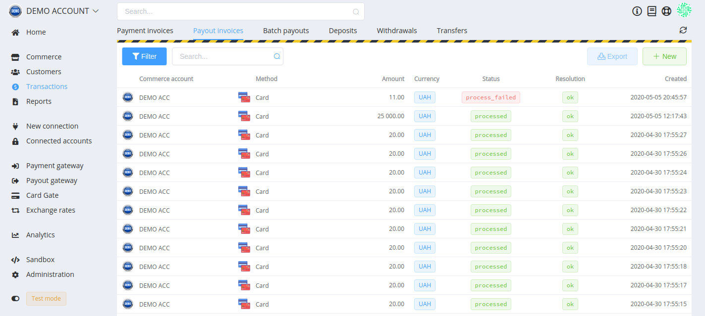
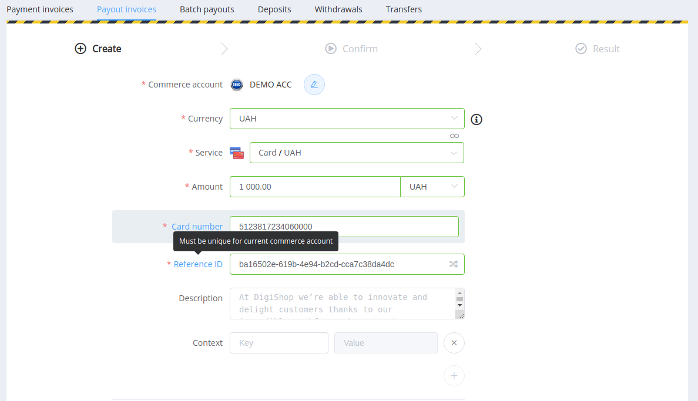

# Managing Payout Invoices

You can create payout invoices using the Dashboard or Private APIs. But also you can send payout pre-request to obtain the list of services available for any particular currency.

All data about Payout Invoices are displayed in Transactions section.

## A list of payout invoices

This screen contains a list of payout transactions with main properties, such as Commerce Account, Payout Method, Amount, Currency, current Status, Resolution, and date and time of the invoice creation.

It also contains filters and the search-by-ID field.

## Overview of a payout invoice

Overview page is intended to display detailed info about:

- Main transaction data
- Amounts
- Timeline
- Used Callback URL

## Creating a new payout invoice

Click on *+New* button in the *Payout Invoice* section and create a new payout invoice.

### 1. Create

Block 1. **Basic data**.

Required fields: commerce account, currency, service (with currency), amount, transfer details (the number of fields differs for different payment methods), unique reference ID.

Optional fields: description and context.

!!! tip
    To see the tooltip, hover the mouse pointer over the relevant field's label.

Block 2. **Receiver's data**.

Optional to fill, but if you specify the customer's reference ID, the entered data and transaction will be added to the corresponding Customer record.

Block 3. **Payout Invoice options**.

Optional to fill.

- The expiry date and time of the request
- Number of attempts for payout
- Enable to split payout into multiple parts
- Autoprocess — to skip the [next step](#2-confirm)
- Enable to process the payout partially (for example, in case of a transaction failure or insufficient amount in the account)

### 2. Confirm

At this stage, you confirm payout invoice creating and send it to processing provider.

### 3. Result

You can check the payout status on the Result tab.

