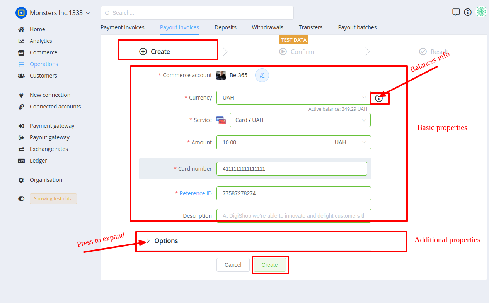
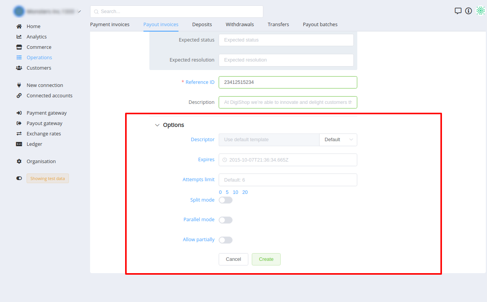
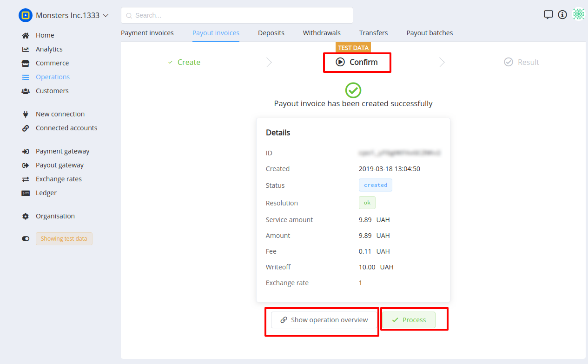
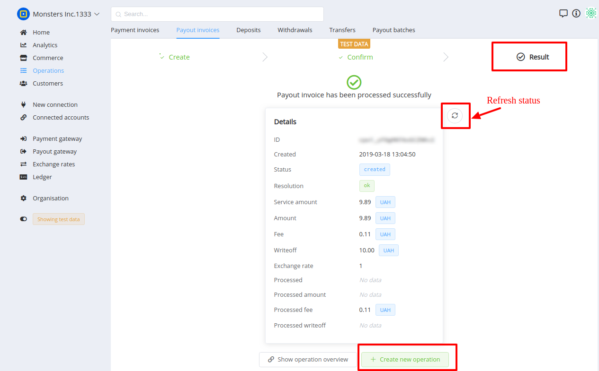

# Managing Payout Invoices

Payout Invoice is located in Operations section. This entity includes **List**, **Overview** and **Creating** screens.

## A list of payout invoices

This screen contains an enumeration of transactions with main properties, such as Commerce account, Payout Method, Amount, Currency, Current status, Resolution, Created time.

It also contains filters and search features to facilitate use.

## Overview of a payout invoice

Overview page is intended to display detailed info about:

- Operation states
- Amounts
- Service, Method, Provider
- Related entities etc. 

## Creating a new payout invoice

This action consists of 3 stages:

### 1. Create

This stage requires the setting of Invoice proerties and parameters. It contains **basic** properties and **options**.

    !!! tip
        Hover over the option label to see info tooltip!

### 2. Confirm

This stage is intended to get user ensured that all data is correct and functionality for **manual** process

### 3. Result

Contains processing data 

