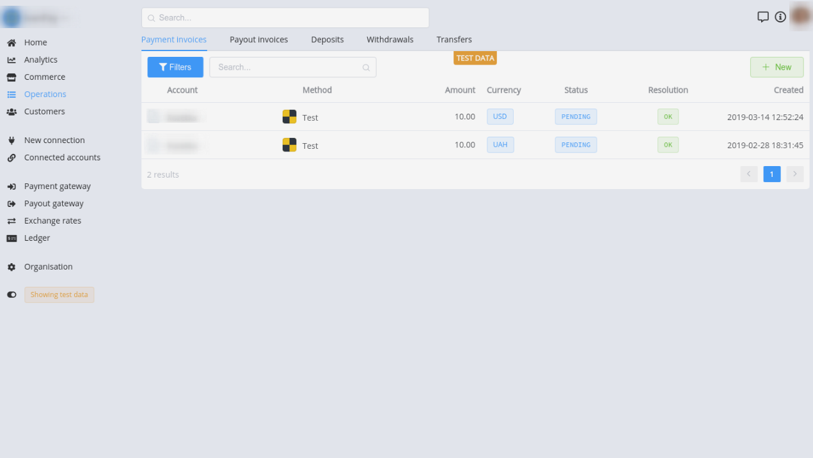
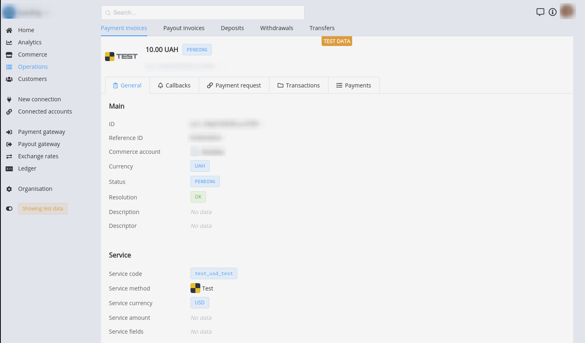

# Payment Invoice: Usage

Payment Invoice is locate in Operations section. This entity includes **List**, **Overview** and **Creating** screens.

## List

This screen contains an enumeration of transactions with main properties, such as Commerce account, Payment Method, Amount, Currency, Current status, Resolution, Created time.

It also contains filters and search features to facilitate use.

!!! info "Payment Invoice Overview"
    [](images/payment_invoice_list.png)

## Creating

This action consists of 3 stages:
- Create : this stage requires the setting of Invoice proerties and parameters
- Confirm : this stage is intended to get user ensured that all data is correct 
- Process

!!! info "Payment Invoice Creating"
    [](images/invoice_creating1.png)

## Overview

!!! info "Payment Invoice Overview"
    [](images/payment_invoice_overview.png)


## Configuration


To configure the payment invoice **```lifetime```** or **```attempts limit```**:

1. Navigate to the <a href =https://dashboard.paycore.io/commerce/accounts/" target="_blank" rel="noopener">Commerce accounts</a>
2. Go to the Setting of neccessary one
3. Find **Payment Options** section
4. Set property value

!!! info "Payment Options"
    [](images/payment_options1.png)

!!! tip
    Do not forget to Save changes!