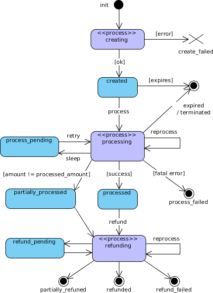

# Payment Invoice

## Workflow

## Status list

Below is a list of statuses and it's descriptions:

| Code | Final | Description |
|------|-------|-------------|
| `created` |  | Invoice is created, processing has not started. If {{custom.company_name}} will not return response 201 (Created) HTTP status code on your request, you should consider that the payment invoice was failed to be created |
| `expired` | ✔ | Invoice hit the lifetime limit (configurable in the 'Invoice lifetime' property) without being successfully processed, but also did not either cancelled or terminated, e.g. your customer has abandoned the payment |
| `terminated` | ✔ | Terminated by a payer prior to the payment invoice lifetime limit |
| `processing` |  | Invoice is processing by {{custom.company_name}} but its processing is not finished and there will be further status updates |
| `process_pending` |  | Process still being unknown and may not be known for an extended period of time |
| `processed` |  | Processed successfully. This isn't a final status since the payment can be refunded for different reasons |
| `partially_processed` |  | Paid amount is less than the invoice amount and that amount is successfully processed. e.g. your customer has entered an amount less than the invoice amount while making an online payment |
| `process_error` |  |  |
| `process_failed` | ✔ | Processing has failed, may be set when an error occurs and the corresponding payment request has failed. This status is considered final due to the maximum number of attempts has been reached (default – 5 attempts) |
| `refunding` |  | Is refunding and the result of the payment invoice refunding still being unknown |
| `refund_pending` |  | Refunding still being unknown and may not be known for an extended period of time |
| `partially_refunded` | ✔ | Amount refunded is less than the invoice amount and that amount is successfully refunded. |
| `refunded` | ✔ | Successfully refunded in full |
| `refund_error` |  |  |
| `refund_failed` | ✔ | Refunding has been failed or cannot be completed |
