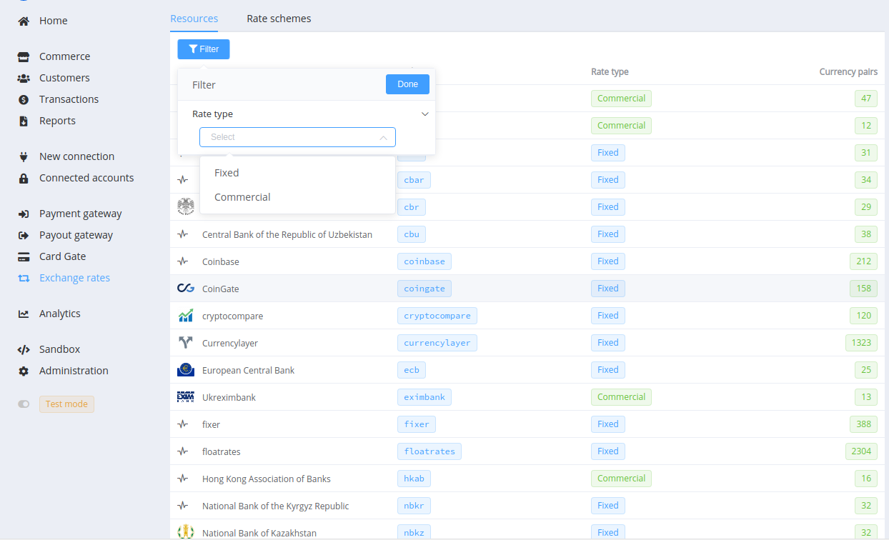
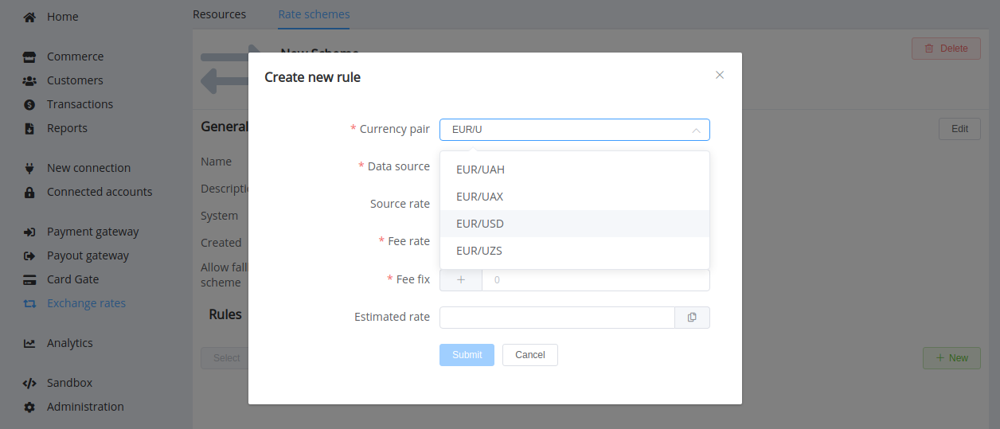

# Exchange Rates

An exchange rate is the value of one currency versus another currency. In most cases, exchange rates are free-floating and rise or fall based on supply and demand in the market. But others are strictly regulated by the decisions of governments or central banks.

## Types of Exchange Rates

1. A **fixed** or pegged exchange rate is linked to another currency or asset (often gold) to derive its value. Such an exchange rate mechanism ensures the exchange rates' stability by associating it to a stable currency itself. On the Paycore.io platform, it also means that the exchange rate for a currency pair is the same for both buying and selling.

    

2. Flexible **commercial** or business exchange rates are the interbank rates that fluctuate prices at which banks trade currencies.
    - The *bid* price refers to the highest price buyers pay for a currency in the pair currency.
    - The *ask* price refers to the lowest price sellers accept for a currency in the pair currency.
    - The difference between these two prices is known as the *spread.* A smaller spread means greater liquidity of the given currency.

    

## Sources

{{custom.company_name}} has various connected exchange rate sources automatically updated and used in transaction processing if the recipient's currency and the sender's currency do not match. You can view the complete list in the appropriate section.

Please <!--email_off-->[contact us](mailto:{{custom.support_email}})<!--/email_off--> if you need to set up a connection with the other source.

## Rate Schemes

We use Rate Schemes to define rules and conditions for currency exchange in transaction processing.

'*System*' is a default rate scheme. It contains all available currency pairs and initially has null values of Fee rate and Fee fix in all rules. It's perfect for testing, but if you want to manage exchange rates, we recommend creating a new rate scheme.

### New Rate Scheme Setup

Go to the '*Exchange Rates*' section -> '*Rates Schemes*' and click the '*+ New*' button. Name the new scheme and (optionally) shortly describe it.

The *'Allow fallback to System scheme*' option helps avoid exchange errors when a rule about some currency pair is missing in the current rate scheme. If you enable it, the missing rules will be bound to the '*System*' rate scheme, and we will make the exchange according to the default rules.

Let's pick the created scheme and add every necessary exchange rules: one rule for each currency pair. Click the '*+ New*' button to open creating form and  type currency codes separating the base and quote currencies by a stroke `/`.

After finding the proper exchange pair, you can choose a data source. In this drop-down list, direct currency rates use the first currency in the pair as the base, and inverted rates use the second currency in the pair as the base.

Then you can set fee values or assign zero values and save. The resulting value of '*Estimated rate*' is the sum of the source rate and both types of fee: the rate fee (per cent of the source rate) and the fixed fee (in base currency).

$$
\sum_{rate} = S_{rate} + \frac{S_{rate} \times F_{rate}} {100\%} + F_{fixed}
$$

The *Estimated Rate* is applied to converting.

!!! tip
    Later, you can edit the name, description and any of the scheme rules. You may also remove the scheme provided it is not used in the calculations for:

    - Payment Page
    - Payout Point
    - Commerce Scheme
    - Payment/Payout Request
