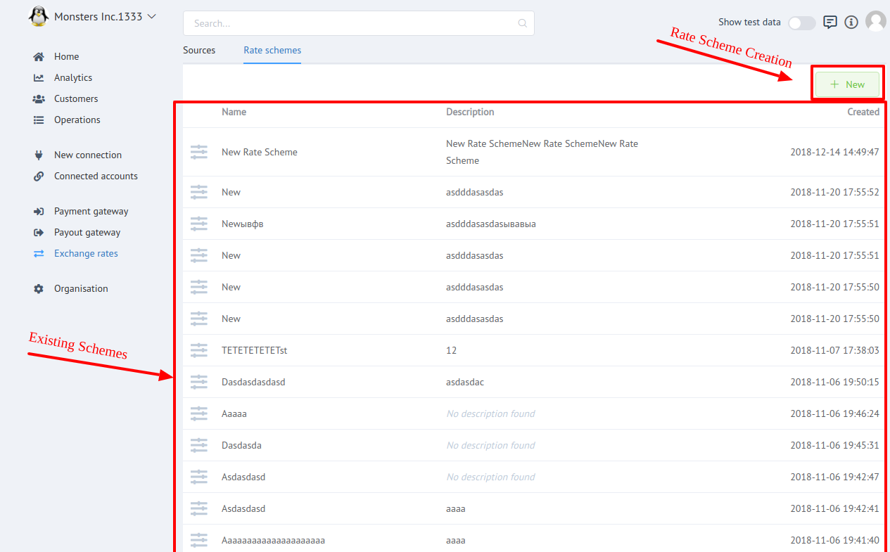
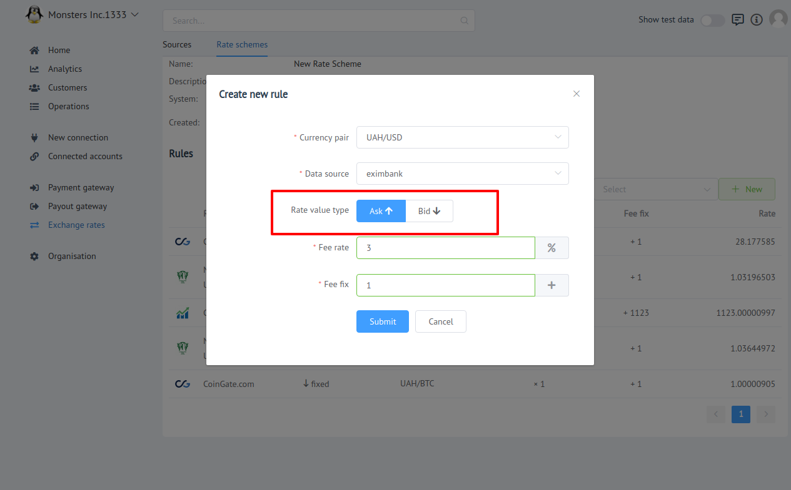

# Rate Schemes

## General
**Rate scheme** - is  an entity that determines exchange rules for currency pair in your organisation.  

!!! info "Screenshot"
    [](images/rate-schemes_1.png)

There are **```two```** types of Rate Schemes:

- **```System```** : Default presetted rate scheme, which icludes rules for all system currency-pairs.
    
    !!! warning 
        **```System scheme```** can not be _```deleted```_ or _```modified```_!

- **```Custom```** : An organisation administrator can create  custom rate schemes for current organisation.

!!! info "Screenshots"
    [](images/rate-schemes_2.png)
    [](images/rate-schemes_3.png)


## Rules

Rate scheme rule icludes:
 
 - Currency pair
 - Resource
 - Source Rate Type
 - Fee rate (%)
 - Fee fix
 - Rate

You can create (add) rule using **```+ New```** button above the rules list.

!!! note
    For Rules with **```Commercial```** Resource user should choose between  **```Ask```** and **```Bid```** source rate.

!!! info "Screenshot"
    [](images/rate-schemes-rules_1.png)