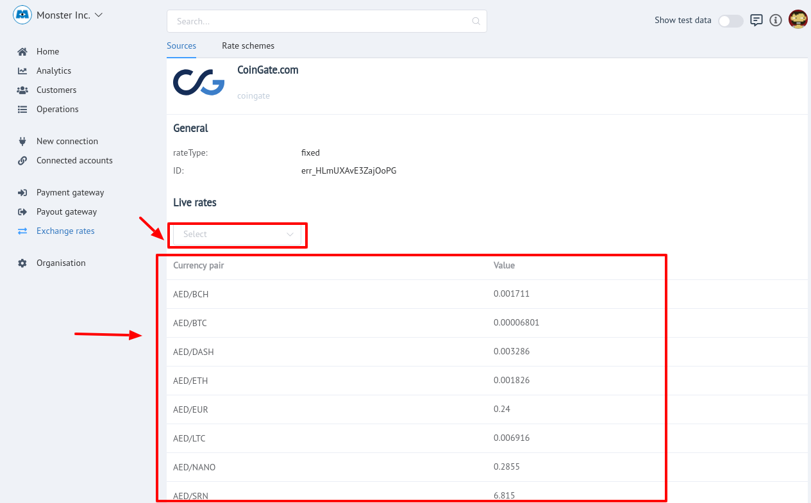

# Resources


!!! info "Definition"
    **```Resource```**  -  is a source of exchange rates of a certain type  for the currency pairs it supports.

There are **```two```** types of Exchange rates:

 - **```Fixed```** : A fixed exchange rate is a regime applied by a country whereby the government or central bank ties the official exchange rate to another country's currency or the price of gold. The purpose of a fixed exchange rate system is to keep a currency's value within a narrow band.

 - **```Commercial```**  - the rates of commercial banks and exchangers.
 
!!! note
    **```Commercial```** Resource has **```two```** rates:

    - Ask (Buy)
    - Bid (Sell)

 Here you can get informed about current currency rates in one of supported resources.
 
 There is an ability to filter rates by certain currency pair.

!!! tip
    To filter rate list use **```currency pair input```** above the Live rates  list.

!!! info "Screenshots"
    [](images/exch-rate_2.png)
    [](images/exch-rate_3.png)


