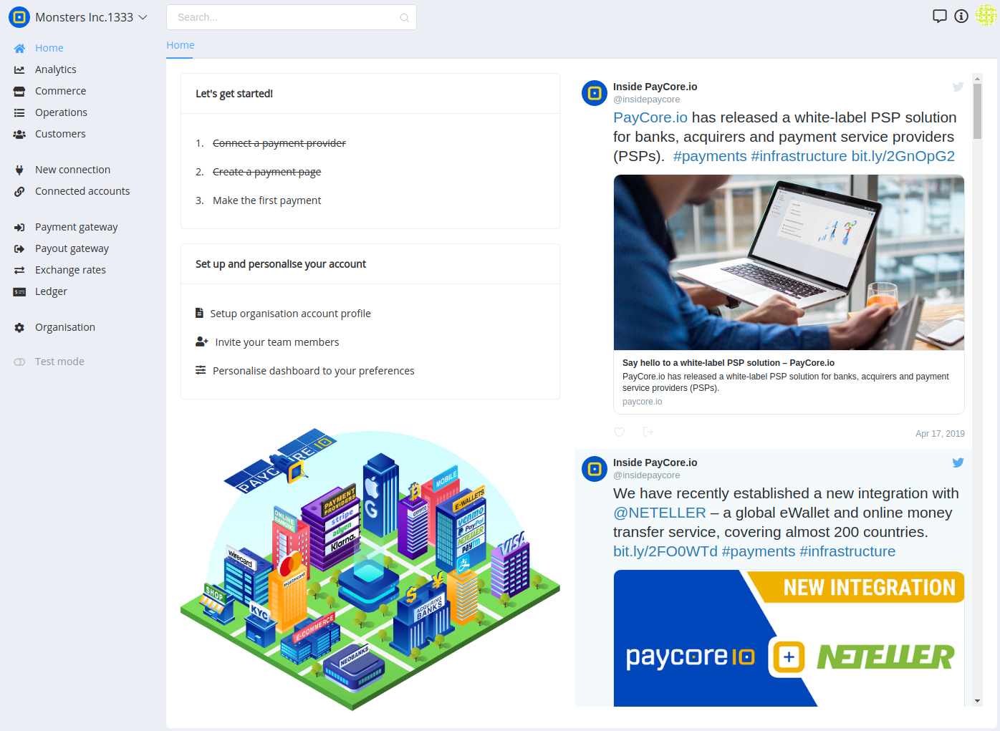

## Introduction

The [PayCore.io](https://paycore.io/) Dashboard is a feature-rich user interface for you to operate and configure your [PayCore.io](https://paycore.io/) account. You can use it to manage payments and payouts, respond to disputes, monitor your integration, and more.

The Dashboard home page provides useful at-a-glance information about the activity on your account. A wide range of analytics and real-time charts provide insight into the performance of your business. The Dashboard also shows recent activity that may require you to take action.

## Basic features

-   **Search**  payments, payouts, customers and provider accounts by using the  **header search bar**.
-   Easily switch between organization accounts with the **account dropdown.**
-   Access the Knowledge Center articles and documentation by clicking the **Help button**.
-   Contact with [PayCore.io](https://paycore.io/) team using the **chat button**.
-   Use the user account dropdown list, to find your: **Profile settings, Access Role in the current organization,** and the **Log Out** button.
-   Control the interval for which the data is being displayed, by selecting one of the predefined timeframes: **today, yesterday, last 7 days, last 30 days, this month, last month** or set a specific timeframe with the **custom range** option.

## Navigation

The Dashboard is primarily organized into separate sections. Each section represents a particular area of the API (e.g.,  Payment Request represents Payment  objects that have been created) or functionality provided by [PayCore.io](https://paycore.io/) (e.g., PayCore Commerce).

In many cases, you can use the Dashboard to perform specific actions, such as refunding a payment or canceling a subscription, without needing to use the API-making the Dashboard a useful tool for running your business.

## Test mode

You can view test data by toggling the Dashboard’s  **Viewing test data**  option. Whether a  _transaction_  was created in test or live mode is dictated by which  [API keys](/products/account)  were used to create it.

## Team member access

You can invite  [team members](http://confluence.paymaxi.com)  to access your Dashboard and help manage your business. Each team member can have different privileges that restrict the information they can see or actions they can take. For instance, you can allow members of your customer service team to access your Dashboard for the purpose of handling  payments  and  payouts.

## Creating reports and searches

All of your transactional data can be filtered and exported as  [reports](/products/analytics)  in CSV format in PayCore's Analytics.

For more advanced searches and reporting, [PayCore Analytics](/products/analytics)  makes all of your data available as an interactive SQL environment in the Dashboard. You can write queries to generate highly customized reports without needing to use additional reporting tools.

## Browser compatibility

The Dashboard officially supports the following web browsers and mobile environments:

-   Chrome versions greater than 49
-   The last two versions of Firefox, Safari, and Edge
-   The last two versions of mobile Safari on iOS
-   Internet Explorer 11