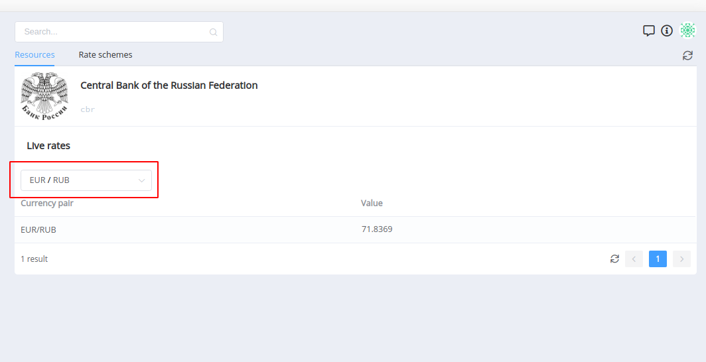
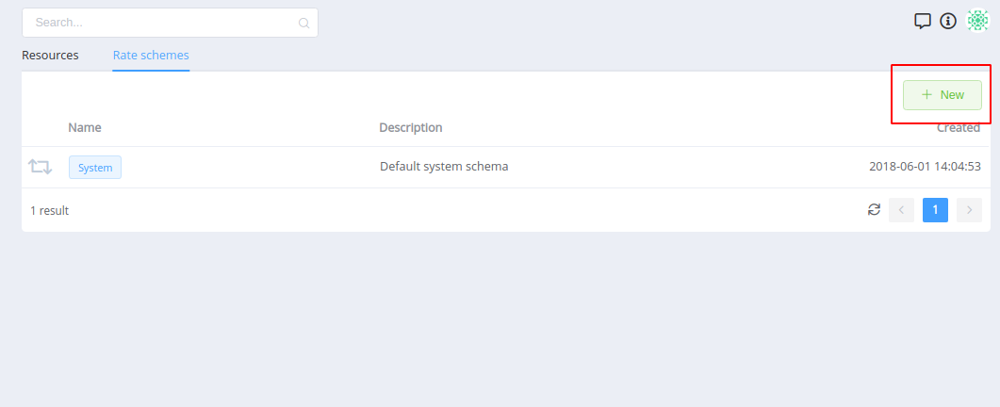
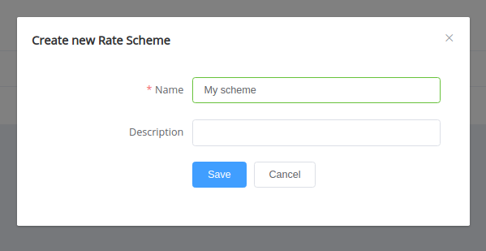
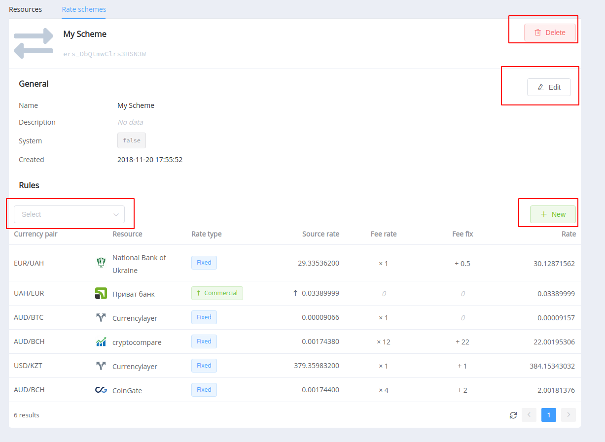
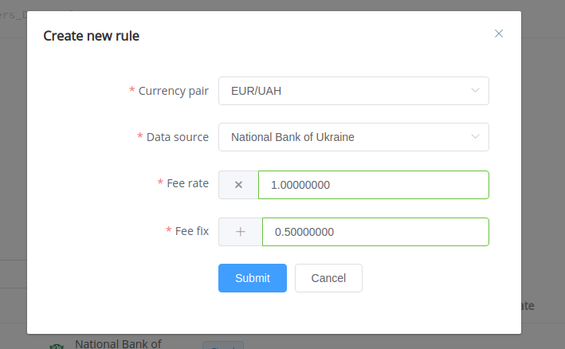
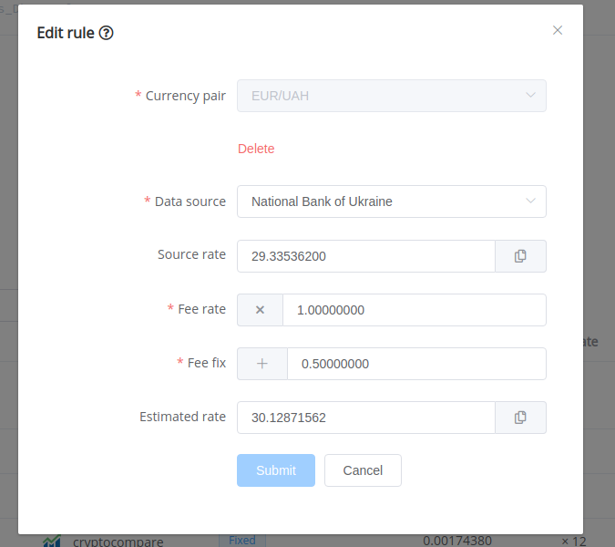

# FX Rates: How To

Раздел [FX Rates]({{custom.dashboard_base_url}}fx-rates) состоит из 2 подразделов:
- Ресурсы
- Схемы курсов

## Resources

### Курс по валютной паре

## Rate Schemes

### Создание новой схемы

При создании новой схемы достаточно указать её имя. Его можно будет сменить.

### Редактирование схемы

Редактирование схемы включает:

1. Изменение информации (Имя, описание)
2. Удаление схемы
    
    !!! info
        Удалить схему можно только если она нигде не задействована:
        
        - Payment Page
        - Payout Point
        - Commerce Scheme
        - Payment/Payout Request

    

3. Добавление правил:

    При добавлении нужно: 
    
    - выбрать валютную пару

        !!! info
            Для каждой валютной пары можно создать 1 правило!

    - Выбрать источник курса
    - Задать **`Fee rate`**, **`Fee Fix`**

    

4. Изменение/Удаление правил

    Нажмите на правило в списке для открытия окна редактирования:

    

    **`Estimated Rate`** — итоговый рассчётный курс конвертации, с учётом **`Fee rate`**, **`Fee Fix`**

