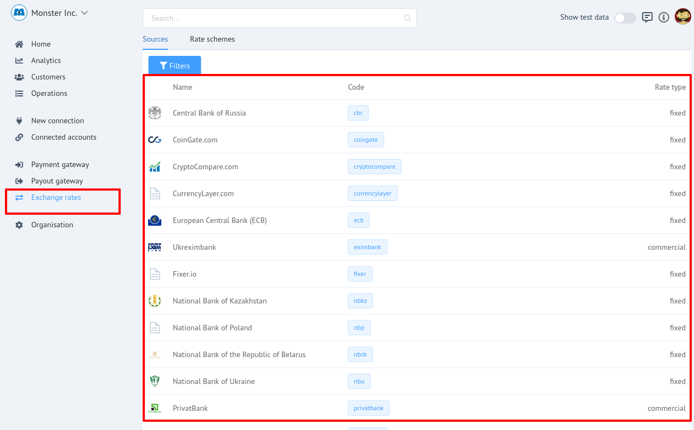
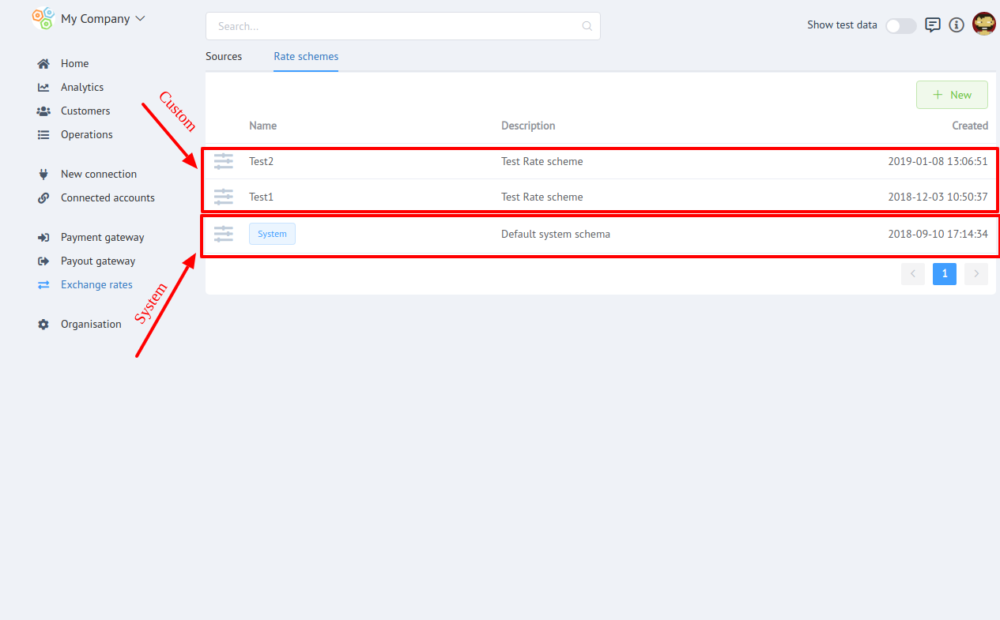
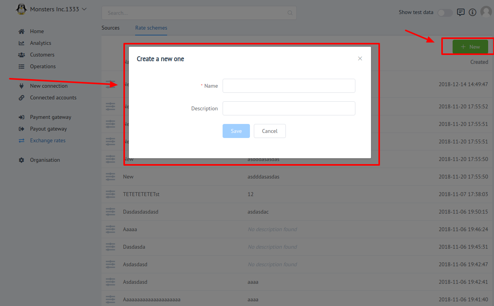

# Exchange Rates

## Overview

In finance, an **`exchange rate`** or  **`currency rate`**   is the rate at which one currency will be exchanged for another. It is also regarded as the value of one country’s currency in relation to another currency.

For each organization, **_a list of base currencies_** with which it works is determined.

!!! tip
    If the required currency is not supported by the system, the client can request its addition through the feedback form.
    

This section of PayСore.io Dashboard is intended to make you informed about current currency rates and it's [Resources](../resources) and manage [Rate schemes](../rate-schemes).

## Course calculation strategies

!!! info "Definition"
    **`Currency quotation`** is the fixing of the national currency in a foreign.

There are  **`two`** types of Strategies:

- **`Direct quotation`**  shows the amount of base currency per unit of quoted currency.

- **`The reverse (indirect) quotation`** reflects the number of units of the quoted currency per unit of base currency.

## FX Resources

!!! info "Definition"
    **`Resource`**  -  is a source of exchange rates of a certain type  for the currency pairs it supports.

There are **`two`** types of Exchange rates:

 - **`Fixed`** : A fixed exchange rate is a regime applied by a country whereby the government or central bank ties the official exchange rate to another country's currency or the price of gold. The purpose of a fixed exchange rate system is to keep a currency's value within a narrow band.

 - **`Commercial`**  - the rates of commercial banks and exchangers.
 
!!! note
    **`Commercial`** Resource has **`two`** rates:

    - Ask (Buy)
    - Bid (Sell)

 Here you can get informed about current currency rates in one of supported resources.
 
 There is an ability to filter rates by certain currency pair.

!!! tip
    To filter rate list use **`currency pair input`** above the Live rates  list.




## Rate schemes

**Rate scheme** - is  an entity that determines exchange rules for currency pair in your organisation.  

[](images/rate-schemes_1.png)

There are **`two`** types of Rate Schemes:

- **`System`** : Default presetted rate scheme, which icludes rules for all system currency-pairs.
    
    !!! warning 
        **`System scheme`** can not be _```deleted```_ or _```modified```_!

- **`Custom`** : An organisation administrator can create  custom rate schemes for current organisation.




### Rules

Rate scheme rule icludes:
 
 - Currency pair
 - Resource
 - Source Rate Type
 - Fee rate (%)
 - Fee fix
 - Rate

You can create (add) rule using **`+ New`** button above the rules list.

!!! note
    For Rules with **`Commercial`** Resource user should choose between  **`Ask`** and **`Bid`** source rate.

