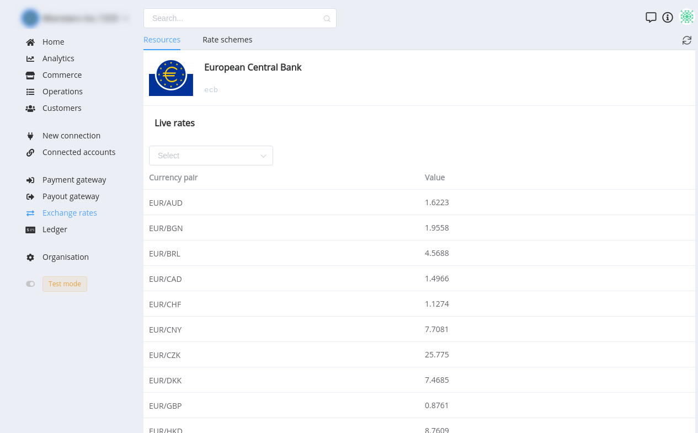
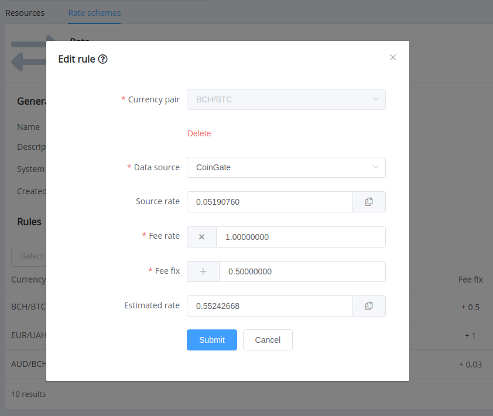

# FX Rates

## Basics

**Валютный курс** — это соотношение обмена двух денежных единиц на валютном рынке, формирующееся в зависимости от спроса и предложения той или иной валюты, а также от ряда других факторов.

{{custom.company_name}} имеет ряд [подключённых источников курсов]({{custom.dashboard_base_url}}fx-rates/resources). В случае необходимости 
подключить новый источник, свяжитесь с нами. 

Вы всегда можете посмотреть актуальные курсы на странице источника.

Источники могут иметь курсы нескольких типов:

1. Фиксированные
2. Коммерческие
    - Ask
    - Bid

## Rate Scheme

**Rate Scheme** — определяет правила и условия конвертации валют при проведении операций.

По умолчанию используется **System**. Эта схема содержит все доступные валютные пары и все правила имеют `fee_rate`,`fee_fix` — **0**. 

Для управления курсами для операций необходимо **создать новую схему**.

В созданой схеме необходимо задать правила для каждой валютной пары, указав источник, и поправочные коефициенты `fee_rate`,`fee_fix`. На выходе рассчитывается `Estimated Rate`, который будет применяться в конвертации.

