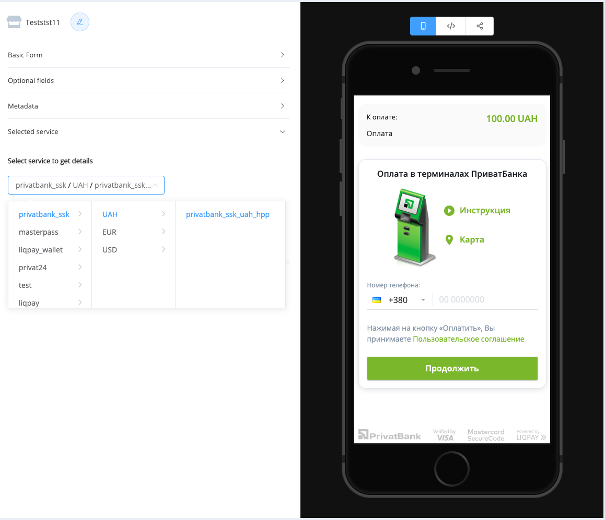
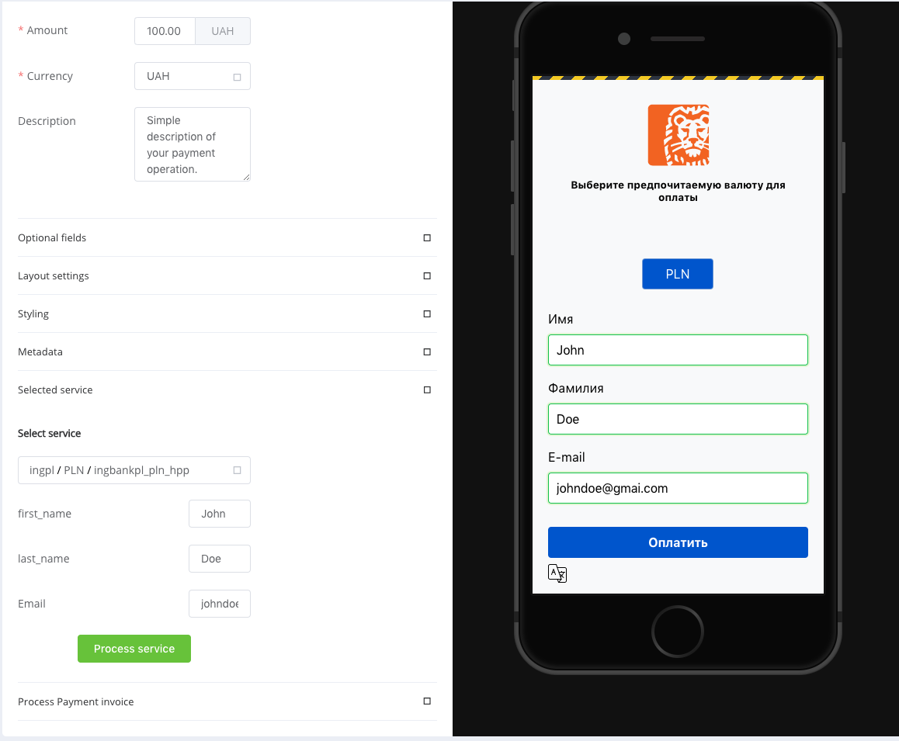
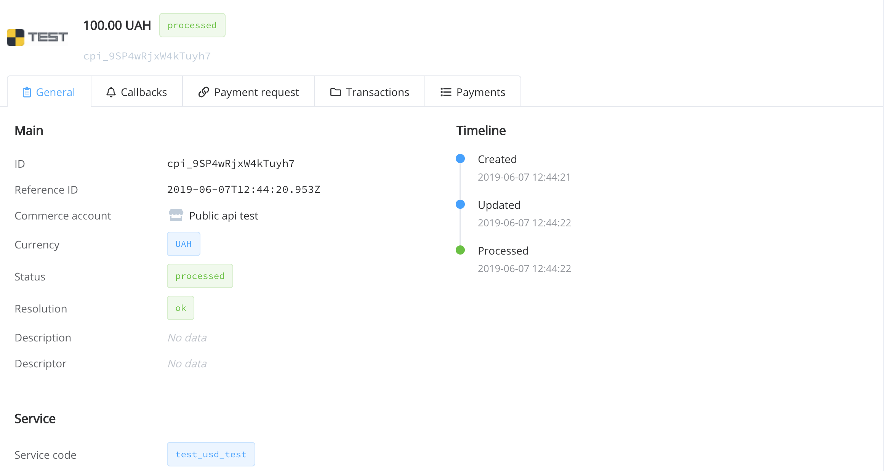
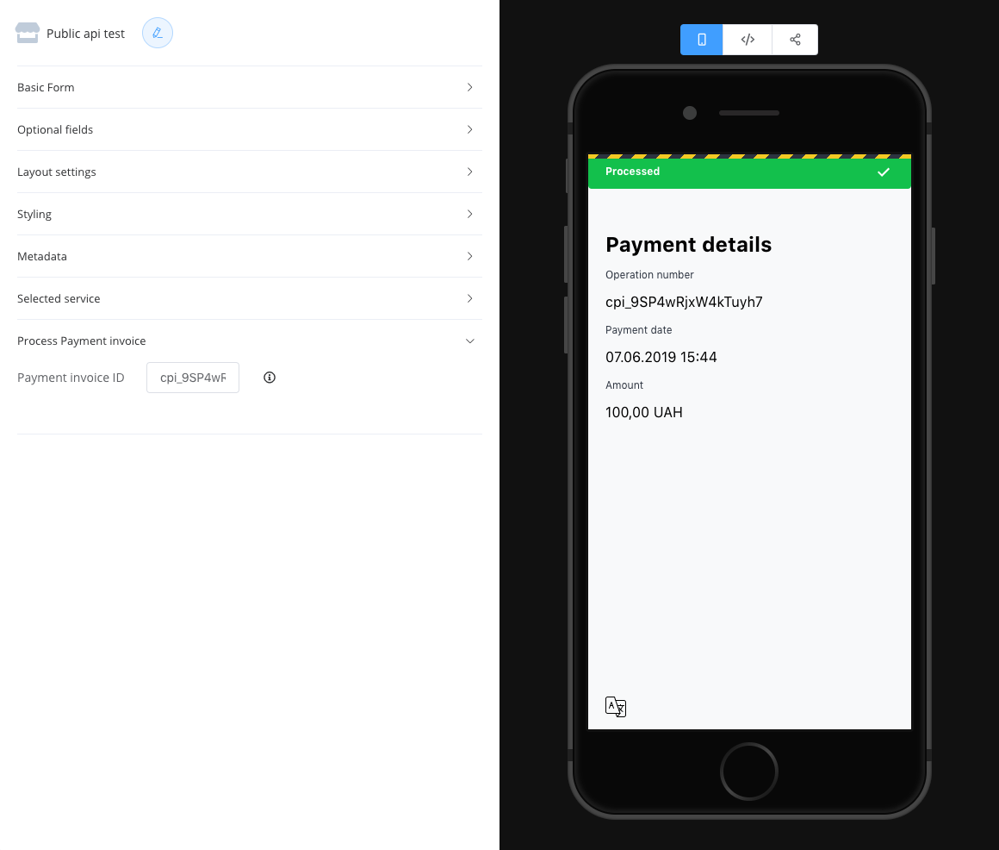

# HPP Guide: Quick start and integration

!!! note
To share your HPP with customers You can only use <b>active</b> commerce account which allowed to public API access.
Please contact your account Administrator if you need to activate commerce account or allow public payment invoice creation.

## Integration

### Widget

The fastest and easiest way to use our HPP is to use payment_widget.js.
To integrate the widget into your website, you can download it from the CDN.
Or integrate the library into your javascript build.

#### Integration

```html tab="CDN"
<script src="https://unpkg.com/@paycore/payment-widget-js@0.1.91/dist/paymentWidget.umd.min.js"></script>
```

```html tab="JS package"
> Soon...
```

#### Initialization

```javascript
window.payment_widget.init({
  selector: "HTML_ID_SELECTOR_TO_INSERT_WIDGET_INTO",
  flow: "iframe",
  public_key: "YOUR_PUBLIC_KEY",
  amount: "AMOUNT_OF_INVOICE",
  currency: "USD",
  baseUrl: "URL_OF_YOUR_HPP",
});
```

#### Live preview

<figure class="hpp_container">
  <iframe  height="600px" width="375px" src="https://com-dev.paycore.io/hpp/methods?amount=100&currency=UAH&public_key=pk_test_yNznq07p7MChOL8shs7WT3Yat6ZnlqyXq8ep6WKF998&service=&service_fields=&cpi=&description=" frameborder="0" allowfullscreen="true"> </iframe>
</figure>

##### Widget Parameters

| Key        | Type     | Description                                                                                                                                |
| ---------- | -------- | ------------------------------------------------------------------------------------------------------------------------------------------ |
| `flow`     | `string` | User can insert HPP inside iframe on page, or open HPP in new tab in browser <ul><li>iframe</li><li>redirect</li></ul> Default : 'iframe'. |
| `selector` | `string` | ID of DOM element you want HPP to insert into.                                                                                             |

!!! note
List of all available parameters you can find in
[HPP reference]: (./reference.md)

#### Communication with HPP

##### Events

The widget handles a number of events that are generated by HPP which you can handle for various purposes. The table below provides list of events — use them to attach to one or more handlers.

| Event name | When                                                                                                     |
| ---------- | -------------------------------------------------------------------------------------------------------- |
| `delete`   | User click's on "Return to shop" button on success page. Removes the iframe from client page by default. |
| `reinit`   | It's not being used now.                                                                                 |

###### Adding an event handler

```javascript tab="After initializing the widget"
payment_widget.bindEventListener(<Event Name>, handler)
```

## Possible integration cases.

### Iframe

Set flow field to "iframe" and create HTML tag to insert HPP into. Define "selector" key in widget configuration options;

Example:

```Javascript
window.payment_widget.init({
  selector: "HTML_ID_SELECTOR_TO_INSERT_WIDGET_INTO",
  flow: "redirect",
  public_key: "YOUR_PUBLIC_KEY",
  amount: "AMOUNT_OF_INVOICE",
  currency: "USD",
});
```

### Open HPP in new tab

Set flow field to "redirect":

```Javascript
window.payment_widget.init({
  selector: "HTML_ID_SELECTOR_TO_INSERT_WIDGET_INTO",
  flow: "redirect",
  public_key: "YOUR_PUBLIC_KEY",
  amount: "AMOUNT_OF_INVOICE",
  currency: "USD",
});
```

## HPP use cases.

### Default initialization

After you have specified all the required fields and customized your HTP, you will see a list of payment methods.

```Javascript
window.payment_widget.init({
  flow: "redirect",
  public_key: "YOUR_PUBLIC_KEY",
  amount: "100",
  currency: "USD",
});
```


### With a predefined service

#### Service without fields

Each method has services that are used to make payments.

You can watch all enable methods/services in dashboard commerce HPP sandbox.

Also in dashboard user can configure payment link or code snippet to execute on client page. And immediately test the required configuration.

If you specify the code of the service in the service field, the HPP will be opened immediately on this service.

```javascript
window.payment_widget.init({
  selector: "HTML_ID_SELECTOR_TO_INSERT_WIDGET_INTO",
  flow: "iframe",
  public_key: "YOUR_PUBLIC_KEY",
  amount: "AMOUNT_OF_INVOICE",
  currency: "USD",
  service: "CODE_OF_SERVICE_TO_OPEN",
});
```



#### Service with fields

For some payment services it is necessary to specify the data for payment execution. For example, the user's name and phone number.

You can check fields for every service also in the dashboard.
Fill them and add to widget init payload.
If the fields are valid, the service will be performed immediately

```javascript
window.payment_widget.init({
  selector: "HTML_ID_SELECTOR_TO_INSERT_WIDGET_INTO",
  flow: "iframe",
  public_key: "YOUR_PUBLIC_KEY",
  amount: "AMOUNT_OF_INVOICE",
  currency: "USD",
  service: "CODE_OF_SERVICE_TO_OPEN",
  service_fields: [
    { key: "first_name", value: "john" },
    { key: "last_name", value: "doe" },
    { key: "email", value: "johndoe@gmail.com" },
  ],
});
```



#### By payment invoice id

In the list of transactions on your commercial account, you can find a list of payment requests that have already been created. Taking the id of any of them you can immediately initialize the widget.

<b> Smart redirect. </b>

If the service is already in its final status, the user will see its status page.





If the service needs additional actions, such as entering payment data on the PSP side - the user will be directed to the external service.

```javascript
window.payment_widget.init({
  cpi: "PAYMENT_INVOICE_ID",
});
```

<style>
  .hpp_container {
        width: 375px;
        box-shadow: 0 10px 30px 2px rgba(0, 0, 0, 0.56);
        display:flex;
        justify-content: center;
        border-radius: 10px;        
        overflow: hidden;
  }
  .hpp_container iframe {
        border-radius: 10px;        
  }
</style>
