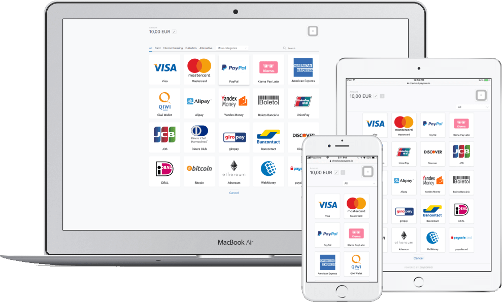

# Commerce Hosted Payment Page

## Overview

Start accepting online payments in just a few minutes with HPP. It's quick and easy to integrate, accepts online payments from all major methods and credit cards, and is customizable to your brand.

The  **Hosted Payment Page**  (HPP) is a service that lets you use PayCore.io to accept payments without the need of integrating our products in your web pages, or even without having any customer fronting website for  _In-store_  or  _Telesales_  use cases.

HPP lets you accept payments on your website with PayCore.io just by redirecting the customer in the checkout flow.

It supports  _PayCore.io Commerce_  so that you get the solution that matches the best your eCommerce needs. With distribution mechanisms (QR Code, SMS and Email), it lets you build your own customized flow that goes beyond the typical eCommerce solution.

Before deciding to integrate the Hosted Payment Page, make sure that you checked our guidelines regarding integrations depending on your use case. A seemless integration of _PayCore.io Commerce_ in your eCommerce checkout flow will always lead to a better conversion rate than using our HPP.

For more information, visit our product page on [PayCore.io HPP](https://paycore.io/payment-gateway/checkout/).

## Benefits

Why use PayCore.io’s in-app Hosted Payment Page rather than building your own checkout form:

### Flexibility and Adaptivity

-   Easy to setup. It only takes 5 minutes to have a working flow.
-   Integrate multiple payment methods like Card, PayPal, Direct debit via Gocardless, ACH via Stripe and Plaid. PayCore.io provides a way to control these payment methods without even changing a single line of code at your end.
-   All payment methods you have enabled are – when relevant – shown to your customers. A newly activated payment method is available immediately for all of your visitors.
-   The Commerce HPP are designed to work with all the payment methods in the world.

### Excellent User Experience

-   PayCore.io’s Hosted Payment Pages are suitable for web, smartphones and tablets.
-   Takes full advantage of mobile browser’s autocomplete functionality. For eg. card scanning is supported in iPhone safari browser.
-   You can alter the look and feel of the page easily online in the _Commerce Account settings in Dashboard_.
-   You can offer over 10 languages to your customers.

### Smart & Secure payments

-   If the customer’s first choice of payment method is not successful, it’s very easy for the customer to select and try another one. If a customer appears to not have sufficient credit on a checking account a retry by credit card could easily be attempted. We handle this for you without asking you to implement any extra APIs.
-   PayCore.io optimizes the order of payment methods. For Dutch customers we know to list iDEAL at the top while for Belgians we start off with the payment method Bancontact. A lot of effort goes into this and we optimize this using A/B-testing. This way we improve your conversion without your effort.
-   You can make use of PayCore.io’s smart routing rules to manage payment gateways. For different currencies, different gateways can be configured. You need not worry about changing your code, if you want to switch to a different gateway. Change your smart routing rule, it will get applied in your checkout pages
-   PCI compliance for collecting card details.

## Use cases

HPP is especially made to help you use  **PayCore.io Commerce**  in workflows that are not typical e-commerce flows. It is a good fit when you are interacting with a customer and you need to enable a payment in a store or by phone, without having to host a website. You interact with the customer to define the order and either redirect them to the Hosted Payment Page or send them a link to pay by Email, SMS or even QR Code.

As this hosted solution provides only basic customization features, for other cases PayCore.io encourages you when possible to integrate  _PayCore.io Payments_  directly in your website to get a better user experience and conversion rate.

### In-store

HPP lets you provide PayCore.io as a payment method in your website store, your customer will be able to finance their purchase in a few questions with PayCore.io.

### Telesales

HPP lets you accept payments in a Telesales flow without the need of any website integration. Send your customer a _paylink_ by e-mail or sms and let them pay the order. Paylink could be generated like a QR code.

## How it works

Once a customer has added items to the shopping cart and filled out the shipping and billing details, he or she needs to choose the payment method and needs to provide the payment details. If you choose not to touch and store the credit card details of your customers, you can outsource your payment page to us and use the Hosted Payment Page.

The payment method selection can be done on your site or can be hosted by us. The payment page itself is hosted by PayCore.io and takes care of building forms, validating the input and securing your customers payment details.

## Follow our guide

1.  [Choose your integration path](/products/hpp/integration-methods/).
2.  Learn more about  [objects handled using Commerce APIs](/products/hpp/integration-overview/): payment invoice, payment request, callbacks…
3.  Read our  [step by step integration guide](/products/hpp/integration-guide/)  and create your own flow.
4.  Check that you  [respect specific use cases rules](/products/hpp/#use-cases)  for Telesales or In-store cases.
5.  [Customize the Hosted Payment Page](/products/hpp/customization/)  to increase conversion.
6.  Read the  [Full HPP API Reference](/integration/api-references/#commerce-hpp).