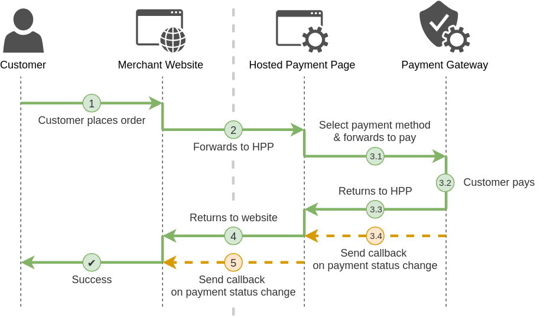

# HPP: Quickstart

## Introduction

Hosted Payment Page (HPP) is a ready-to-go solution that allows quick and easy integration with PayCore.io. You only have to redirect your customers to the payment form we give you. There’s also no need for you to pass any PCI scans or have an SSL certificate (though having one is always recommended), since the actual payment is submitted via our secure payment page.


## Try it out

Why not give HPP a test run? Click the  **Pay Now**  button below and the form will spring to life.

<figure class="hpp_container">
    <iframe height="600px" width="100%" src="https://com.paycoreio.com/hpp/methods?amount=100&currency=UAH&public_key=pk_test_yNznq07p7MChOL8shs7WT3Yat6ZnlqyXq8ep6WKF998" frameborder="0" allowfullscreen="true" scrolling="no"></iframe>
</figure>


## Customer Journey

PayCore.io Commerce HPP is a secure hosted payment page, where you can redirect customers from your website to make a payment through PayCore.io. Commerce HPP provides customers with access to a range of payment methods, based on their location and your account and integration settings. Integration to Commerce HPP is simple and requires collecting customer payment information on your website in a standard HTML form and submitting this to PayCore.io.

Commerce HPP then collects the customer payment details needed to complete the payment, and sends these details to the relevant bank or payment provider for authorisation. After the payment is complete, the customer is returned to your website and you receive a real-time notification of the payment, which includes details of the transaction.

A simplified illustration of the PayCore.io HPP payment flow is shown in the figure below.



??? tip "Full customer journey details"
    1.  A customer on your website decides to checkout.
    2.  Your website redirects the customer to the Hosted Payment Page on the PayCore.io platform by submitting HTML form or calling the Private API with Payment Invoice data the amount, a payment description, a callback URL, and a Return URL we should redirect the customer to after the payment is made.
    3.  The customer reaches the Hosted Payment Page, chooses a payment method and makes the payment. This process is entirely taken care of by PayCore.io. You don’t need to do anything here.
    4.  At this point PayCore.io returns the visitor to your website using the  `return_url`  specified when the payment was created. Your website already knows the payment was successful and thanks the customer.
    5.  When the payment is made PayCore.io will call your  [callback URL](/integration/callbacks/)  informing your website about the  [payment’s invoice status change](/products/commerce/payment-invoice/). You should define a callback when creating the initial payment.
        
        In response to your callback being called your application just needs to issue a  `200  OK`  status. From that response PayCore.io can tell that your processing of the new status was successful – for any other response we keep trying.

        This fetched status serves to mark the payment paid, trigger fulfilment and send out an email confirmation to the customer.

## Requirements

Commerce HPP is the easiest and the quickest way to integrate checkout into your website.  **No coding knowledge**  is required. But your requirements should satisfy the below conditions:

-   You do not have an user authentication or management system at your end and you rely on PayCore.io for providing it.
-   Only after completing checkout, end users are allowed to access your product or service.

You can integrate with any of our payment page experience offerings. Choose from one of our simple hosted solutions — **Payment Widget** or **Payment Link** which are based on **Commerce HPP API**.


## Integration methods

Read about our integration methods below, then choose the one that best suits your needs.

### Payment Widget


Payment widget is our simplest integration method and requires little technical know-how. It's a payment lightbox that you can easily add to your website without redirecting client to the separate payment page.

Widget is integrated directly to the website page — client selects a payment method, fills out payment details and confirms payment in the widget.

=== "Payment Widget Example"
    ```html
    <script async src="https://unpkg.com/@paycore/payment-widget-js@0.1.93/dist/paymentWidget.umd.min.js"></script>
    <script>
    window.HPPConfig = {
        public_key: "<your_public_key>",
        amount: 100.00,
        currency: "USD",
        description: "Some goods"
    };
    </script>
    <div id="payment_widget" style="width: 375px; height: 600px;"></div>
    ```

### Payment Link


Payment Link is a quick and easy solution for accepting payments. Just create, and optionally customize, a Payment Link, then copy and paste the HTML code snippet to your website.

The simplest case would involve an HTML form with specific information that would be sent via a GET request. There’s no need to require any the data from your customers, so all the fields will be hidden in most cases. 
Here’s how it can look like:

=== "HTML Form"

    ``` html
    <form action="https://com.paycore.io/hpp/" method="get">
        <input type="hidden" name="public_key" value="<your_public_key>" />
        <input type="hidden" name="currency" value="USD" />
        <input type="hidden" name="description" value="Some goods" />
        <input type="hidden" name="amount" value="100" />
        <input type="submit" value="Pay" />
    </form>
    ```

=== "URL (Link)"

    ``` html
    <a href="https://com.paycore.io/hpp/?public_key=your_public_key&currency=USD&description=Some%20goods&amount=100" target="self" />
    ```

=== "QR Code (Image)"

    ```html
    
    ```

??? tip "Payment Link as a QR-Code"
    Payment Link could be generated even like a QR code:

    

### Widget vs Link

|Feature                   |Payment Widget|Payment Link    |
|--------------------------|--------------|----------------|
|Technology                |JavaScript    |HTTP GET Request|
|Request Validation        |✔             |                |
|Error & Event Handing     |✔             |                |
|Invoicing via Email or SMS|              |✔               |
|Invoicing via QR-code     |              |✔               |

### Alternative methods

Our additional integration methods:

-   To study all the APIs, such as cancelling subscriptions, issuing refunds, getting the list of supported methods, go to  [full API References](/integration/api-references/).
-   For server-side API libraries, check out the  [Server SDKs section](/integration/sdks/).
-   For shopping cart systems or e-commerce solutions, such as Magento or Woocommerce, check out the  [CMS Modules & Shopping Cards](/integration/cms-modules/).

Read about our all integration methods for accepting payments below, then [choose the one that best suits your needs](/integration/accept-payments/).

## Basic integration

### Before you start

Make sure you have your  `public_key`. You can find it in the  [Dashboard](https://dashboard.paycore.io/), under  **Commerce Account Settings > Integration**. If you don't have an account with us yet, sign up for your free test account at  [PayCore.io](https://dashboard.paycore.io/).

!!! warning "General requirements"

    HPP works only with:

    * [x]  *active* commerce account 
    * [x]  which *allows public creation for payment invoices*
    * [x]  and has at least *one active currency*

    Please contact your account Administrator if you need to set up those options for it.


### Step 1:  Pick a integration method

First, you need to choose a [integration method](#integration-methods). We offer two ways to integrate HPP into your website, so you can pick the one that best fits your requirements.


### Step 2:  Add the code snippet to your site

Next, copy the code snippet for your chosen method and add it to your checkout page.

You'll need to replace the example  `public_key`  with your own, and edit the required key-value pairs to reflect the order details (see the  [full reference](/products/hpp/reference/)  below for details).

=== "Payment Widget (JS)"

    ``` html
    <script async src="https://unpkg.com/@paycore/payment-widget-js@0.1.93/dist/paymentWidget.umd.min.js"></script>
    <script>
    window.HPPConfig = {
        public_key: "<your_public_key>",
        amount: 100.00,
        currency: "USD",
        description: "Some goods"
    };
    </script>
    <div id="payment_widget" style="width: 375px; height: 600px;"></div>
    ```

=== "Payment Link (HTML Form)"

    ``` html
    <form action="https://com.paycore.io/hpp/" method="get">
        <input type="hidden" name="public_key" value="<your_public_key>" />
        <input type="hidden" name="currency" value="USD" />
        <input type="hidden" name="description" value="Some goods" />
        <input type="hidden" name="amount" value="100" />
        <input type="submit" value="Pay" />
    </form>
    ```

### Step 3 (Optional):  Add callback handler to your backend app

When the payment process is complete PayCore.io sends the details of the transaction to the `callback_url` page you provided in your payment request. This is done with a standard HTTP POST. The PayCore.io server continues to post the status until a response of HTTP `OK` (`200`) is received from your server or the number of posts exceeds `attempts_limit` (10 by default).

More information about handling callbacks you could find [here](/integration/callbacks/).

## Embed options

We provide two ways to integrate:

**Full-page redirect**: Redirect to a customizable hosted payment page.

:    The Hosted Payment Page are displayed full-page in a browser. When your customers are redirected to the Hosted Payment Page, the web address for the Hosted Payment Page is displayed. Full-page redirect supports over 60 payment methods.

??? example "Full-page redirect examples"

    === "Payment Widget (JS)"

        ``` html hl_lines="8"
        <script async src="https://unpkg.com/@paycore/payment-widget-js@0.1.93/dist/paymentWidget.umd.min.js"></script>
        <script>
        window.HPPConfig = {
            public_key: "<your_public_key>",
            amount: 100.00,
            currency: "USD",
            description: "Some goods",
            target: "redirect"
        };
        </script>
        ```

    === "Payment Link (HTML Form)"

        ``` html hl_lines="1"
        <form action="https://com.paycore.io/hpp/" method="get" target="_self">
            <input type="hidden" name="public_key" value="<your_public_key>" />
            <input type="hidden" name="currency" value="USD" />
            <input type="hidden" name="description" value="Some goods" />
            <input type="hidden" name="amount" value="100" />
            <input type="submit" value="Pay" />
        </form>
        ```

**Embedded (iframe or lightbox)**: Display an overlay payment form on your site.

:    The Hosted Payment Page are displayed in an **iframe** or **lightbox** within your website. When you redirect your customers to our payment page, the web address for your website remains unchanged, providing a more seamless shopping experience. An iframe or lightbox integration requires a more advanced integration.

More about embedding options you could find in our [Full Reference Guide](/products/hpp/reference/#embed-options).

??? example "Embedded (iframe or lightbox) examples"

    === "Payment Widget (JS)"

        ``` html hl_lines="8 11"
        <script async src="https://unpkg.com/@paycore/payment-widget-js@0.1.93/dist/paymentWidget.umd.min.js"></script>
        <script>
        window.HPPConfig = {
            public_key: "<your_public_key>",
            amount: 100.00,
            currency: "USD",
            description: "Some goods",
            target: "iframe"
        };
        </script>
        <div id="payment_widget" style="width: 375px; height: 600px;"></div>
        ```

    === "Payment Link (HTML Form)"

        ``` html hl_lines="1 8"
        <form action="https://com.paycore.io/hpp/" method="get" target="payment_frame">
            <input type="hidden" name="public_key" value="<your_public_key>" />
            <input type="hidden" name="currency" value="USD" />
            <input type="hidden" name="description" value="Some goods" />
            <input type="hidden" name="amount" value="100" />
            <input type="submit" value="Pay" />
        </form>
        <iframe name="payment_frame" src="" id="payment_frame" width="100%" height="600"></iframe>
        ```

## Use cases

A shopper makes an order for a total amount payable of GBP 100. The order reference in your backoffice is Internet order 12345.

The order details are:

-   Order summary information to display on the payment review page for the order: _1 digital camera_.
-   The order was placed with unique ID is _12345_.
-   Amount of the order bill is _100 USD_.
-   You want the payment offer to expire on _October 11th 2020, 11:00 am_.

This example represents a complete payment process, based on the order details above.

=== "Payment Widget (JS)"

    ``` html
    <script async src="https://unpkg.com/@paycore/payment-widget-js@0.1.93/dist/paymentWidget.umd.min.js"></script>
    <script>
    window.HPPConfig = {
        public_key: "<your_public_key>",
        reference_id: "12345", // The order was placed with unique ID is _12345_.
        amount: 100.00, // Amount of the order bill is _100 USD_.
        currency: "USD", // Amount of the order bill is _100 USD_.
        description: "1 digital camera", // Order summary information to display on the payment review page for the order: _1 digital camera_.
        expires: 1602414000 // You want the payment offer to expire on _October 11th 2020, 11:00 am_.
    };
    </script>
    <div id="payment_widget" style="width: 375px; height: 600px;"></div>
    ```

=== "Payment Link (HTML Form)"

    ``` html
    <form action="https://com.paycore.io/hpp/" method="get">
        <input type="hidden" name="public_key" value="<your_public_key>" />
        <input type="hidden" name="reference_id" value="12345" /><!-- The order was placed with unique ID is _12345_. -->
        <input type="hidden" name="currency" value="USD" /><!-- Amount of the order bill is _100 USD_. -->
        <input type="hidden" name="amount" value="100" /><!-- Amount of the order bill is _100 USD_. -->
        <input type="hidden" name="description" value="1 digital camera" /><!-- Order summary information to display on the payment review page for the order: _1 digital camera_. -->
        <input type="hidden" name="expires" value="1602414000" /><!-- You want the payment offer to expire on _October 11th 2020, 11:00 am_. -->
        <input type="submit" value="Pay" />
    </form>
    ```

**More examples:**

??? example "Basic payment with description"

    === "Payment Widget (JS)"

        ``` html hl_lines="7"
        <script async src="https://unpkg.com/@paycore/payment-widget-js@0.1.93/dist/paymentWidget.umd.min.js"></script>
        <script>
        window.HPPConfig = {
            public_key: "<your_public_key>",
            amount: 100.00,
            currency: "USD",
            description: "Some goods",
        };
        </script>
        <div id="payment_widget" style="width: 375px; height: 600px;"></div>
        ```

    === "Payment Link (HTML Form)"

        ``` html hl_lines="5"
        <form action="https://com.paycore.io/hpp/" method="get">
            <input type="hidden" name="public_key" value="<your_public_key>" />
            <input type="hidden" name="currency" value="USD" />
            <input type="hidden" name="amount" value="100" />
            <input type="hidden" name="description" value="Some goods" />
            <input type="submit" value="Pay" />
        </form>
        ```    

??? example "Payment with description and unique Reference ID"

    === "Payment Widget (JS)"

        ``` html hl_lines="5 8"
        <script async src="https://unpkg.com/@paycore/payment-widget-js@0.1.93/dist/paymentWidget.umd.min.js"></script>
        <script>
        window.HPPConfig = {
            public_key: "<your_public_key>",
            reference_id: "<your_unique_reference_id>",
            amount: 100.00,
            currency: "USD",
            description: "Some goods"
        };
        </script>
        <div id="payment_widget" style="width: 375px; height: 600px;"></div>
        ```

    === "Payment Link (HTML Form)"

        ``` html hl_lines="3 6"
        <form action="https://com.paycore.io/hpp/" method="get">
            <input type="hidden" name="public_key" value="<your_public_key>" />
            <input type="hidden" name="reference_id" value="<your_unique_reference_id>" />
            <input type="hidden" name="currency" value="USD" />
            <input type="hidden" name="amount" value="100" />
            <input type="hidden" name="description" value="Some goods" />
            <input type="submit" value="Pay" />
        </form>
        ```    

??? example "Payment with customer details"

    === "Payment Widget (JS)"

        ``` html hl_lines="9 10 11 12 13 14 15 16 17"
        <script async src="https://unpkg.com/@paycore/payment-widget-js@0.1.93/dist/paymentWidget.umd.min.js"></script>
        <script>
        window.HPPConfig = {
            public_key: "<your_public_key>",
            reference_id: "<your_unique_reference_id>",
            amount: 100.00,
            currency: "USD",
            description: "Some goods",
            customer: {
                reference_id: "cus_1234567",
                email: "somename@domain.com",
                name: "John Wick",
                metadata: {
                    key1: "value1",
                    key2: "value2"
                }
            }
        };
        </script>
        <div id="payment_widget" style="width: 375px; height: 600px;"></div>
        ```

    === "Payment Link (HTML Form)"

        ``` html hl_lines="7 8 9 10 11"
        <form action="https://com.paycore.io/hpp/" method="get">
            <input type="hidden" name="public_key" value="<your_public_key>" />
            <input type="hidden" name="reference_id" value="<your_unique_reference_id>" />
            <input type="hidden" name="currency" value="USD" />
            <input type="hidden" name="amount" value="100" />
            <input type="hidden" name="description" value="Some goods" />
            <input type="hidden" name="customer[reference_id]" value="cus_1234567" />
            <input type="hidden" name="customer[email]" value="somename@domain.com" />
            <input type="hidden" name="customer[name]" value="John Wick" />
            <input type="hidden" name="customer[metadata][key1]" value="value1" />
            <input type="hidden" name="customer[metadata][key1]" value="value2" />
            <input type="submit" value="Pay" />
        </form>
        ```    

??? example "Payment with additional fields (metadata)"

    === "Payment Widget (JS)"

        ``` html hl_lines="9 10 11 12"
        <script async src="https://unpkg.com/@paycore/payment-widget-js@0.1.93/dist/paymentWidget.umd.min.js"></script>
        <script>
        window.HPPConfig = {
            public_key: "<your_public_key>",
            reference_id: "<your_unique_reference_id>",
            amount: 100.00,
            currency: "USD",
            description: "Some goods",
            metadata: {
                key1: "SomeValue1",
                key2: "SomeValue2"
            }
        };
        </script>
        <div id="payment_widget" style="width: 375px; height: 600px;"></div>
        ```

    === "Payment Link (HTML Form)"

        ``` html hl_lines="7 8"
        <form action="https://com.paycore.io/hpp/" method="get">
            <input type="hidden" name="public_key" value="<your_public_key>" />
            <input type="hidden" name="reference_id" value="<your_unique_reference_id>" />
            <input type="hidden" name="currency" value="USD" />
            <input type="hidden" name="description" value="Some goods" />
            <input type="hidden" name="amount" value="100" />
            <input type="hidden" name="metadata[key1]" value="SomeValue1" />
            <input type="hidden" name="metadata[key2]" value="SomeValue2" />
            <input type="submit" value="Pay" />
        </form>
        ```

??? example "Payment with custom return URL"

    === "Payment Widget (JS)"

        ``` html hl_lines="5"
        <script async src="https://unpkg.com/@paycore/payment-widget-js@0.1.93/dist/paymentWidget.umd.min.js"></script>
        <script>
        window.HPPConfig = {
            public_key: "<your_public_key>",
            return_url: "https://somedomain.com/",
            amount: 100.00,
            currency: "USD",
            description: "Some goods"
        };
        </script>
        <div id="payment_widget" style="width: 375px; height: 600px;"></div>
        ```

    === "Payment Link (HTML Form)"

        ```html hl_lines="3"
        <form action="https://com.paycore.io/hpp/" method="get">
            <input type="hidden" name="public_key" value="<your_public_key>" />
            <input type="hidden" name="return_url" value="https://somedomain.com/" />
            <input type="hidden" name="currency" value="USD" />
            <input type="hidden" name="amount" value="100" />
            <input type="hidden" name="description" value="Some goods" />
            <input type="submit" value="Pay" />
        </form>
        ```    

??? example "Payment with editable amount"

    === "Payment Widget (JS)"

        ```html hl_lines="3 7 13 14"
        <script>
        function initPaymentWidget() {
            const amount = document.getElementById("amount").value;
            window.payment_widget.init( {
                public_key: "<your_public_key>",
                reference_id: "<your_unique_reference_id>",
                amount: amount,
                currency: "USD",
                description: "Some goods",
            });
        }
        </script>
        Enter amount:<input type="number" id="amount" name="amount"/><br/>
        <input type="button" value="init" onclick="initPaymentWidget()"/>
        ```

    === "Payment Link (HTML Form)"

        ```html hl_lines="5"
        <form action="https://com.paycore.io/hpp/" method="get">
            <input type="hidden" name="public_key" value="<your_public_key>" />
            <input type="hidden" name="reference_id" value="12345" />
            <input type="hidden" name="currency" value="GBP" />
            Amount: <input type="text" name="amount" value="100" />
            <input type="submit" value="Pay" />
        </form>
        ```

More about configuration options you could find in our [Full Reference Guide](/products/hpp/reference/).

## Make HPP your own

### Customization

HPP gives you the flexibility to adjust its look and feel to suit your brand and payment page. You can display your company's logo, use custom fonts and add some color to represent your brand's personality. Check out our [Customization Guide](/products/hpp/customization/) for more details.

### Configuration options

You'll find a list of all the possible configuration options, plus some examples, in our [HPP reference guide](/products/hpp/reference/).

### Self-hosted Payment Page

Integrating using API provides you with better control. But requires coding knowledge. Choose this option if you:

-   Have user authentication / management system at your end.
-   Or need more control than offered by  **HPP**  (like 'price overriding' , changing 'trial end date')

Jump to  [this page](/products/hpp/self-hpp/)  for the API based integration steps.

## Follow our guide

1.  To learn which components works with which API, check the  [Integration Overview](/products/hpp/integration-overview/).
2.  Learn more about  [callback handling](/integration/callbacks/).
3.  Read our  [step by step integration guide](/products/hpp/integration-guide/)  and create your own flow.
4.  Check that you  [respect specific use cases rules](/products/hpp/#use-cases)  for Telesales or In-store cases.
5.  [Customize the Hosted Payment Page](/products/hpp/customization/)  to increase conversion.
6.  Read the  [Full HPP API Reference](/products/hpp/reference/).