# Hosted Payment Page Samples

The sequence of payment pages is the same whether you use a full-page redirect or Payment Widget integration.

Depending on the payment flow used for payment, one or more payment specific pages can be displayed next in the payment page flow.

## IFrame and lightbox pages

We apply responsive web design to payment content displayed in an iframe or lightbox. When the width of the parent page is resized, the content in the iframe or lightbox is automatically adjusted.

Depending on the content being displayed, the height of the iframe or lightbox may increase. For an iframe, the content in the parent page that is below the iframe is pushed down as the payment page content expands vertically.

With an iframe integration, an iframe containing the Hosted Payment Pages is injected directly into a webpage on your site. Although your customers are redirected to our secure payment pages for payment, it appears to them that they 
remain on your website.

With lightbox integration, the Hosted Payment Pages are displayed in a layer over your website.

This image shows a lightbox with the payment details page for a fictional shop:
    
[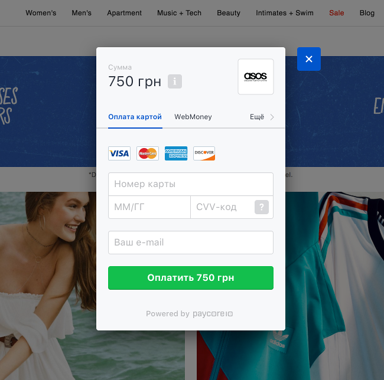](images/hpp_modal_view.png)

## Payment method selection page

This first page displays the payment methods available to the shopper, which depend on:

-   The country specified 
-   The payment methods set up on your account

!!! note
    Alternatively, you can request the shopper's desired payment method on your website and then provide it to PayCore.io. If you do, this page is bypassed, shortening the shopper's payment journey.

**Desktop view**

**Modal view**

[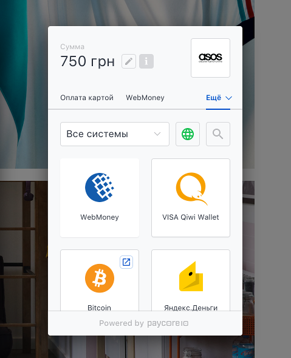](images/hpp_modal_methods_list.png)

## Payment Flows

### Card payment flow

Shoppers can securely enter their payment information on the payment details page. They can also opt to select a different payment method or to cancel the payment.

[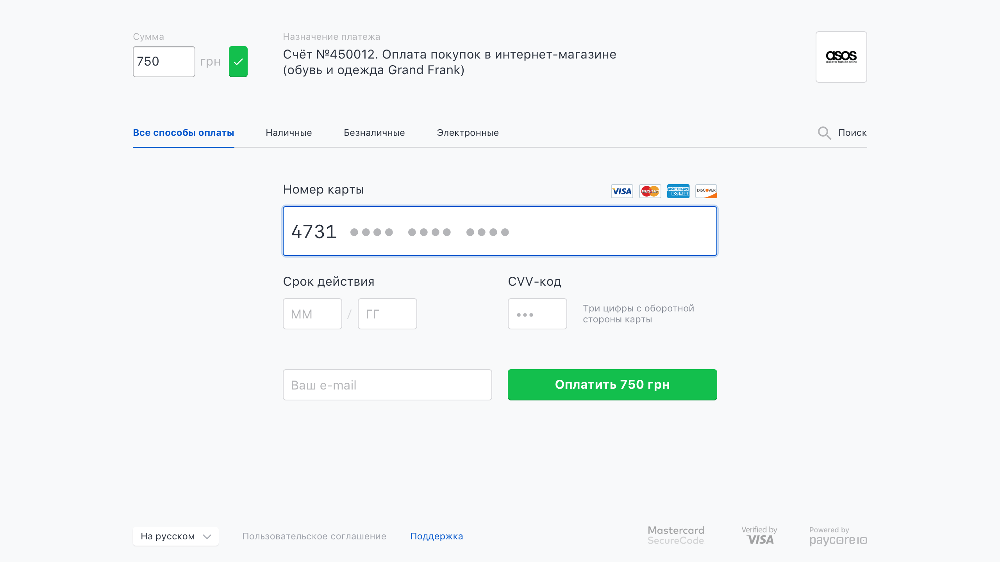](images/hpp_payment_card.png)

#### 3D Secure

The payment pages display 3D Secure (3DS) content in an iframe. Shoppers have 30 minutes to enter their authentication details after which an expiry message is displayed. This 30-minute time-out period cannot be changed.

!!! note
    We have no control over the display of 3DS content in an iframe. Scroll bars will appear within the 3DS Authentication window if the issuer's content exceeds the recommended scheme dimensions.

### Payment service without fields

[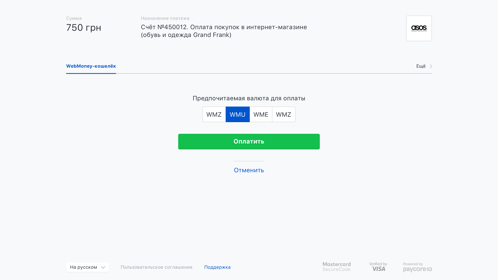](images/hpp_payment_webmoney.png)

### Payment service with fields

In this example, JavaScript is enabled and the fields are validated in real-time. The  _Make payment_  button is not available until all mandatory fields are populated correctly.

[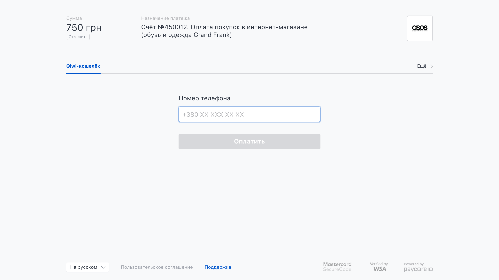](images/hpp_payment_qiwi.png)

### Offline bank transfer instruction page

[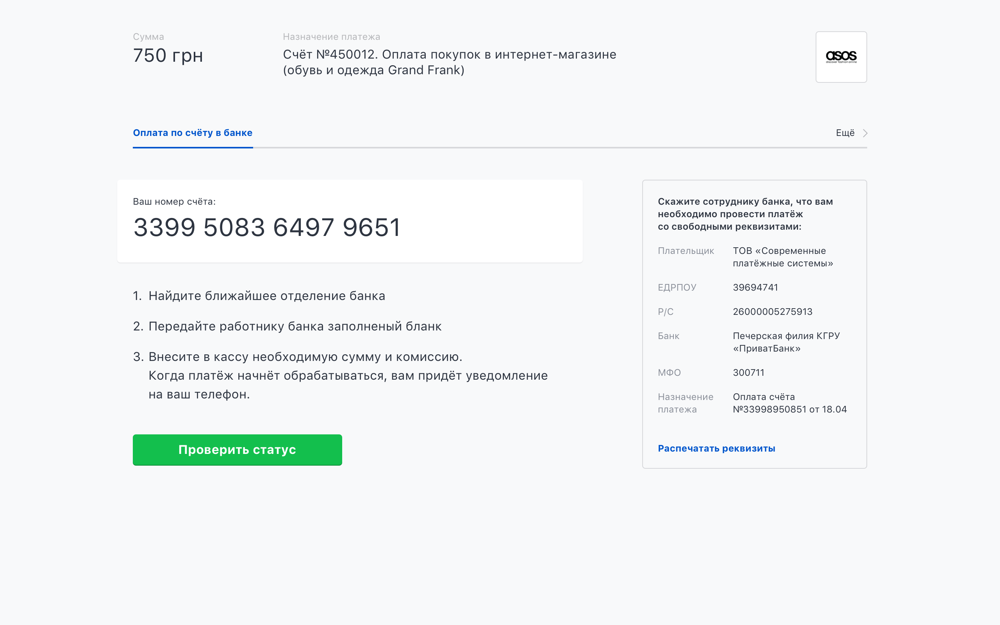](images/hpp_payment_invoice.png)

### Self-service kiosk instruction page

[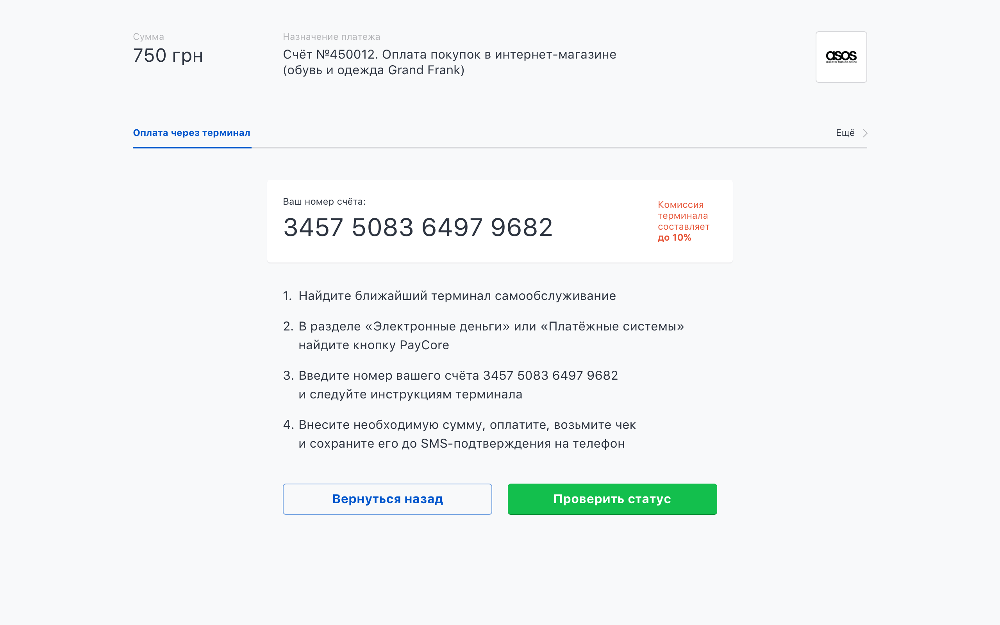](images/hpp_payment_terminal.png)

### Test flow

[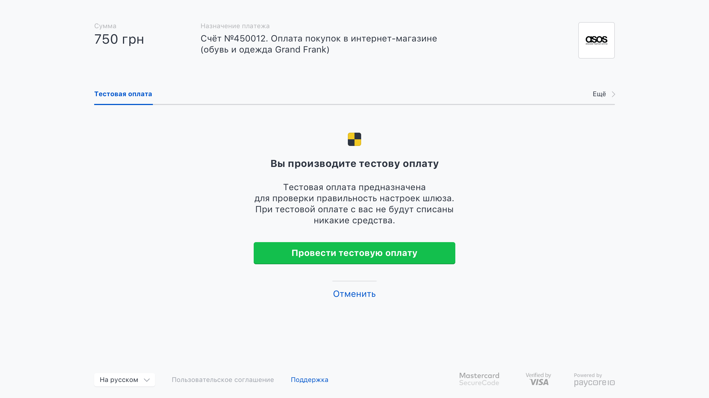](images/hpp_payment_test.png)

## Redirection to payment gateway

!!! note
    Some payment methods must be consumed via a full-page redirect integration. We therefore recommend that you tell your shoppers to have JavaScript and 3rd party cookies enabled before they select and use an payment methods.

[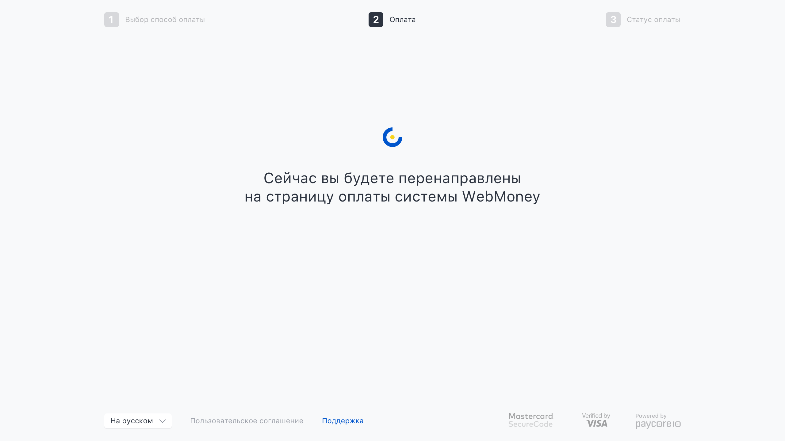](images/hpp_redirect.png)

## Payment result page

The payment result page provides the status of the payment to the shopper.

!!! note
    You can use PayCore.io's default result pages. However, to ensure that your customer is returned to your website, we recommend that you provide your own.

### Success

[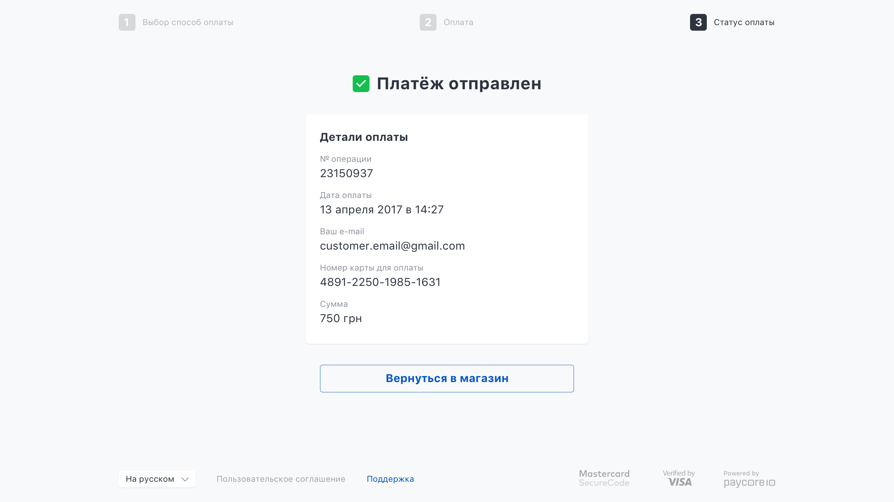](images/hpp_result_success.png)

### Pending

[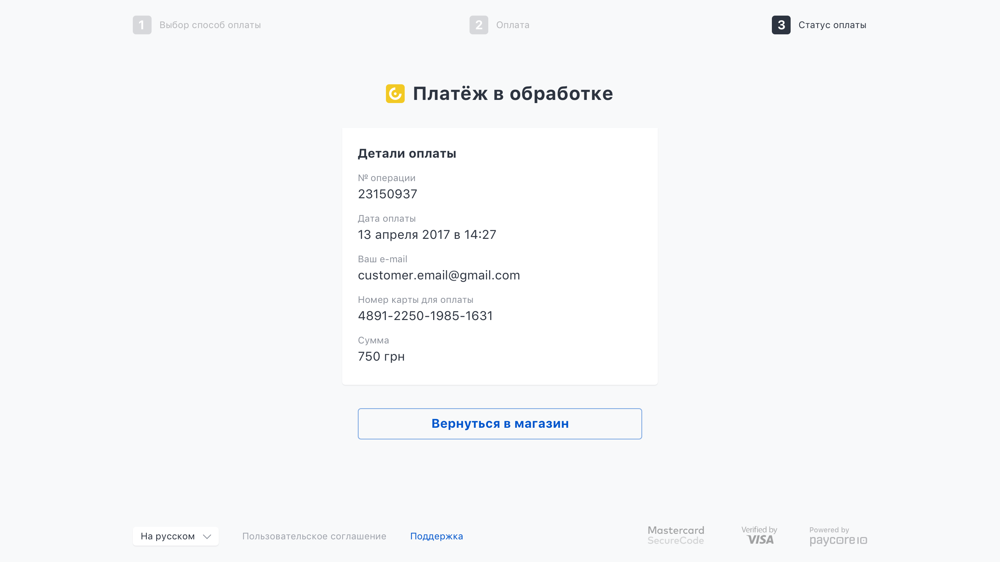](images/hpp_result_pending.png)

### Failure

