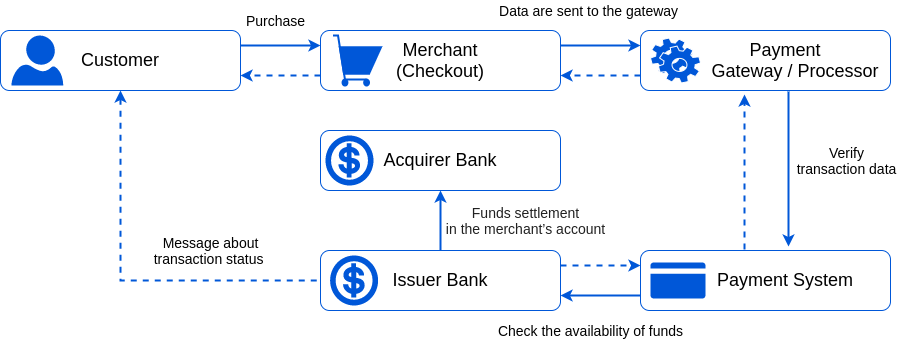

# Basics of payments

## Payment flow

A payment transaction flow is the journey of payment from start to approval and credit funds. When a customer buys something using a credit card, funds follow a transaction flow passing through several players to finish the payment.

The main participants there are:

- Payer (cardholder) that decides to pay for the service.
- Merchant (business owner or service provider) to whose account the funds are transmitted.
- Acquirer processes payments on behalf of the merchant and routes them through the card networks (such as Visa or Mastercard) to the issuing bank.
- Seldom acquirers may attract third party providers to help process payments. **Payment providers (PSP)** can offer the organisation of payment reception, Internet acquiring, agency cooperation scheme, act as international or local companies, have different conditions for opening accounts.
- Issuer bank that extends cards to consumers on behalf of the card networks.

To succeed in a payment process, you should accurately interact with each of the participants.

### In a nutshell

What happens when a customer decides to pay for merchandise or service? In general, we can describe the interaction as follows:

1. The customer places an order, fills in all necessary card (account) data for payment, and press a 'Pay' button.
2. The encrypted data are sent to a payment gateway that collects payment details, initiates a transaction and sends data to an acquirer. Yet, the acquirer by itself may act as a payment gateway in several cases.
3. After confirming transaction data and, optionally, checking the payer by OTP verification, the acquirer transfer data to a payment system.
4. The payment system validates the transaction data and passes them to an issuer bank.
5. The issuer also checks the authorisation request and responds to the payment processor with the transaction status or error details. Before this, the issuer bank may request 3DS verification from the payer.
6. Through the payment gateway, the transaction status is returned to the merchant.
7. The merchant displays a status page with the transaction status (accepted or denied). And the issuer bank also sends an appropriate message to the customer.
8. Within a day or a couple of days, during clearing process, the issuing bank transfers funds to the merchant's account.

The payment gateway plays an essential role by connecting the main participants. However, depending on the flow chosen, it can:

- **process** all the data on its side, 
- or **redirect** the payer to the provider's  payment page.

In addition, the payment gateway can **make the card verification** (for the further payments) without writing off funds.

## {{custom.company_name}} payment gateway

A payment gateway is a tool for accepting payments through connected payment providers interacting with them in a unified form. It takes care of authorising the invoice and ensuring that the data entered is enough to finalise the transaction and distributing funds into the currency account.

The gateway protects customer data by encrypting all sensitive information it holds. And this process ensures that personal private details are passed securely between the customer, the payment provider, and the merchant.

The payment gateway performs its tasks depending on supported integration methods, chosen payment flow, and transaction processing procedure defined by the provider interface.

Payment gateways can execute the following transaction processing types:

**The authorisation** type of transaction identifies whether the payment card is valid and a customer has enough funds. It doesn't include the actual money transfer. Instead, the issuer bank holds money and ensures a merchant the customer can pay for an order, usually for the one that takes time to ship or manufacture.

**Capture** is the actual processing of a previously authorised payment resulting in funds sending to the merchant's account.

**Sale** is a combination of authorisation and capture transactions. It's a regular payment for quick and possibly everyday purchases like a subscription or e-tickets.

**Refund** is the result of a cancelled order for which a merchant has to apply a refund payment processing to return the money to a customer.

**Void** is similar to the refund and used if the provider authorised but didn't yet capture funds.

### The benefits of the payment gateway using

1. Security isn't your problem: the payment gateway takes over the purchase data safety and ensures that your customers can pay with confidence. The gateway protects customer data by encrypting all sensitive information it holds. And this process ensures that personal private details are passed securely between the customer, the payment provider, the banks, and the merchant.
2. More straightforward integration: such payment gateways as {{custom.company_name}} integrate more than 100 payment service providers, and you can choose all that suit you.
3. Multiple payment options are available: you can offer your users numerous ways to pay, not only debit and credit cards but vouchers, e-wallet and cryptocurrency payments.
4. If you have plans to sell to customers abroad, it's worth granting a gateway accepting payments in foreign currencies.
5. The payment gateways are independent of the bank working hours and run around the clock to process a customer's payment no matter the purchase time.
6.  Finally, using a single gateway, you collect all payments received in one spot and get reports and analysis under a unified structure so that the decision-making process becomes faster and cheaper.

In the following pages, we're going closer to setting up the {{custom.company_name}} payment gateways and choosing [payment methods and options in their variety](methods-n-options).

!!! note
    The gateway's correct work strongly depends on the payment provider accounts' proper settings. When you begin configuring {{custom.company_name}} payment gateway, you need to choose and set up several [connections](/connectors/) (we recommend to start with the [Test connector](/connectors/test/)).

    And it is also advisable to check and configure the [organisation's account](/products/account/) firstly.
